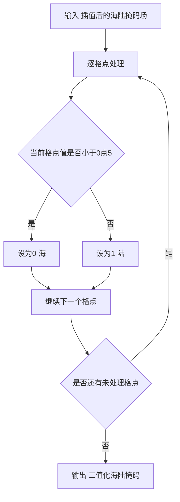
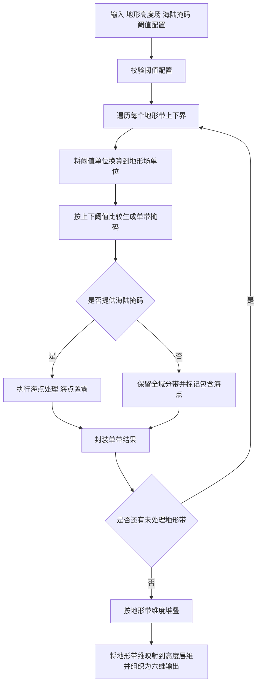
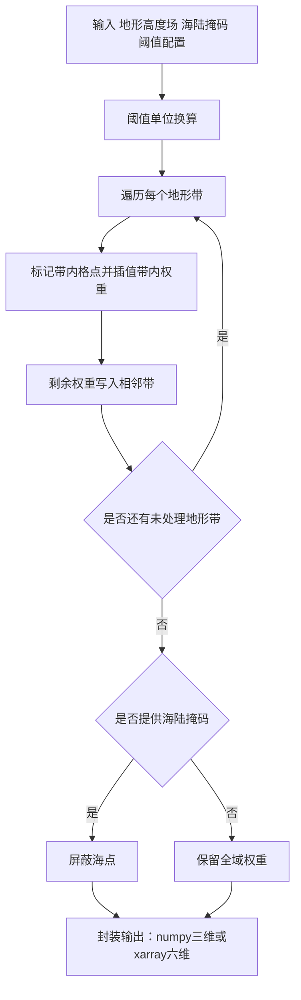

# generate_ancillary 方法说明

## 1. 概述

`generate_ancillary` 包用于生成地形相关辅助场，主要插件方法如下：

- `CorrectLandSeaMask`（`src/generate_ancillary.py`）：将插值后的海陆掩码二值化为 0/1。
- `GenerateOrographyBandAncils`（`src/generate_ancillary.py`）：按海拔阈值将地形高度场分带，输出各地形带的二值掩码。
- `GenerateTopographicZoneWeights`（`src/generate_topographic_zone_weights.py`）：按地形高度在各地形带内的位置计算折叠权重，供下游按带融合邻域结果。

面向双输入：

- `xarray.DataArray`：即 meteva_base 六维网格（`member, level, time, dtime, lat, lon`）；
- `numpy.ndarray`：纯数值数组。

### 1.1 坐标无关性说明

本包算法（海陆掩码二值化、地形带分带、折叠权重、海点屏蔽等）均**不依赖空间坐标的物理数值**进行计算。坐标仅参与 `xarray` 的维度对齐与广播，其值从未被读取或用于数值运算。因此：

- 输入场可以是任意空间坐标系（投影坐标 `projection_x/y_coordinate` 或地理坐标 `lat/lon`），不影响计算正确性。
- 因官方测试数据使用投影坐标，预期结果也是由投影坐标输入所得，故将投影输入做出约定：投影坐标映射为lat/lon维度，投影参数保留为`grid_mapping` 属性。
- 若上游数据保留 `grid_mapping` 属性（如 `lambert_azimuthal_equal_area` 的投影参数），本模块会将其随输出场透传，供下游消费方按需重建 CRS 并做投影转换。
- 算法本身不做投影↔经纬转换；测试数据的经纬对照由独立预处理脚本完成（见第 4 节），Notebook 只读盘验证。

---

## 2. 核心函数说明

### 2.1 `CorrectLandSeaMask.process`

#### CorrectLandSeaMask 函数签名

```python
@staticmethod
def process(standard_landmask: Union[xr.DataArray, ndarray]) -> Union[xr.DataArray, ndarray]:
```

#### CorrectLandSeaMask 参数说明

| 参数名 | 类型 | 含义 | 单位 |
| --- | --- | --- | --- |
| `standard_landmask` | `xr.DataArray` 或 `np.ndarray` | 插值后的海陆掩码场 | 无量纲（通常值域在 0 到 1） |

#### CorrectLandSeaMask 返回值说明

- 类型：与输入同类型（`xr.DataArray` 或 `np.ndarray`）
- 数据结构：
  - 每个格点被二值化为 `0`（海）或 `1`（陆）
  - 数值类型为 `int8`
  - 若输入为 `xr.DataArray`，保留 `dims/coords`，变量名重命名为 `land_binary_mask`

#### CorrectLandSeaMask 功能逻辑简述

1. 将输入转为可计算数组（浮点）。
2. 执行阈值判断：
    - `< 0.5` 置为 `0`
    - `>= 0.5` 置为 `1`
3. 转换为 `int8` 并按输入类型返回。

---

### 2.2 `GenerateOrographyBandAncils.process`

#### GenerateOrographyBandAncils 函数签名

```python
def process(
    self,
    orography: Union[xr.DataArray, ndarray],
    thresholds_dict: Dict[str, Any],
    landmask: Optional[Union[xr.DataArray, ndarray]] = None,
) -> Union[xr.DataArray, ndarray]:
```

#### GenerateOrographyBandAncils 参数说明

| 参数名 | 类型 | 含义 | 单位 |
| --- | --- | --- | --- |
| `orography` | `xr.DataArray` 或 `np.ndarray` | 标准网格地形高度场；DataArray 须为 meteva_base 六维 | 由地形场自身定义（DataArray 取 `attrs["units"]`） |
| `thresholds_dict` | `dict` | 地形带定义，须含 `bounds` 与 `units`（见下） | `units` 为上下界单位 |
| `landmask` | `xr.DataArray` / `np.ndarray` / `None` | 标准网格海陆掩码（陆=1，海=0）。提供则每个带内海点置 0；不提供则陆海均分带 | 无量纲 |

`thresholds_dict` 格式示例：

```python
{"bounds": [[0, 100], [100, 200]], "units": "m"}
```

未另行指定时，CLI 等入口可使用默认 `THRESHOLDS_DICT`：

```python
{
    "bounds": [
        [-500.0, 50.0], [50.0, 100.0], [100.0, 150.0], [150.0, 200.0],
        [200.0, 250.0], [250.0, 300.0], [300.0, 400.0], [400.0, 500.0],
        [500.0, 650.0], [650.0, 800.0], [800.0, 950.0], [950.0, 6000.0],
    ],
    "units": "m",
}
```

#### GenerateOrographyBandAncils 返回值说明

- DataArray（meteva_base 六维）：`(member, level, time, dtime, lat, lon)`，`level` 为地形带；变量名 `topography_mask`，`units="1"`。
- `numpy`：`(n_band, y, x)` 二值掩码。
- `level` 坐标附带 `level_lower_bound` / `level_upper_bound`。

#### GenerateOrographyBandAncils 功能逻辑简述

1. 校验 `thresholds_dict`：
    - `bounds` 必须存在且非空；
    - `units` 必须存在。
2. 循环每个地形带上下界，调用 `gen_orography_masks` 生成单带结果。
3. 将所有单带结果堆叠输出：
    - `xarray` 先 `xr.concat(..., dim="level")`，每个单带结果的 `level` 维长度为 1
    - `numpy` 使用 `np.concatenate(..., axis=0)`。

---

### 2.3 `GenerateTopographicZoneWeights.process`

实现文件：`generate_ancillary/src/generate_topographic_zone_weights.py`。

#### GenerateTopographicZoneWeights 函数签名

```python
def process(
    self,
    orography: Union[xr.DataArray, ndarray],
    thresholds_dict: Dict[str, Any],
    landmask: Optional[Union[xr.DataArray, ndarray]] = None,
) -> Union[xr.DataArray, ndarray, MaskedArray]:
```

#### GenerateTopographicZoneWeights 参数说明

| 参数名 | 类型 | 含义 | 单位 |
| --- | --- | --- | --- |
| `orography` | `xr.DataArray` 或 `np.ndarray` | 标准网格地形高度场；DataArray 须为 meteva_base 六维且 `member/level/time/dtime` 长度为 1，`ndarray` 须为二维 | 由地形场自身定义（DataArray 取 `attrs["units"]`） |
| `thresholds_dict` | `dict` | 地形带定义，须含 `bounds` 与 `units`（见下） | `units` 为上下界单位 |
| `landmask` | `xr.DataArray` / `np.ndarray` / `None` | 标准网格海陆掩码（陆=1、海=0）。提供则屏蔽海点（DataArray 为 `NaN`，numpy 为 `MaskedArray`）；不提供则陆海均生成权重 | 无量纲 |

`thresholds_dict` 格式示例：

```python
{"bounds": [[0, 50], [50, 200]], "units": "m"}
```

未另行指定时，CLI 等入口可使用默认 `THRESHOLDS_DICT`：

```python
{
    "bounds": [
        [-500.0, 50.0], [50.0, 100.0], [100.0, 150.0], [150.0, 200.0],
        [200.0, 250.0], [250.0, 300.0], [300.0, 400.0], [400.0, 500.0],
        [500.0, 650.0], [650.0, 800.0], [800.0, 950.0], [950.0, 6000.0],
    ],
    "units": "m",
}
```

#### GenerateTopographicZoneWeights 返回值说明

- DataArray（meteva_base 六维）：`(member, level, time, dtime, lat, lon)`，`level` 为地形带；若提供 `landmask`，海点为 `NaN`。
- `numpy`：`(n_band, y, x)`；若提供 `landmask` 则返回 `MaskedArray`。
- 变量名：`topographic_zone_weights`；`units="1"`。
- `level` 坐标附带 `level_lower_bound` / `level_upper_bound`。

#### GenerateTopographicZoneWeights 功能逻辑简述

1. 将阈值单位换算到地形场单位。
2. 对每个地形带：标记 `lower < hgt <= upper` 的格点，按中点=1、边界=0.5 插值得到带内权重。
3. 高于/低于中点的剩余权重 `1-w` 写入相邻带（最底/最高带边界点权重置 1）。
4. 可选：按海陆掩码屏蔽海点。
5. `xarray` 路径将带维映射到 `level` 并组织为六维输出。

---

## 3. 核心处理流程图

### 3.1 CorrectLandSeaMask 处理流程图



### 3.2 GenerateOrographyBandAncils 处理流程图



### 3.3 GenerateTopographicZoneWeights 处理流程图



---

## 4. 测试数据预处理

官方投影样例需先预处理，再供 CLI / Notebook 读取。脚本：

`generate_ancillary/cli/preprocess_test_data.py`

仓库根目录运行：

```text
python generate_ancillary/cli/preprocess_test_data.py
```

写出目录（`cli_inputs/` 文件名保持不变，供现有 CLI 使用）：

| 路径 | 内容 | 用途 |
| --- | --- | --- |
| `<数据集>/cli_inputs/` | 投影维重命名后的 meb 六维 | 方案一：迁移方法 / CLI |
| `<数据集>/latlon/` | Iris Linear/Nearest 规则经纬 Cube | 方案二：原 IMPROVER 方法 |
| `<数据集>/latlon/cli_inputs/` | 与 `latlon/` 同源数值的 meb 六维 | 方案二：迁移方法 |

覆盖数据集：`generate-landmask/basic`、`generate-topography-bands-mask/basic`、
`generate-topography-bands-weights/{basic,multi_realization}`
（`basic_no_landsea_mask` 仅含 KGO，输入复用对应 `basic`）。

`kgo.nc` 与原方法结果不转换。Notebook 只读上述写出结果做对照，不再内嵌预处理。

## 5. 调用示例

### 5.1 CorrectLandSeaMask：使用 meteva_base 读取 NetCDF

```python
import meteva_base as meb

from generate_ancillary.src.generate_ancillary import CorrectLandSeaMask

landmask = meb.read_griddata_from_nc(
    "generate_ancillary/test_data/generate-landmask/basic/cli_inputs/input_landmask_meb.nc"
)

result = CorrectLandSeaMask().process(landmask)

print(result.name)
print(result.dims)
print(result.dtype)
print(result.attrs)
```

### 5.2 GenerateOrographyBandAncils：使用 meteva_base 读取 NetCDF

```python
import meteva_base as meb

from generate_ancillary.src.generate_ancillary import (
    GenerateOrographyBandAncils,
    THRESHOLDS_DICT,
)

orography = meb.read_griddata_from_nc(
    "generate_ancillary/test_data/generate-topography-bands-mask/basic/cli_inputs/input_orog_meb.nc"
)
landmask = meb.read_griddata_from_nc(
    "generate_ancillary/test_data/generate-topography-bands-mask/basic/cli_inputs/input_land_meb.nc"
)

result = GenerateOrographyBandAncils().process(
    orography=orography,
    thresholds_dict=THRESHOLDS_DICT,
    landmask=landmask,
)

print(result.name)
print(result.dims)
print(result.coords["level"].values)
print(result.coords["level_lower_bound"].values)
print(result.coords["level_upper_bound"].values)
print(result.attrs)
```

### 5.3 GenerateTopographicZoneWeights：使用 meteva_base 读取 NetCDF

```python
import meteva_base as meb

from generate_ancillary.src.generate_ancillary import THRESHOLDS_DICT
from generate_ancillary.src.generate_topographic_zone_weights import (
    GenerateTopographicZoneWeights,
)

orography = meb.read_griddata_from_nc(
    "generate_ancillary/test_data/generate-topography-bands-weights/basic/cli_inputs/input_orog_meb.nc"
)
landmask = meb.read_griddata_from_nc(
    "generate_ancillary/test_data/generate-topography-bands-weights/basic/cli_inputs/input_land_meb.nc"
)

result = GenerateTopographicZoneWeights().process(
    orography=orography,
    thresholds_dict=THRESHOLDS_DICT,
    landmask=landmask,
)

print(result.name)
print(result.dims)
print(result.sizes["level"])
```

---

## 6. CLI 应用示例

参考脚本：

- `generate_ancillary/cli/anc_generate_landmask_ancillary.py`
- `generate_ancillary/cli/dsc_generate_topography_bands_mask.py`
- `generate_ancillary/cli/dsc_generate_topographic_zone_weights.py`

### 6.1 直接运行脚本内置示例路径

```bash
python generate_ancillary/cli/anc_generate_landmask_ancillary.py
python generate_ancillary/cli/dsc_generate_topography_bands_mask.py
python generate_ancillary/cli/dsc_generate_topographic_zone_weights.py
```

### 6.2 在 Python 中调用 landmask CLI 的 `process` 入口

```python
from generate_ancillary.cli.anc_generate_landmask_ancillary import process

result = process(
    landmask_path="generate_ancillary/test_data/generate-landmask/basic/cli_inputs/input_landmask_meb.nc",
    output_path="generate_ancillary/test_data/generate-landmask/basic/cli_outputs/cli_landmask_result.nc",
)

print(result)
```

### 6.3 在 Python 中调用 topography bands CLI 的 `process` 入口

```python
from generate_ancillary.cli.dsc_generate_topography_bands_mask import process

result = process(
    orography_path="generate_ancillary/test_data/generate-topography-bands-mask/basic/cli_inputs/input_orog_meb.nc",
    landmask_path="generate_ancillary/test_data/generate-topography-bands-mask/basic/cli_inputs/input_land_meb.nc",
    thresholds_path="generate_ancillary/test_data/generate-topography-bands-mask/basic/bounds.json",
    output_path="generate_ancillary/test_data/generate-topography-bands-mask/basic/cli_outputs/cli_topography_bands_mask_result.nc",
)

print(result)
```

### 6.4 在 Python 中调用 topographic zone weights CLI 的 `process` 入口

```python
from generate_ancillary.cli.dsc_generate_topographic_zone_weights import process

result = process(
    orography_path="generate_ancillary/test_data/generate-topography-bands-weights/basic/cli_inputs/input_orog_meb.nc",
    landmask_path="generate_ancillary/test_data/generate-topography-bands-weights/basic/cli_inputs/input_land_meb.nc",
    thresholds_path="generate_ancillary/test_data/generate-topography-bands-weights/basic/bounds.json",
    output_path="generate_ancillary/test_data/generate-topography-bands-weights/basic/cli_outputs/cli_topographic_zone_weights_result.nc",
)

print(result)
```

---

## 7. 写出注意事项（meb.write_griddata_to_nc）

- `CorrectLandSeaMask` 与 `GenerateOrographyBandAncils` 的掩码结果在算法层保持整型输出（如 `int8` / `int32`），这是预期行为。
- 若直接调用 `meb.write_griddata_to_nc` 写出整型掩码，可能触发 `xarray` 编码冲突（`scale_factor` 与整型数据的类型转换冲突）。
- 建议在写出前显式转换为 `float32`：

```python
meb.write_griddata_to_nc(result.astype("float32"), output_path, creat_dir=True)
```

- 当前三个 CLI 示例脚本均已内置该转换：
  `anc_generate_landmask_ancillary.py`、
  `dsc_generate_topography_bands_mask.py`、
  `dsc_generate_topographic_zone_weights.py`。

---

## 8. 测试情况

- 覆盖场景：
  - `CorrectLandSeaMask`：`numpy/xarray` 输入二值化、`__call__` 与 `process` 一致性、六维格式校验；官方 `generate-landmask` KGO / 原算法回归。
  - `GenerateOrographyBandAncils`：单带/多带生成、单位换算、海陆掩码广播、`xarray/numpy` 等价性、阈值配置异常分支；官方 `generate-topography-bands-mask` KGO / 原算法回归。
  - `GenerateTopographicZoneWeights`：带内插值、相邻带分配、海陆屏蔽、单位换算、六维 `level` 封装、越界告警；官方 `generate-topography-bands-weights`（含 JSON / 无掩码 / multi_r0）KGO / 原算法回归。
  - `make_mask_griddata`：非法 bounds、单带/多带坐标（`test_make_mask_griddata.py`）。
  - 插件输出字段约定（`test_meb_attrs.py`）。
  - CLI smoke：`anc_generate_landmask_ancillary`、`dsc_generate_topography_bands_mask`、`dsc_generate_topographic_zone_weights` 的 `process` 入口可运行。
- 回归数据（对应上游 `improver_test_data-master/data/`）：
  - `CorrectLandSeaMask`：`generate_ancillary/test_data/generate-landmask`
  - `GenerateOrographyBandAncils`：`generate_ancillary/test_data/generate-topography-bands-mask`
  - `GenerateTopographicZoneWeights`：`generate_ancillary/test_data/generate-topography-bands-weights`

    （覆盖默认阈值、JSON 阈值、无海陆掩码；权重另含 `multi_realization` 取 `realization=0` 对照）

- 结果一致性结论：
  - 迁移实现与 KGO、原实现结果一致（测试内现场调用原算法对照，按断言通过）。
  - 当前 `generate_ancillary/test` 全量测试通过。
- 边界条件测试：
  - `thresholds_dict` 缺少 `units`、缺少或空 `bounds`。
  - 非六维 `xarray` 输入拒绝。
  - 海陆掩码形状广播失败抛出明确错误。
  - 权重插件：DataArray 非单成员（`member` 等长度 > 1）拒绝。
