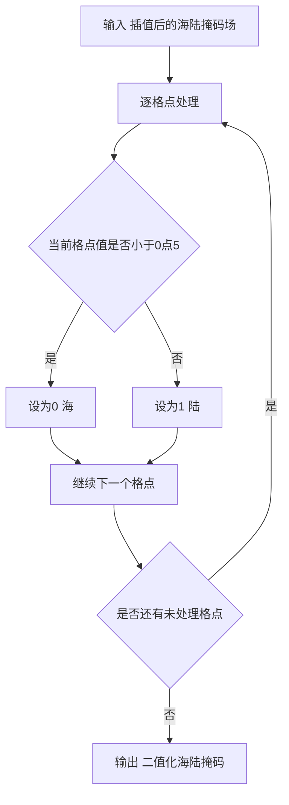
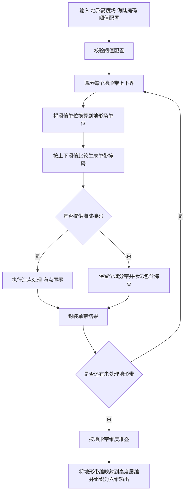

# generate_ancillary 方法说明

## 1. 概述

`generate_ancillary/src/generate_ancillary.py` 用于生成地形相关辅助场，核心包含两类能力：

- 海陆掩码纠正：将插值后的海陆掩码重新二值化为 0/1。
- 地形带掩码生成：按阈值配置将地形高度场分带，并输出每个地形带的二值掩码。

该实现面向 `xarray.DataArray` 与 `numpy.ndarray` 双输入，同时兼容 meteva_base 常见六维网格（`member, level, time, dtime, lat, lon`）。

### 1.1 坐标无关性说明

本模块所有算法（海陆掩码二值化、地形带分带、阈值比较、掩码堆叠）均**不依赖空间坐标的物理数值**进行计算。坐标仅参与 `xarray` 的维度对齐与广播，其值从未被读取或用于数值运算。因此：

- 输入场可以是任意空间坐标系（投影坐标 `projection_x/y_coordinate` 或地理坐标 `lat/lon`），不影响计算正确性。
- 若上游数据保留 `grid_mapping` 属性（如 `lambert_azimuthal_equal_area` 的投影参数），本模块会将其随输出场透传，供下游消费方按需重建 CRS 并做投影转换。

为避免不必要的投影往返转换带来的精度损失与额外依赖，当前并未实现投影坐标与经纬坐标的转换，并且测试数据在预处理阶段也并未进行坐标转换，投影坐标只是映射到经纬维度。

---

## 2. 核心函数说明

### 2.1 `CorrectLandSeaMask.process`

#### 函数签名

```python
@staticmethod
def process(standard_landmask: Union[xr.DataArray, ndarray]) -> Union[xr.DataArray, ndarray]:
```

#### 参数说明


| 参数名                 | 类型                            | 含义        | 单位               |
| ------------------- | ----------------------------- | --------- | ---------------- |
| `standard_landmask` | `xr.DataArray` 或 `np.ndarray` | 插值后的海陆掩码场 | 无量纲（通常值域在 0 到 1） |


#### 返回值说明

- 类型：与输入同类型（`xr.DataArray` 或 `np.ndarray`）
- 数据结构：
  - 每个格点被二值化为 `0`（海）或 `1`（陆）
  - 数值类型为 `int8`
  - 若输入为 `xr.DataArray`，保留原 `dims/coords/attrs`，变量名重命名为 `land_binary_mask`

#### 功能逻辑简述

1. 将输入转为可计算数组（浮点）。
2. 执行阈值判断：
  - `< 0.5` 置为 `0`
  - `>= 0.5` 置为 `1`
3. 转换为 `int8` 并按输入类型返回。

---

### 2.2 `GenerateOrographyBandAncils.process`

#### 函数签名

```python
def process(
    self,
    orography: Union[xr.DataArray, ndarray],
    thresholds_dict: Dict[str, Any],
    landmask: Optional[Union[xr.DataArray, ndarray]] = None,
) -> Union[xr.DataArray, ndarray]:
```

#### 参数说明


| 参数名               | 类型                                       | 含义                            | 单位                                    |
| ----------------- | ---------------------------------------- | ----------------------------- | ------------------------------------- |
| `orography`       | `Union[xr.DataArray, ndarray]`           | 地形高度场                         | 由地形场自身定义（`xarray` 取 `attrs["units"]`） |
| `thresholds_dict` | `Dict[str, Any]`                         | 地形带配置，必须包含 `bounds` 与 `units` | `units` 指定阈值单位                        |
| `landmask`        | `Optional[Union[xr.DataArray, ndarray]]` | 海陆掩码，可选                       | 无量纲                                   |


#### 返回值说明

- 类型：
  - `xarray` 输入返回 `xr.DataArray`
  - `numpy` 输入返回 `np.ndarray`
- 数据结构：
  - `numpy` 路径下沿地形带轴堆叠，形状为 `(n_band, y, x)`
  - `xarray` 路径下会将地形带维映射到 `level`，并组织为六维：
  `("member", "level", "time", "dtime", 空间维1, 空间维2)`
  - 地形带上下界坐标写为：
    - `level_lower_bound`
    - `level_upper_bound`

#### 功能逻辑简述

1. 校验 `thresholds_dict`：
  - `bounds` 必须存在且非空；
  - `units` 必须存在。
2. 循环每个地形带上下界，调用 `gen_orography_masks` 生成单带结果。
3. 将所有单带结果堆叠输出：
  - `xarray` 先 `xr.concat(..., dim="level")`，每个单带结果的`level`维长度为 1
  - `numpy` 使用 `np.concatenate(..., axis=0)`。

---

## 3. 核心处理流程图

### 3.1 CorrectLandSeaMask 处理流程图




### 3.2 GenerateOrographyBandAncils 处理流程图




---

## 4. 调用示例

### 4.1 使用 meteva_base 读取 NetCDF

```python
import meteva_base as meb

from generate_ancillary.src.generate_ancillary import (
    CorrectLandSeaMask,
    GenerateOrographyBandAncils,
    THRESHOLDS_DICT,
)

orography = meb.read_griddata_from_nc(
    "generate_ancillary/test_data/official_test_generate_ancillary/basic/cli_inputs/input_orog_meb.nc"
)
landmask = meb.read_griddata_from_nc(
    "generate_ancillary/test_data/official_test_generate_ancillary/basic/cli_inputs/input_land_meb.nc"
)

result = GenerateOrographyBandAncils().process(
    orography=orography,
    thresholds_dict=THRESHOLDS_DICT,
    landmask=landmask,
)

print(result.name)
print(result.dims)
print(result.coords["level"].values)
print(result.coords["level_lower_bound"].values)
print(result.coords["level_upper_bound"].values)
print(result.attrs)
```

---

## 5. CLI 应用示例

参考脚本：

- `generate_ancillary/cli/dsc_generate_topography_bands_mask.py`
- `generate_ancillary/cli/anc_generate_landmask_ancillary.py`

### 5.1 直接运行脚本内置示例路径

```bash
python generate_ancillary/cli/dsc_generate_topography_bands_mask.py
python generate_ancillary/cli/anc_generate_landmask_ancillary.py
```

### 5.2 在 Python 中调用 topography bands CLI 的 `process` 入口

```python
from generate_ancillary.cli.dsc_generate_topography_bands_mask import process

result = process(
orography_path="generate_ancillary/test_data/official_test_generate_ancillary/basic/cli_inputs/input_orog_meb.nc",
landmask_path="generate_ancillary/test_data/official_test_generate_ancillary/basic/cli_inputs/input_land_meb.nc",
thresholds_path="generate_ancillary/test_data/official_test_generate_ancillary/basic/bounds.json",    output_path="generate_ancillary/test_data/official_test_generate_ancillary/basic/cli_outputs/cli_topography_bands_mask_result.nc",
)

print(result)
```

---

## 6. 写出注意事项（meb.write_griddata_to_nc）

- `CorrectLandSeaMask` 与 `GenerateOrographyBandAncils` 的掩码结果在算法层保持整型输出（如 `int8` / `int32`），这是预期行为。
- 若直接调用 `meb.write_griddata_to_nc` 写出整型掩码，可能触发 `xarray` 编码冲突（`scale_factor` 与整型数据的类型转换冲突）。
- 建议在写出前显式转换为 `float32`：

```python
meb.write_griddata_to_nc(result.astype("float32"), output_path, creat_dir=True)
```

- 当前 `generate_ancillary/cli/generate_topography_bands_mask.py` 与 `generate_ancillary/cli/generate_landmask_ancillary.py` 已内置该转换。

---

## 7. 测试情况

- 覆盖场景：
  - `CorrectLandSeaMask`：`numpy/xarray` 输入二值化、`__call__` 与 `process` 一致性、六维格式校验。
  - `GenerateOrographyBandAncils`：单带/多带生成、单位换算、海陆掩码广播、`xarray/numpy` 等价性、阈值配置异常分支。
  - CLI smoke：`anc_generate_landmask_ancillary` 与 `dsc_generate_topography_bands_mask` 的 `process` 入口可运行、可写出、结果可读。
- 回归数据：
  - 使用 `generate_ancillary/test_data/official_test_generate_ancillary` 下官方样例。
  - 覆盖默认阈值、JSON 阈值、无海陆掩码三类官方场景。
- 结果一致性结论：
  - 迁移实现与 KGO、原实现结果一致（按测试断言通过）。
  - 当前 `generate_ancillary/test` 全量测试通过。
- 边界条件测试：
  - `thresholds_dict` 缺少 `units`、缺少或空 `bounds`。
  - 非六维 `xarray` 输入拒绝。
  - 海陆掩码形状广播失败抛出明确错误。

