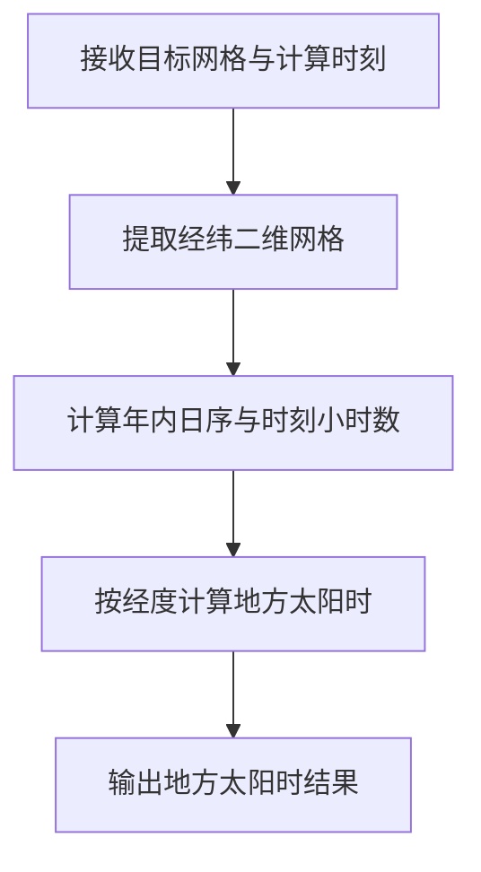
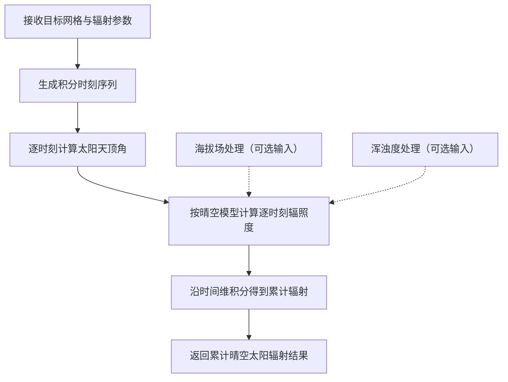

# generate_derived_solar_fields 算法说明

## 1. 模块功能概述

`generate_derived_solar_fields/src/generate_derived_solar_fields.py` 提供两个太阳相关衍生场算法：

- `GenerateSolarTime`：在目标网格上计算地方太阳时（单位：小时，范围 0-24）。
- `GenerateClearskySolarRadiation`：在目标网格上计算指定累积时段内的晴空太阳辐射累计量（单位：`W s m-2`）。

当前实现保持了与原 improver 核心计算链一致的思路，同时适配了 `xarray.DataArray` / `meteva_base` 六维网格输入输出。

---

## 2. 数据与输入约定

- 输入网格默认采用六维顺序：`member, level, time, dtime, lat, lon`。
- 两个主方法都要求输入为单场（前四维压缩后仅保留一个空间场）。
- 方法内部使用经纬二维场进行计算；输入同时支持经纬坐标与投影坐标。若为投影坐标输入，须具备 `attrs["grid_mapping_attrs"]`，并在其中给出相关投影参数。

---

## 3. 类与参数说明

## 3.1 `GenerateSolarTime`

### 3.1.1 初始化参数

该类无显式初始化参数，直接实例化即可：

```python
plugin = GenerateSolarTime()
```

### 3.1.2 主函数参数（`process`）

| 参数名 | 类型 | 必填 | 说明 |
| --- | --- | --- | --- |
| `target_grid` | `xr.DataArray` | 是 | 目标网格数据，需满足六维单场约束 |
| `time` | `datetime` | 是 | 计算时刻 |
| `new_title` | `str  或 None` | 否 | 输出标题；为 `None` 时不覆盖现有标题 |

### 3.1.3 输出要点

- 变量名：`local_solar_time`
- 单位：`hours`
- 若 `time` 维长度为 1，会将输出时间坐标更新为传入时刻

### 3.1.4 核心流程图



---

## 3.2 `GenerateClearskySolarRadiation`

### 3.2.1 初始化参数

该类无显式初始化参数，直接实例化即可：

```python
plugin = GenerateClearskySolarRadiation()
```

### 3.2.2 主函数参数（`process`）

| 参数名 | 类型 | 必填 | 说明 |
| --- | --- | --- | --- |
| `target_grid` | `xr.DataArray` | 是 | 目标网格，需满足六维单场约束 |
| `time` | `datetime` | 是 | 累积结束时刻 |
| `accumulation_period` | `int` | 是 | 累积时长（小时） |
| `surface_altitude` | `xr.DataArray  或 None` | 否 | 海拔输入，不传时内部使用默认海拔场 |
| `linke_turbidity` | `xr.DataArray  或 None` | 否 | Linke 浑浊度输入，不传时内部使用默认浑浊度场 |
| `temporal_spacing` | `int` | 否 | 时间积分步长（分钟），默认 30 |
| `new_title` | `str  或 None` | 否 | 输出标题；为 `None` 时不覆盖现有标题 |

### 3.2.3 输出要点

- 变量名：`integral_of_surface_downwelling_shortwave_flux_in_air_assuming_clear_sky_wrt_time`
- 单位：`W s m-2`
- 输出附带：
  - `time_lower_bound` / `time_upper_bound`
  - `accumulation_period_hours`
  - `temporal_spacing_minutes`
  - `vertical_coordinate`（依据海拔场是否全 0）

字段说明：

- `time_lower_bound` / `time_upper_bound`

用于表示本次累计辐射对应的时间窗口起止。

  - `time_upper_bound` 对应主时间坐标（累计结束时刻）；
  - `time_lower_bound` 为 `time_upper_bound - accumulation_period`。

  这两项等价于原实现中的时间边界信息，便于下游明确“该值是哪个时段的累计量”。

- `accumulation_period_hours`

记录本次计算使用的累计时长（小时）。该字段是主函数参数 `accumulation_period` 的显式回写，便于结果追溯和多批次结果拼接时校验一致性。

- `temporal_spacing_minutes`

记录积分步长（分钟），对应主函数参数 `temporal_spacing`。该字段用于说明累计积分的时间离散精度。

- `vertical_coordinate`

用于标记计算时采用的垂直语义：

  - 当海拔输入全为 0（默认补齐场）时写为 `altitude`；
  - 当传入了非零海拔场时写为 `height`。

  该字段用于提示结果与地形修正信息的关联状态。

### 3.2.4 核心流程图



---

## 4. 方法调用示例

## 4.1 `GenerateSolarTime` 示例

```python
import meteva_base as meb
from datetime import datetime
from generate_derived_solar_fields.src.generate_derived_solar_fields import GenerateSolarTime

target_grid = meb.read_griddata_from_nc(
    "generate_derived_solar_fields/test_data/generate-solar-time/cli_inputs/input_target_grid_meb.nc"
)

result = GenerateSolarTime().process(
    target_grid=target_grid,
    time=datetime(2022, 6, 7, 0, 0),
)
```

## 4.2 `GenerateClearskySolarRadiation` 示例

```python
import meteva_base as meb
from datetime import datetime
from generate_derived_solar_fields.src.generate_derived_solar_fields import GenerateClearskySolarRadiation

target_grid = meb.read_griddata_from_nc(
    "generate_derived_solar_fields/test_data/generate-clearsky-solar-radiation/cli_inputs/input_surface_altitude_meb.nc"
)
surface_altitude = target_grid
linke_turbidity = meb.read_griddata_from_nc(
    "generate_derived_solar_fields/test_data/generate-clearsky-solar-radiation/cli_inputs/input_linke_turbidity_meb.nc"
)

result = GenerateClearskySolarRadiation().process(
    target_grid=target_grid,
    time=datetime(2022, 5, 6, 0, 0),
    accumulation_period=24,
    surface_altitude=surface_altitude,
    linke_turbidity=linke_turbidity,
)
```

---

## 5. CLI 应用示例

对应示例脚本：

- `generate_derived_solar_fields/cli/cal_generate_solar_time.py`
- `generate_derived_solar_fields/cli/cal_generate_clearsky_solar_radiation.py`

可直接运行：

```bash
python generate_derived_solar_fields/cli/cal_generate_solar_time.py
python generate_derived_solar_fields/cli/cal_generate_clearsky_solar_radiation.py
```

也可以在 Python 中调用 CLI 脚本的 `process` 入口：

```python
from datetime import datetime
from generate_derived_solar_fields.cli.cal_generate_solar_time import process as solar_cli_process

target_grid_path = "generate_derived_solar_fields/test_data/generate-solar-time/cli_inputs/input_target_grid_meb.nc"

solar_time_result = solar_cli_process(
    target_grid_path=target_grid_path,
    time=datetime(2022, 6, 7, 0, 0),
)

from generate_derived_solar_fields.cli.cal_generate_clearsky_solar_radiation import process as clearsky_cli_process

target_grid_path = "generate_derived_solar_fields/test_data/generate-clearsky-solar-radiation/cli_inputs/input_surface_altitude_meb.nc"
linke_turbidity_path = "generate_derived_solar_fields/test_data/generate-clearsky-solar-radiation/cli_inputs/input_linke_turbidity_meb.nc"

solar_radiation_result = clearsky_cli_process(
    target_grid_path=target_grid_path,
    time=datetime(2022, 5, 6, 0, 0),
    accumulation_period=24,
    surface_altitude_path=target_grid_path,
    linke_turbidity_path=linke_turbidity_path,
)
```

---

## 6. 测试数据预处理

官方投影样例需先预处理，再供 CLI / Notebook 读取。脚本：

`generate_derived_solar_fields/cli/preprocess_test_data.py`

仓库根目录运行：

```text
python generate_derived_solar_fields/cli/preprocess_test_data.py
```

写出目录（`cli_inputs/` 文件名保持不变）。官方输入无 time 维，脚本从对应 KGO 注入时刻。

| 路径 | 内容 | 用途 |
| --- | --- | --- |
| `<数据集>/cli_inputs/` | 投影维重命名后的 meb 六维（含 `grid_mapping_attrs`） | 方案一：迁移方法 / CLI |
| `<数据集>/latlon/` | 投影→规则经纬后的 Iris Cube | 方案二：原 IMPROVER 方法 |
| `<数据集>/latlon/cli_inputs/` | 与 `latlon/` 同源数值的 meb 六维 | 方案二：迁移方法 |

`kgo.nc` 与原方法结果不转换。Notebook 只读上述写出结果做对照，不再内嵌预处理。

## 7. 测试情况

当前已覆盖的测试与验证主要包括：

- 单元测试文件：`generate_derived_solar_fields/test/test_generate_derived_solar_fields.py`
  - `GenerateSolarTime` 基本功能、时间属性、投影坐标转换、单位换算
  - `GenerateClearskySolarRadiation` 默认输入、时间步长约束、前四维单场约束
  - 两个类均覆盖“缺少 grid_mapping_attrs 时默认按经纬处理”分支
- notebook 视觉与统计对比：`generate_derived_solar_fields/nbs/generate_derived_solar_fields.ipynb`
  - 投影输入与经纬输入对比
  - current / original / KGO 三路对比
  - CLI 结果对比章节
- CLI 示例可运行并产出 NetCDF 结果。

---

## 8. 当前输入适配实现的注意项

当前输入适配总体可用，但存在以下约束（建议在使用时明确）：

- 仅支持六维单场输入（前四维压缩后必须是单个空间场）。
- 经纬输入无需 `grid_mapping_attrs`；投影输入须提供可解析的 `attrs["grid_mapping_attrs"]`（详见 §2）。
- `surface_altitude` 与 `linke_turbidity`（若传入）必须与 `target_grid` 的空间坐标严格一致。
- `accumulation_period * 60` 必须能被 `temporal_spacing` 整除，否则会报错。

以上属于当前版本的输入约定与边界限制，不是数值算法本身错误。
