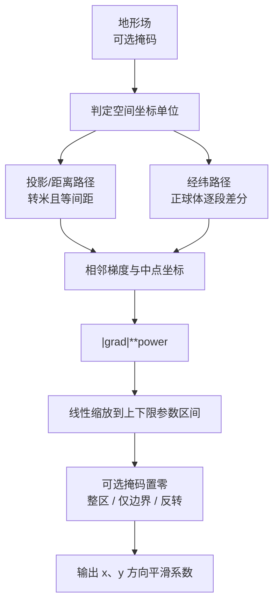

# generate_orographic_smoothing_coefficients 算法说明

## 1. 模块功能概述

`generate_orographic_smoothing_coefficients/src/generate_orographic_smoothing_coefficients.py`
根据地形相邻格点梯度，生成递归滤波使用的 x/y 平滑系数。

核心步骤：

1. 按坐标类型计算相邻格点梯度（差分 / 格距）
2. 未归一化系数 = `|gradient| ** power`
3. 再线性缩放到 `[min_gradient_smoothing_coefficient, max_gradient_smoothing_coefficient]`
4. 可选掩码：整区置零、仅边界置零、或反转掩码语义

## 2. 当前版本约定

- 输入为 meb 六维单场：`member, level, time, dtime, lat, lon`
- 支持两类空间坐标（由 `lat`/`lon` 的 `units` 判定）：

| 类型 | `units` | 格距计算 |
| --- | --- | --- |
| 投影/距离 | 可转换为米（如 `m`、`km`） | 先转米，再按**等间距**平均格距做差分 |
| 经纬度 | `degrees` 等，或**无 units / 空** | 正球体逐段 `diff`：`dx = R·cos(lat)·Δlon`，`dy = R·Δlat` |

- 投影路径：`km` 等长度单位会经 `cf_units` **自动换算为米**后再算梯度；坐标须等间距，否则报错。中点坐标仍保持输入原单位（如 `km`）。投影场可带 `grid_mapping_attrs`
- 经纬度路径：业务经纬网格通常**坐标无 `units`**；格距用正球体默认半径 `R = 6371229 m`（与 Iris GeogCS / Improver 常用值一致）。底层 API 可显式传 `sphere_radius` 覆盖
- 经纬度坐标建议保持 `float64`；降为 `float32` 会放大球面格距误差
- 输出为两个 DataArray：
  - `smoothing_coefficient_x`：`lon` 维比输入少 1（中点坐标）
  - `smoothing_coefficient_y`：`lat` 维比输入少 1（中点坐标）
  - 中点坐标单位与输入轴一致（投影保持原长度单位；经纬为度）
- `min_gradient_smoothing_coefficient` 与 `max_gradient_smoothing_coefficient` 各自须满足 `0 <= value <= 0.5`（递归滤波守恒约束）；输出系数再线性缩放到由二者界定的区间（默认平坦处 `0.5`、陡峭处 `0.0`）
- 默认语义：平坦处系数偏大（更平滑），陡峭处偏小（更少平滑）

## 3. 插件参数

### 3.1 初始化参数（`__init__`）

| 参数 | 类型 | 说明 |
| --- | --- | --- |
| `min_gradient_smoothing_coefficient` | `float` | 最小梯度处系数，默认 0.5 |
| `max_gradient_smoothing_coefficient` | `float` | 最大梯度处系数，默认 0.0 |
| `power` | `float` | 幂次，默认 1 |
| `use_mask_boundary` | `bool` | True 时仅掩码过渡边界置零；False 时对掩码区域及边界置零。默认为False |
| `invert_mask` | `bool` | True 时反转掩码置零语义（`use_mask_boundary=True` 时无效）。默认为False |

### 3.2 主函数参数（`process`）

| 参数 | 类型 | 说明 |
| --- | --- | --- |
| `orography` | `xr.DataArray` | 地形场（六维单场） |
| `mask` | `xr.DataArray \| None` | 可选掩码，网格须与地形一致 |

返回：`(smoothing_coefficient_x, smoothing_coefficient_y)` 两个六维 `DataArray`。

## 4. 处理流程



## 5. 插件类调用示例

```python
from generate_orographic_smoothing_coefficients.src.generate_orographic_smoothing_coefficients import (
    OrographicSmoothingCoefficients,
)

# orography / mask 为 meb 六维 DataArray
plugin = OrographicSmoothingCoefficients(
    min_gradient_smoothing_coefficient=0.5,
    max_gradient_smoothing_coefficient=0.0,
    power=1.0,
    use_mask_boundary=True,  # 仅在传入 mask 时生效：True 时只置零掩码过渡边界
)
coeff_x, coeff_y = plugin.process(orography, mask=mask)  # mask 可选
```

也可直接：

```python
coeff_x, coeff_y = OrographicSmoothingCoefficients().process(orography)
```

## 6. CLI

示例脚本：

```bash
python generate_orographic_smoothing_coefficients/cli/dsc_generate_orographic_smoothing_coefficients.py
```

默认读取：

- `test_data/cli_inputs/input_orography_meb.nc`
- 写出：`test_data/cli_outputs/cli_basic_result.nc`

业务调用示例：

```python
from generate_orographic_smoothing_coefficients.cli.dsc_generate_orographic_smoothing_coefficients import process

coeff_x, coeff_y = process(
    orography_path=".../input_orography_meb.nc",
    mask_path=".../input_landmask_meb.nc",  # 可选
    use_mask_boundary=True,
    output_path=".../out.nc",
)
```

## 7. 测试情况

- 单元测试：
  - 投影：等间距米制、`km` 单位换算、合成场、mask 边界、参数校验
  - 经纬度：逐段格距对齐 Improver、无 units、递减坐标符号、最终系数对齐原插件
- 官方样例对照（投影网格）：`basic` / `mask_boundary` / `mask_zeroed` / `inverse_mask_zeroed`
  （含不同 limits、不同 power）；与原 Improver、KGO 一致（`atol/rtol=1e-5`）
- CLI 冒烟：合成网格写出 + 默认 `cli_inputs` 可跑通

说明：官方 KGO 仅覆盖投影网格。经纬路径以「同一经纬输入上 current vs 原算法」验证，不把重网格后的投影 KGO 当作判据。

运行：

```bash
pytest generate_orographic_smoothing_coefficients/test
```
