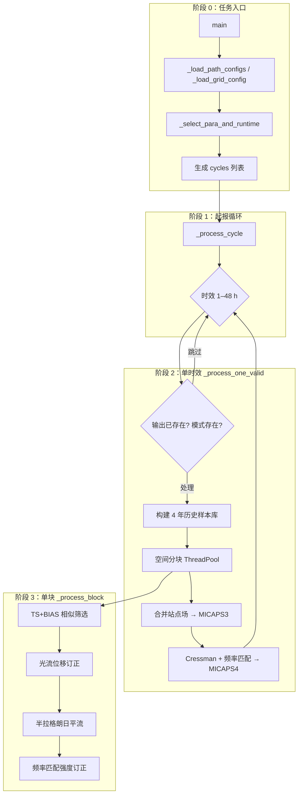

# 逐 1 小时降水频率匹配订正 — 程序说明

**multi_qpf_fm_rain01** 的应用场景、程序架构、算法原理与实现、配置参数及运行方式说明如下。

**核心路径**：`src/runner.py`（主程序 `process`）、`src/proc/`（核心算法）、`src/utils/util_env.py`（路径 ini）。  
命令行：`python -m cli`；模块：`from runner import process`；直跑：`python src/runner.py`（改 `__main__` 传参）。

---

## 1. 文档与工程定位

- **程序性质**：针对**单一数值模式**逐 1 小时（1–48 h）降水预报的业务型**统计订正**流水线。利用历史同期模式–实况配对样本，在分区块内做相似个例筛选、光流位移订正与频率匹配强度订正，输出 MICAPS3 站点场与 MICAPS4 格点场。
- **设计目标**：与既有业务数据接口（MICAPS3/MICAPS4、二进制格点、NetCDF 等）对齐；在保持原 `QPFFrequencyMatch_Rain01` 算法与数值结果一致的前提下，目录布局对齐 `mait_24h`，便于维护与集成。
- **相关材料**：项目根目录 `README.md`（快速开始）。

---

## 2. 应用场景

| 场景 | 说明 |
|------|------|
| **单模式 QPF 订正** | 对 ECMWF、GRAPES 等单一模式的 1 h 降水预报做后处理订正，改善 TS、频率分布与极值表现。 |
| **逐时效业务批处理** | 对每个起报时刻循环 1–48 h 预报时效；支持单时次、时次范围（步长 1 h）及多模式键（`path.json` 中 `configs`）。 |
| **空间分块订正** | 将目标区域划分为多块（短时效细分为 8×7 块，长时效为 1×1 整块），块内独立筛选样本与订正，缓解大范围单一统计关系的空间失配。 |
| **历史同期样本库** | 回溯最多 4 个日历年、在起报日 ±15 天窗口内收集模式–实况配对，构建「相似环流/相似降水型」样本池。 |
| **产品双格式输出** | MICAPS3：订正后的**站点**降水；MICAPS4：经 Cressman 插值与二次频率匹配后的**规则格点**降水。 |
| **有效区域约束** | 使用 `resource/mask010.dat` 掩膜，订正与背景场插值仅在服务区域内进行。 |

**不适用或需自行扩展的情形**：

- 多模式集成融合（本程序为**单模式**订正，非 mait_24h 式多模式权重集成）；
- 模式动力过程改进、雷达/QPE 新型观测质控；
- 与默认 MICAPS 接口不同的全新数据格式（需在 `src/utils/types.py` 扩展读写）。

---

## 3. 程序架构与模块划分

### 3.1 处理阶段划分

程序按时间尺度分为：**全局配置**（进程启动一次）→ **起报循环**（每个 `dt_input1`）→ **时效循环**（每个 `i_valid`，1–48）→ **空间分块**（每块独立订正）→ **产品写出**。



### 3.2 目录与核心文件

| 路径 | 作用 |
|------|------|
| `cli/` | `python -m cli` 解析参数 → `runner.process` |
| `src/runner.py` | **主程序**：`process(...)` 调度流水线；`__main__` 直接传参 |
| `src/utils/types.py` | `GridData`、`ScatterData`、MICAPS/二进制 I/O（`from utils.types import ...`） |
| `src/utils/verify.py` | 检验数据准备脚本（非主流水线） |
| `src/proc/frequency_match.py` | 频率匹配（CDF 分位数映射） |
| `src/proc/ensemble.py` | TS + BIAS 相似度评分与排序 |
| `src/proc/optical_flow.py` | 光流风场估计 |
| `src/proc/rain_extrapolation.py` | 半拉格朗日降水平流 |
| `src/proc/spatial_analysis.py` | Cressman 插值、站点约束 |
| `src/utils/util_env.py` | 从 `resource/qpf_fm.ini` 解析路径（`from utils.util_env`） |
| `src/utils/util_paths.py` | 仓库根目录与相对路径展开 |
| `src/utils/string_process.py` | 路径模板 `date_replace`（`YYYY`、`VVV` 等） |
| `00temp/utils/multipro_plugin.py` 等 | 共享并行/数据准备；根 `utils` 合并，无本地副本 |
| `resource/path.json` | 模式/实况/输出路径模板 |
| `resource/config.json` | 网格域、分块边界、掩膜参数 |
| `resource/sta.info` | 订正站点列表 |
| `resource/mask010.dat` | 区域掩膜二进制 |
| `resource/qpf_fm.ini` | 日志与资源路径索引 |

运行期约定：程序将工作目录切换至**仓库根目录**（`repo_root()`），`src` 与项目根已加入 `sys.path`。

### 3.3 日志与异常

- 日志文件路径由 `resource/qpf_fm.ini` 的 `log_file` 指定（默认 `log/YYYYMMDD.txt`）。
- 单时效读模式失败时，`_process_one_valid` 返回错误字符串，由 `main` 写入 `log.write_error`。
- 时效级多进程（`QPF_VALID_PROCESS_WORKERS` > 1）使用 `spawn` 上下文；进程池异常时自动回退串行。

---

## 4. 算法原理

### 4.1 总体思路

数值模式 1 h 降水预报存在两类典型误差：

1. **位置误差**：雨带落区偏东/偏西、偏北/偏南；
2. **强度误差**：弱降水偏多（「空报」）或强降水偏弱（「漏报」），降水频率分布与实况不一致。

本程序采用 **「相似历史样本 + 光流平流 + 频率匹配」** 的组合订正策略：

| 步骤 | 原理 | 作用 |
|------|------|------|
| 历史样本库 | 在相近日历日期、相同预报时效下，收集历史上模式与实况的配对场 | 提供「模式误差」的统计样本 |
| 相似个例筛选 | 用 TS（Threat Score）与 BIAS 综合衡量当前模式场与历史模式场的相似性 | 选出与当前形势最接近的历史个例 |
| 光流外推 | 由历史「模式→实况」演变场估计位移向量，反推到当前模式场 | 订正雨系**位置** |
| 半拉格朗日平流 | 沿估计风场对降水场做平流 | 实现格点上的位移订正 |
| 频率匹配 | 将模式降水分布的分位数映射到实况分布的分位数（CDF matching） | 订正降水**强度与频率** |
| Cressman 插值 | 站点订正场 + 模式背景场，多尺度距离权重插值到规则网格 | 生成空间连续的 MICAPS4 格点产品 |

### 4.2 历史样本库构建

对每个起报时刻 `dt_input1`、预报时效 `i_valid`（1–48 h）：

- 遍历 **4 个日历年**：`y = 0, 1, 2, 3`，对应 `dt_input1.year - y`；
- **时间窗口**（同期样本）：
  - `y = 0`（当年）：`[dt_input1 - 15 天, dt_input1 - 1 天]`；
  - `y > 0`（往年）：`[dt_input1 - 15 天, dt_input1 + 15 天]`（含闰年日期替换逻辑）；
- 对每个日历日 `d`，若同时存在：
  - 模式：`date_replace(model_template, d, i_valid)`
  - 实况：`date_replace(fact_template, d + i_valid 小时, 0)`
  则加入样本池。

样本加载后统一重网格到 `config.json` 指定的 `[lon_start, lon_end] × [lat_start, lat_end]`，分辨率 `dlon × dlat`（默认 0.1°）。

### 4.3 相似个例筛选（TS + BIAS）

在每一空间块内，将历史模式场（10× 粗网格）与当前模式场比较，调用 `Ensemble.get_similarity_index_by_ts_and_bias`：

**Threat Score（TS）**：

$$
TS = \frac{H}{H + M + F}
$$

其中 \(H\) 为命中、\(M\) 为漏报、\(F\) 为空报；降水判定阈值在 `similar_level` 数组上多阈值平均（默认 0.1–20 mm 共 9 档）。

**BIAS**：

$$
BIAS = \frac{H + F}{H + M}
$$

**综合评分**：

$$
Score = TS + \frac{0.2}{|9 \times (BIAS - 1)| + 1}
$$

按 Score 降序排列，取前 `choose_num = dy`（样本总数）个索引；后续实际使用 `top_n = int(0.5 × dy)` 个最优样本做频率匹配。

**光流触发条件**：若 Score ≥ 0.3 的样本数 ≥ 20，则对前 20 个相似个例估计光流风场。

### 4.4 光流位移订正

对满足条件的前 20 个历史配对：

1. 用实况站点 Cressman 插值到模式格点，得到「历史实况格点场」；
2. 对模式场与实况场做 9 点平滑（`smooth9(20)`）；
3. 对每对 `(before, next)` 做频率匹配，得到订正后的 before 场；
4. 在 5× 粗网格上，由 `OpticalFlow.get_wind_from_optical_flow` 通过亮度恒定方程 \( \partial I / \partial t + u \partial I / \partial x + v \partial I / \partial y = 0 \) 的最小二乘解估计 \(u, v\)；
5. Cressman 插值到目标分辨率，得到块内风场 `uv[0], uv[1]`。

若条件不满足，风场为零，仅做频率匹配而不平流。

### 4.5 半拉格朗日平流

`RainExtrapolation.simple_semi_lagrangian_in_angle` 对每个相似样本的模式场及当前模式场执行：

$$
I^{new}(x, y) = I^{old}(x - u \cdot \Delta t,\; y - v \cdot \Delta t)
$$

双线性插值取源点值，越界或 NaN 时保留原值。`\Delta t = 1.0`（单位与风场一致，表示 1 个时间步平流）。

### 4.6 频率匹配（CDF Matching）

`FrequencyMatch.get_used_model_level` 核心步骤：

1. 将实况与模式样本的所有格点/站点值分别排序（加微小随机扰动避免相等值排序不稳定）；
2. 对每个目标降水等级 `level`（来自 `fact_level` 或 `final_fact_level`），在实况 CDF 中找到对应分位位置，线性插值得到模式 CDF 上同分位的值，构成 `(model_level, fact_level)` 映射对；
3. `correct_model_data` 对模式场每个格点值按分段线性函数映射到订正强度。

**分块订正**使用 `fact_level`（15 档，0.1–100 mm）；**MICAPS4 输出**使用 `final_fact_level`（19 档，含 0.01、2.5、150–250 mm 等更细等级）。

`fact_level_limit=20` 表示在 CDF 两端各忽略 20 个样本，避免极值分位不稳定。

### 4.7 空间分块策略

| 预报时效 | 经向分块 | 纬向分块 | 说明 |
|----------|----------|----------|------|
| `i_valid ≤ 60` | `short_lon_edges`（9 点 → 8 块） | `short_lat_edges`（8 点 → 7 块） | 短时效细分为 56 块 |
| `i_valid > 60` | `long_lon_edges`（2 点 → 1 块） | `long_lat_edges`（2 点 → 1 块） | 长时效整域 1 块 |

每块有两层边界：

- **订正区** `[cll, clr] × [clb, clt]`：输出站点插值范围；
- **样本区** `[lll, llr] × [llb, llt]`：订正区外扩 `expand`（默认 1.0°），用于样本匹配与光流计算。

块内订正结果按 `(jy, ix)` 排序合并为全域站点场。

### 4.8 MICAPS3 / MICAPS4 生成

**MICAPS3（站点）**：

- 合并各块 `ScatterData`；
- 小于 0.01 mm 清零；
- 写出至 `{output_template}.m3`。

**MICAPS4（格点）**：

1. 从模式背景场取掩膜内（`mask < 0`）稀疏背景点（步长 `background_stride`，默认 5）；
2. 叠加 MICAPS3 订正站点；
3. 多步 Cressman 插值（权重 `[0.6, 0.4, 0.2, 0.1]` 对应不同影响半径）；
4. `smooth9(10)` 平滑；
5. 对插值场与站点场再做一次频率匹配（`final_fact_level`）；
6. 写出至 `{output_template}.m4`。

### 4.9 运行控制逻辑

| 条件 | 行为 |
|------|------|
| `{output}.m3` 与 `{output}.m4` 均已存在 | 跳过该时效 |
| 当前模式文件不存在 | 跳过该时效 |
| 历史样本数 `dy = 0` | 跳过该时效 |
| CLI 指定多个运行时刻 | 转换为 `cycles`：`run_dt - (h+8)`，`h = 0..24`（业务时区换算） |

---

## 5. 算法实现与代码对应

| 算法步骤 | 实现位置 | 关键函数/类 |
|----------|----------|-------------|
| 主入口 | `src/runner.py` | `main()` |
| 起报循环 | `src/runner.py` | `_process_cycle()` |
| 单时效流水线 | `src/runner.py` | `_process_one_valid()` |
| 单块订正 | `src/runner.py` | `_process_block()` |
| 历史样本加载 | `src/runner.py` | `_load_history_sample()` |
| TS+BIAS 相似度 | `src/proc/ensemble.py` | `Ensemble.get_similarity_index_by_ts_and_bias()` |
| 光流风场 | `src/proc/optical_flow.py` | `OpticalFlow.get_wind_from_optical_flow()` |
| 降水平流 | `src/proc/rain_extrapolation.py` | `RainExtrapolation.simple_semi_lagrangian_in_angle()` |
| 频率匹配 | `src/proc/frequency_match.py` | `FrequencyMatch.correct_model_data()` |
| Cressman 插值 | `src/proc/spatial_analysis.py` | `SpatialAnalysis.gressman_interpolation_for_rain()` |
| 路径模板替换 | `src/utils/string_process.py` | `date_replace()` |
| 配置加载 | `src/runner.py` | `_load_path_configs()`, `_load_grid_config()` |

### 5.1 并行策略

| 层级 | 环境变量 | 默认 | 实现 |
|------|----------|------|------|
| 历史样本加载 | `QPF_SAMPLE_THREADS` | 4 | `ThreadPoolExecutor`（NC 模式强制 1 线程） |
| 空间分块 | `QPF_BLOCK_THREADS` | 1 | `ThreadPoolExecutor` |
| 预报时效 | `QPF_VALID_PROCESS_WORKERS` | `CPU/2`（上限 8） | `ProcessPoolExecutor(spawn)` |
| 随机种子 | `QPF_FIXED_RANDOM_SEED` | 无 | 频率匹配排序可复现 |

---

## 6. 配置与参数说明

### 6.1 `resource/qpf_fm.ini`

| 键 | 默认值 | 说明 |
|----|--------|------|
| `log_file` | `log/YYYYMMDD.txt` | 运行日志路径模板 |
| `config_json` | `resource/config.json` | 网格与分块配置 |
| `path_json` | `resource/path.json` | 模式/实况/输出路径 |
| `station_info` | `resource/sta.info` | 站点列表 |
| `mask_file` | `resource/mask010.dat` | 区域掩膜 |

相对路径均相对**仓库根目录**展开为绝对路径。

### 6.2 `resource/path.json`

```json
{
  "default": "ecmwf",
  "configs": {
    "ecmwf": {
      "model_template": ".../YYYYMMDDHH.VVV",
      "fact_template": ".../h01_YYYYMMDDHH00.m3",
      "output_template": ".../YYYYMMDDHH.VVV"
    }
  }
}
```

| 字段 | 说明 |
|------|------|
| `default` | 未指定模式键时的默认 config |
| `model_template` | 模式 1 h 降水路径；支持 `YYYY MM DD HH VVV` 占位 |
| `fact_template` | 实况 MICAPS3 路径；时效 0 表示观测时刻 |
| `output_template` | 输出前缀（程序自动追加 `.m3` / `.m4`） |

**路径占位符**（`date_replace`）：

| 占位符 | 含义 | 示例 |
|--------|------|------|
| `YYYY` / `YY` | 年 | 2026 |
| `MM` / `DD` / `HH` / `NN` / `SS` | 月日时分秒 | 04 / 08 / 11 / 30 / 00 |
| `VVV` / `VV` | 预报时效（小时，零填充） | 012 / 12 |

### 6.3 `resource/config.json`

| 字段 | 默认 | 说明 |
|------|------|------|
| `lon_start` / `lon_end` | 70 / 140 | 目标域经度范围（°E） |
| `lat_start` / `lat_end` | 0 / 60 | 目标域纬度范围（°N） |
| `dlon` / `dlat` | 0.1 / 0.1 | 输出网格分辨率（°） |
| `expand` | 1.0 | 分块样本区相对订正区的外扩（°） |
| `background_stride` | 5 | MICAPS4 背景场稀疏采样步长（格点） |
| `short_lon_edges` | 9 个经度点 | 短时效经向分块边界 |
| `short_lat_edges` | 8 个纬度点 | 短时效纬向分块边界 |
| `long_lon_edges` | [70, 140] | 长时效经向边界（整域） |
| `long_lat_edges` | [0, 60] | 长时效纬向边界（整域） |
| `mask_file` | `mask010.dat` | 掩膜文件名（位于 `mask_file` 所在 resource 目录） |
| `mask_source_*` | 70–140°E, 0–60°N, 0.1° | 掩膜原始二进制网格定义 |

### 6.4 算法内置常量（`src/runner.py`）

**分块订正等级 `FACT_LEVEL`（mm）**：

`0.1, 0.5, 1, 3, 5, 7.5, 10, 15, 20, 25, 30, 40, 50, 75, 100`

**相似度评定等级 `SIMILAR_LEVEL`（mm）**：

`0.1, 0.5, 1, 3, 5, 7.5, 10, 15, 20`

**MICAPS4 订正等级 `FINAL_FACT_LEVEL`（mm）**：

`0.01, 0.1, 0.5, 1, 2.5, 5, 7.5, 10, 15, 20, 25, 30, 40, 50, 75, 100, 150, 200, 250`

### 6.5 命令行参数

```powershell
python -m cli --help
python -m cli                          # 默认模式 + 当前时刻
python -m cli ecmwf 202604081130         # 指定模式键与起报时刻
python -m cli ecmwf 202604081130 202604081800   # 起报时次范围（步长 1 h）
python -m cli --data-key ecmwf --start 202604081130 --end 202604081800
```

| 参数形式 | 说明 |
|----------|------|
| `--data-key` / 第 1 个非时间 token | 模式键（对应 `path.json` → `configs`） |
| `--start` / `YYYYMMDDHHMM` × 1 | 单个运行时刻 |
| `--end` / `YYYYMMDDHHMM` × 2 | 起止时刻，闭区间，步长 1 小时 |
| 缺省时刻 | 使用 `datetime.now()` |
| 模块调用 | `from runner import process` → `process(data_key=..., run_times=...)` |

---

## 7. 运行方式

### 7.1 环境准备

```powershell
cd D:\Work\multi_qpf_fm_rain01
pip install -r requirements.txt
```

运行前确认：

- `resource/path.json` 中路径在本机可访问；
- `resource/sta.info`、`resource/mask010.dat` 存在；
- 输出目录有写权限。

### 7.2 启动命令

```powershell
python -m cli
python -m cli ecmwf 202604081130
python src/runner.py          # 直跑：在 __main__ 中修改 process 传参
```

### 7.3 输出产品

| 产品 | 路径 | 格式 |
|------|------|------|
| 订正站点场 | `{output_template}.m3` | MICAPS3 |
| 订正格点场 | `{output_template}.m4` | MICAPS4 |

---

## 8. 测试

```powershell
pytest test/
```

| 测试文件 | 覆盖内容 |
|----------|----------|
| `test_multi_qpf_fm_rain01.py` | 频率匹配、`date_replace` |
| `test_runner_config.py` | 配置加载、CLI 时间解析 |
| `test_util_env.py` | `qpf_fm.ini` 路径解析 |

---

## 9. 与原版 QPFFrequencyMatch_Rain01 的关系

| 项目 | 原版 | 本项目 |
|------|------|--------|
| 算法核心 | `proc/` 各模块 | **相同逻辑**，自原版迁移 |
| 配置目录 | `para/`、`info/` | `resource/` |
| 入口 | `python -m qpffrequencymatch_rain01` | `python -m cli` |
| 路径索引 | 硬编码 | `resource/qpf_fm.ini` + `util_env` |
| 主程序结构 | 单文件 `runner.py` | 单文件 `runner.py`（配置与流水线合一） |

在相同输入数据与配置下，订正算法路径与数值行为应与原版一致；重构仅涉及目录、配置与模块划分，不改变 `proc/` 与 `utils/types` 中的计算逻辑。
