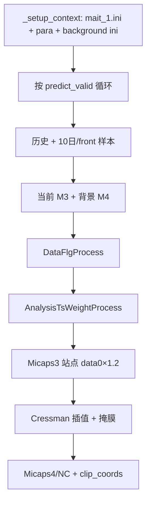

# MAIT 1h 降水自适应集成 — 程序说明

本文档说明仓库 **MAIT 1h** 的**业务场景**、**主流程**与**调用方式**，与 `nbs/mait_1h_说明.ipynb` **§1–§7** 保持一致。Notebook **§8 起**为检验与改造对比（不在本文档范围内）。

**核心源码**：

| 模块 | 文件 |
|------|------|
| 主入口 / 命令行 | `src/mait_1h_cli.py` — `process()` / `RunProcess` / Clize CLI |
| 权重与插值 | `src/mait_1_plugin.py` |
| 读数与时间 | `src/mait_1_plugin_util.py` |
| 运行上下文 | `src/utils/util_context.py` — `RunContext` |
| 插件基类 / 多进程 | `utils/base_plugin.py`、`utils/multipro_plugin.py` |
| 配置与 I/O | `utils/util_env.py`、`utils/util_new.py` |
| 运行默认项 | `resource/mait_1.ini` |

---

## 1. 适用场景

| 场景 | 说明 |
|------|------|
| **1h 多模式集成** | 读取多套模式的 **Micaps3 站点** 1h 降水，按子区 TS 动态加权，经频率匹配订正后写出站点产品，再插值到格点。 |
| **逐起报、逐时效批处理** | 支持多个 `time_input`；每个起报对 `predict_valid_list`（默认 **1–48 h**）逐小时循环。 |
| **分区权重** | `split_lat × split_lon` 划分子区；`area_scale=0.5` 扩展训练邻域后分别算 TS 与权重。 |
| **双路 TS** | **近 10 日**同时效样本 → `score_before`；**当前时效前 1 h** 样本 → `score_now`；`score_last = 0.5×score_before + 0.5×score_now`。 |
| **Micaps 产品** | 站点 **Micaps3**（`staoutputPath`）；格点 **Micaps4 + NC**（`write_grid_to_micaps4`）。 |
| **服务区约束** | 插值掩膜 `mask010.dat`；写出前按 `clip_coords` 裁剪格点。 |

---

## 2. 主流程（`RunProcess._process_single`）

### 2.1 初始化（`_setup_context`）

1. `os.chdir` → **`src/`**  
2. `get_resolved_paths()` → **`mait_1.ini`**  
3. `_prepare`：12 位 `%Y%m%d%H%M` → `dt_now`，读 `sta.info`  
4. `_analysis_para_ini`：读 **`local.ini`**（或 `para_1.ini`，由 `para_ini` 指定）  
5. `_analysis_background_ini` → **`para_1_background.ini`**  
6. `build_run_context`；background 缺键 → `ctx=None` 退出  

### 2.2 按时效循环

| 步骤 | 函数 | 要点 |
|------|------|------|
| 历史样本 | `_read_history_source_micaps3` | 昨日 fact + 模式 M3；**实况缺失则中断** |
| 评分样本 | `_read_mait_st_like_score_samples` | 10 日 + front 1h |
| 当前读数 | `_read_now_source_micaps3_nc` | M3 + 背景 M4；`dt_search_base` |
| 质检 | `DataFlgProcess` | 当前全缺 → `continue` 跳过 |
| TS 融合 | `AnalysisTsWeightProcess` | TS 0.1/1/5/10；beta 链关闭 |
| 站点 | `mait_1h_cli` | `id` 去重；**`data0×1.2`** |
| 格点 | `StationDataInterp2GridDataProcess` | Cressman + 掩膜 + FM |
| 写出 | `write_grid_to_micaps4` | `.m4` + `.nc` |

**不足 48 时效**：配置为 1–48，但模式全缺会跳过；历史 fact 缺失会中断。

### 2.3 读数分工

| 数据 | 配置 | 说明 |
|------|------|------|
| 模式 M3 | para | VVV→TTT；36h 回溯 |
| 背景 M4/NC | `para_1_background.ini` | 仅 TTT；无文件 → 全 0 格点 |
| 实况 | para 的 `fact` | `is_obs_bjt` 对齐 |

### 2.4 `dt_search_base`

`is_obs_bjt=True` 时 **`dt_now−8h`** → 用于检索与 **`grid_base.gtime`**（输出文件名 UTC 时刻）。  
例：北京 `202507020000` → 输出 `2025070116.VVV.*`。

### 2.5 数据流示意



---

## 3. 目录与核心文件

| 路径 | 作用 |
|------|------|
| `src/mait_1h_cli.py` | 主入口 |
| `src/mait_1_plugin.py` | TS、Cressman、DataFlg |
| `src/mait_1_plugin_util.py` | 读数、background、回溯 |
| `src/utils/util_context.py` | `RunContext`、`dt_search_base` |
| `utils/base_plugin.py` | `PostProcessingPlugin` 基类 |
| `utils/multipro_plugin.py` | `SimpleParallelTool` 多进程 |
| `utils/util_env.py` | `mait_1.ini` 配置解析 |
| `utils/util_new.py` | 掩码、Micaps、FM、全 0 背景 |
| `utils/data_prepare_plugin.py` | meteva 数据集准备（辅） |
| `utils/data_distribute_pulgin.py` | 数据文件分发（辅） |
| `src/mait_1_verify.py` | 检验脚本 |
| `test/mait_1_nimm_test.py` | 批量起报测试 |
| `cli/__main__.py` | `python -m cli` 转发至 `src/mait_1h_cli.py` |

## 4. 算法要点

- **TS**：阈值 0.1/1/5/10 mm，权重 0.3/0.2/0.25/0.25；`score_last = 0.5×before + 0.5×now`  
- **融合**：线性加权 + `MetevaFrequencyMatch`  
- **格点**：Cressman 0.6/0.4/0.2/0.1 → 平滑 10 次 → 格点 FM → 极值处理  

---

## 5. 配置文件说明

| 文件 | 内容 |
|------|------|
| `resource/mait_1.ini` | 日志、**`para_ini`**、background、mask、clip、时效、多进程 |
| `resource/local.ini` / `para_1.ini` | 模式 M3、`fact`、`staoutputPath`（GBK） |
| `resource/para_1_background.ini` | 背景 M4/NC，键名与 para 一致 |
| `resource/sta.info` | 站点表 |
| `resource/mask010.dat` | 插值掩膜 |

**重要**：程序只读 `mait_1.ini` 里 **`para_ini=`** 指定的文件；生产环境请设 `para_ini=resource/para_1.ini` 或 `--para-path`。

---

## 6. `process()` 参数

**调用链**：`python -m cli` / `python src/mait_1h_cli.py` → `process()` → `RunProcess._process_single()`。

| 参数 | 作用 | `None` 时 |
|------|------|----------|
| `time_inputs` | 起报列表（12 位） | CLI 必填 |
| `predict_valid_list` | 时效循环 | ini：1…48 |
| `para_path` | para 文件 | ini：`para_ini` |
| `beta_path` | beta 模板（主循环未用 npy 链） | ini |
| `is_obs_bjt` | 是否减 8h | ini：`is_obs_bj` |
| `is_multi` / `pro_count` | 多进程 | ini |
| `clip_coords` / `split_lat` / `split_lon` | 裁剪与分区 | ini |

---

## 7. CLI 示例

```text
python -m cli --time-inputs=202605260800
python src/mait_1h_cli.py --time-inputs=202507020000 --para-path=resource/para_1.ini
python -m cli --help
```

| CLI 选项 | `process` 参数 |
|----------|----------------|
| `--time-inputs` | `time_inputs` |
| `--predict-valid-list` | `predict_valid_list` |
| `--para-path` | `para_path` |
| `--beta-path` | `beta_path` |
| `--is-obs-bjt` | `is_obs_bjt` |
| `--is-multi` | `is_multi` |
| `--clip-coords` | `clip_coords` |
| `--pro-count` | `pro_count` |
| `--split-lat` / `--split-lon` | `split_lat` / `split_lon` |

依赖：`pip install -r requirements-cli.txt`；失败时查 `log/YYYYMMDD.txt`。
