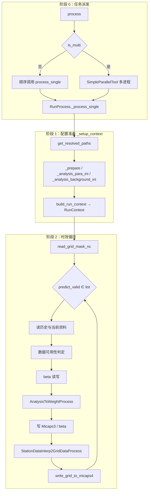

# MAIT 24 小时降水自适应集成程序说明

本文档说明本仓库 **MAIT 24h** 一体化程序的应用场景、算法思路、关键实现位置、配置与运行方式，便于运维与二次开发。

---

## 1. 文档与工程定位

- **程序性质**：多模式 **24 小时累积降水** 的业务型集成流水线；在站点维度估计动态权重并完成融合与订正，再插值到规则经纬网格，输出 Micaps 等业务格式。
- **设计目标**：与既有业务数据接口（Micaps3/Micaps4 等）对齐；支持按预报时效与空间分区调整权重；支持掩码约束下的格点产品写出。
- **相关材料**：更偏专利交底口径的表述见同目录 [`Mait技术交底_发明内容.md`](./Mait技术交底_发明内容.md)；历史简要说明见项目根目录 `README.md`；交互式说明见 [`nbs/mait_24h_说明.ipynb`](../nbs/mait_24h_说明.ipynb)（与本文档程序说明部分一致，另含检验与版本对比附录）。

---

## 2. 应用场景

| 场景 | 说明 |
|------|------|
| **业务模式集成** | 对多个数值模式 24h 降水预报进行融合，得到单套「集成+订正」后的站点与网格产品。 |
| **时效序列批处理** | 对多个起报时次、多个预报时效（如 36–252 h、步长 24 h）循环处理，适用于业务化日/旬滚动。 |
| **分区权重** | 通过 `split_lat`、`split_lon` 将区域划分为若干子块，每块独立做评分与权重，缓解大范围单一权重带来的空间失配。 |
| **权重记忆（beta）** | 读入历史评分、写出本轮 `score_last`，实现跨时次滚动更新（路径由 `beta_path` 配置）。 |
| **有效范围约束** | 使用与目标网格一致的掩码（默认 `resource/mask010.nc`，由 `mait_24.ini` 的 `mask_nc` 指定），避免在服务区域外产生无业务含义的格点值。 |

**不适用或需自行扩展的情形**：模式动力过程改进、观测新型质控、与本仓库 Micaps 接口不同的全新数据格式等，不在本程序默认范围内。

---

## 3. 程序架构与模块划分

### 3.1 处理阶段划分

程序按时间尺度分为三个阶段：**配置准备**（每个 `time_input` 一次）、**时效循环**（每个 `predict_valid` 一次）、**产品写出**（嵌入时效循环末尾）。



### 3.2 运行上下文（RunContext）

`RunContext`（`utils/mai_24_plugin_context.py`）在配置准备阶段组装，贯穿时效循环向下游传递。`build_run_context` 不执行文件读取，仅将已解析参数装箱为四层结构：

| 层级 | 字段 | 含义 |
|------|------|------|
| `ctx.paths` | `beta_path_template`, `fact_path`, `output_sample_path`, `model_path`, `background_templates` | 路径模板 |
| `ctx.models` | `model_name` | 模式键名序列，与 `para_24.ini` 一致 |
| `ctx.grid` | `clip_coords`, `split_lat`, `split_lon`, `area_scale`, `predict_type` | 空间分区与算法标量 |
| `ctx.session` | `dt_now`, `sd_sta_info`, `is_obs_bjt` | 起报时刻、站点表、实况时区标志 |

### 3.3 日志与异常

- 日志在 `RunProcess._setup_context` / `_process_single` 中通过 `init_run_log` 创建，仅主流程写入。
- 子模块不记录日志；读数失败等情况抛出异常，由主流程捕获并写入 `log.error`。
- 多进程运行时，子进程日志文件在 `time_input` 后缀基础上附加进程号，避免并发写入同一文件。

### 3.4 目录与核心文件

| 路径 | 作用 |
|------|------|
| `src/mait_24h_cli.py` | 主入口：`RunProcess`、`process`/`process_single`/`process_multi` |
| `src/mait_24_plugin.py` | `AnalysisTsWeightProcess`、`StationDataInterp2GridDataProcess` |
| `src/mait_24_plugin_util.py` | 模式与实况读取：`_read_history_source_micaps3`、`_read_now_source_micaps3_micaps4`、`_analysis_background_ini`（`para_24_background.ini`） |
| `utils/mai_24_plugin_context.py` | `RunContext` 分层上下文与 `build_run_context` |
| `utils/base_plugin.py` | 后处理插件基类 `PostProcessingPlugin` |
| `utils/multipro_plugin.py` | `SimpleParallelTool` 多进程封装 |
| `utils/util_new.py` | INI 解析、掩码读取、Micaps 写出、beta 路径与读写、格点/站点工具类 |
| `utils/util_env.py` | 全局路径与运行默认值（`resource/mait_24.ini`） |
| `utils/util_mask_file.py` | 辅助：矢量边界（如 GeoJSON）栅格化为掩码 NC/DAT（与主线可衔接） |
| `utils/data_prepare_plugin.py` | 数据准备插件（扩展，非主流程必需） |
| `utils/data_distribute_pulgin.py` | 数据分发插件（扩展） |
| `cli/`（`python -m cli`） | 薄封装：转调 `src/mait_24h_cli.py` 命令行入口 |
| `src/mait_24h_cli.py` | 主入口与 Clize 命令行：`process` / `main` / `python src/mait_24h_cli.py` |
| `requirements-cli.txt` | 命令行额外依赖：**clize**（≥5） |

运行期约定：`src` 为工作目录（程序内 `os.chdir` 到 `mait_24h_cli.py` 所在目录），并需能将 `utils` 作为包导入。除使用下文 **7.4 节命令行** 外，**建议将项目根目录与 `src` 均加入 `PYTHONPATH`（或直接 `import` 前等价设置）**。

---

## 4. 完整算法流程与关键节点实现

本节按程序执行顺序说明各关键节点的输入、处理原理、输出及对应实现位置。

### 4.1 阶段 0：任务派发

| 项目 | 说明 |
|------|------|
| **入口** | `mait_24h_cli.process` |
| **输入** | `time_inputs` 及运行参数；缺省项由 `utils/util_env.get_default_*` 从 `resource/mait_24.ini` 补齐 |
| **原理** | 每个起报时刻对应一个 `RunProcess` 实例；`is_multi=True` 时由 `SimpleParallelTool` 将 `time_inputs` 分发至多个 worker 并行执行 |
| **实现** | `src/mait_24h_cli.py`：`process` / `process_single` / `process_multi`；`utils/multipro_plugin.py` |

### 4.2 阶段 1：配置准备（`_setup_context`）

| 步骤 | 原理 | 实现 |
|------|------|------|
| 工作目录 | 切换至 `src`，保证 `para_24.ini` 中相对路径按业务约定展开 | `os.chdir` |
| 路径解析 | 读取 `mait_24.ini`，将相对路径展开为绝对路径 | `utils/util_env.get_resolved_paths` |
| 站点表 | 解析 `time_input` 为 `dt_now`；读取 Micaps3 站点表并初始化降水列为 0 | `utils/util_new._prepare` |
| 模式配置 | 按 GBK 固定行序解析 `para_24.ini`：`modelNum`、N 行模式路径、`fact`、`staoutputPath` | `utils/util_new._analysis_para_ini` |
| 背景模板 | 解析 `para_24_background.ini` 为 `模式键名 → MICAPS4 路径模板` 字典 | `mait_24_plugin_util._analysis_background_ini` |
| 上下文装箱 | 将上述结果与运行参数写入 `RunContext` | `mai_24_plugin_context.build_run_context` |

### 4.3 阶段 2-A：时效循环——资料读取

对每个 `predict_valid`，依次读取历史样本与当前预报。

#### 4.3.1 时间换算（`_analysis_time1` / `_analysis_time2` / `_analysis_time3`）

三个时间函数将业务运行时刻、模式起报规则与预报时效统一为 Micaps 路径展开所需的时间戳。

**`_analysis_time1(dt_now)`** — 模式世界时起报时刻

| 条件 | `md_current_datetime` | `num3` |
|------|----------------------|--------|
| `hour > 12` 且 `hour ≤ 23` | 当日 00 UTC | 0 |
| 其余时刻 | 前一日 12 UTC | 12 |

**`_analysis_time2(md_current_datetime, predict_valid, num3, is_obs_bjt)`** — 实况与验证时刻

1. `dt_valid = md_current_datetime + predict_valid`
2. `dt_fact` 日界：`num3 == 0` 时取起报前一日，否则取起报当日；再将 `dt_fact` 的小时替换为 `dt_valid.hour`，实现日界对齐
3. 若 `is_obs_bjt=True`，`dt_fact` 加 8 h 转为北京时
4. 返回 `(dt_fact, dt_valid, dt_model_current)`

**`_analysis_time3(md_current_datetime, predict_valid, num3)`** — 历史模式起报时刻

在 `_analysis_time2` 的 `dt_fact` 基础上再减 `predict_valid` 小时，得到昨日同时效模式起报 `dt_model_before`，用于读取历史模式场参与 TS 评分。

#### 4.3.2 历史资料读取（`_read_history_source_micaps3`）

| 数据 | 时间换算 | 文件 |
|------|----------|------|
| 实况 `sd_fact` | `_analysis_time2`：由起报时刻、`predict_valid`、`is_obs_bjt` 计算 `dt_fact` | `ctx.paths.fact_path` |
| 历史模式 `sd_before_model` | `_analysis_time3`：计算昨日同时效起报 `dt_model_before` | `ctx.paths.model_path[i]` |

- 对每个模式：文件存在且读取成功则 `sta_before_flg[i]=1`，否则为 0
- 实况文件缺失或格式错误时抛出异常，终止当前时效处理
- 预分配 `sd_current_model` 容器供下一步填充

**实现**：`src/mait_24_plugin_util.py`

#### 4.3.3 当前资料读取（`_read_now_source_micaps3_micaps4`）

| 数据 | 说明 |
|------|------|
| 当前模式站点 `sd_current_model` | 起报 `dt_model_current`、时效 `predict_valid` 的 Micaps3 |
| 标志 `sta_current_flg` | 同上，按模式记录可用性 |
| 背景格点 `gd_back_ground` | 遍历模式，取首份存在的 MICAPS4 作为网格范围模板 |
| 网格元信息 `grid_base` | 由 `gd_back_ground` 经纬范围与当前时效构建 `meb.grid` |

MICAPS4 路径优先取 `ctx.paths.background_templates[model_name]`；缺键时回退为同模式 Micaps3 路径改后缀 `.m4`。

**实现**：`src/mait_24_plugin_util.py`

#### 4.3.4 数据可用性判定

主流程检查：

- `np.any(sta_before_flg)`：至少一个历史模式可用，否则终止
- `np.any(sta_current_flg)`：至少一个当前模式可用，否则终止

**实现**：`src/mait_24h_cli.py` → `_process_single`

### 4.4 阶段 2-B：beta 评分记忆

| 步骤 | 原理 | 实现 |
|------|------|------|
| 路径生成 | 按 `grid_base` 经纬范围与 `split_lat/split_lon` 划分子区 `(i,j)`，拼接 `beta_path_template` 与 `%02d_%02d_TTT.npy` | `get_now_beta_file_path_npy`、`get_his_beta_file_path_npy` |
| 历史评分读取 | 向前逐日检索至多 9 天，取最近存在的 npy 文件；解析为各模式 `score_before` 向量 | `read_his_beta_npy` |
| 本轮写出 | TS 计算完成后，将 `score_last` 写入对应子区 npy 文件 | `write_beta_npy` |

beta 文件实现跨时次评分记忆：`score_before` 经指数平滑参与下一轮权重计算。

**实现**：`utils/util_new.py`

### 4.5 阶段 2-C：分区 TS 权重与站点集成（`AnalysisTsWeightProcess`）

核心算法在 `_analysis_ts_weight` 中按子区 `(i,j)` 独立执行。

#### 4.5.1 空间分区与训练邻域

1. 将 `grid_base` 经纬矩形按 `split_lon`、`split_lat` 均分为 `xxn × yyn` 个子区
2. 每个子区定义**预测区**（子区本身）与**训练区**（预测区向外扩展 `area_scale` 倍格距，默认 0.5）
3. 用 `meb.sele_by_para` 在训练区内裁剪各模式历史/当前站点场及实况

#### 4.5.2 多量级 TS 评分

对降水阈值 **0.1 / 10 / 25 / 50 mm** 分别计算：

| 量 | 计算对象 | 含义 |
|----|----------|------|
| `ts_fact[i]` | 模式 *i* 历史场 vs 实况 | 各模式预报技巧 |
| `ts_each[i][j]` | 模式 *i* vs 模式 *j* 历史场 | 模式间相似性（冗余度） |

量级权重 `rain_limit_weight` 随时效调整：

- `predict_valid ≤ 60 h`：`[0.1, 0.15, 0.3, 0.45]`（偏重暴雨量级）
- 否则：`[0.1, 0.2, 0.45, 0.25]`（偏重中雨量级）

各量级临时评分（`similar_smooth = 100000.0`）：

\[
e\_ts_i = \frac{1}{N}\sum_j \text{ts\_each}_{ij}, \quad
\text{score\_tmp}_i = \frac{\text{ts\_fact}_i}{e\_ts_i + \text{similar\_smooth}}
\]

对 `score_tmp` 归一化；若该量级无可判性（全部模式 TS < 0.1），则各模式均等权重 `1/N`。归一化后的 `score_tmp` 按 `rain_limit_weight` 累加得 **score_now**。

#### 4.5.3 历史评分融合

1. 若子区无历史 beta（`iflag=0`）或 `score_before` 总和为零，以 `score_now` 初始化 `score_before`
2. 否则将 `score_before` 归一化至总和为 1
3. 指数平滑（`α = 0.1`）：

\[
\text{score\_last}_n = (1-\alpha)\cdot \text{score\_before}_n + \alpha\cdot \text{score\_now}_n
\]

#### 4.5.4 时效筛选与权重归一化

| 时效范围 | 策略 |
|----------|------|
| 108 h ≤ `predict_valid` ≤ 238 h | 仅保留 `ecModel` 非零权重，其余模式置零 |
| 其它时效 | 按评分降序保留前 5 个模式，其余置零 |

最终模式权重：

\[
w_n = \frac{\text{sta\_current\_flg}_n \cdot \text{score\_last}_n}{\sum_k \text{sta\_current\_flg}_k \cdot \text{score\_last}_k + 10^{-6}}
\]

缺失模式因 `sta_current_flg=0` 自动获得零权重。

#### 4.5.5 线性集成与频率匹配

1. **线性集成**：在训练区站点上对当前模式场加权求和，\( \text{集成值} = \sum_n w_n \cdot \text{模式}_n \)
2. **频率匹配**：按 `int(100 × w_n)` 复制各模式样本构造 `output_used` / `current_model_used`，经 `MetevaFrequencyMatch` 按 20 个降水等级（0.01–250 mm）校正分布
3. **裁剪至预测区**：`sele_by_para` 截取子区预测范围站点
4. **小值处理**：小于 0.01 mm 置零

**输出**：`sd_output_list[yyn][xxn]`（各子区集成站点）、`score_last_list`（供 beta 写出）

**实现**：`src/mait_24_plugin.py` → `AnalysisTsWeightProcess`

### 4.6 阶段 2-D：站点产品写出

| 步骤 | 说明 | 实现 |
|------|------|------|
| 子区合并 | 将各 `(i,j)` 子区 `sd_output` 拼接为完整站点 DataFrame | `_process_single` 中 `pd.concat` |
| beta 更新 | 逐子区写入 `score_last` 至 npy | `write_beta_npy` |
| Micaps3 | 按 `output_sample_path` 模板写出集成站点场，`predict_type=24` | `_data_write_to_micaps3` |

### 4.7 阶段 2-E：站点到网格（`StationDataInterp2GridDataProcess`）

掩码文件在时效循环外读取一次（`read_grid_mask_nc`）。

| 步骤 | 原理 |
|------|------|
| 外圈约束点 | 掩码值 `<0` 处按 5×5 稀疏采样背景场格点，作为中国区外约束 |
| 观测序列构造 | 外圈点与集成站点合并为 `StationDataArray` |
| Cressman 插值 | 四半径逐步订正（8/6/4/2 倍格距），参数 `(1.0, 0.001, 2.0, 0.01)` |
| 平滑 | 9 点平滑 5 次 |
| 网格频率匹配 | 双线性将网格值插回站点得 `sd_reference`，再对网格场做 19 级频率校正 |
| 长时效折减 | `predict_valid ≥ 108 h`：全场 ×0.8；≥240 mm 封顶为 250 mm |
| 物理清理 | 小于 0.01 mm 置零 |

**实现**：`src/mait_24_plugin.py` → `StationDataInterp2GridDataProcess._m3_data_interp`

### 4.8 阶段 2-F：格点产品写出（`write_grid_to_micaps4`）

- 输入：Cressman 订正后的 `gd_final_output`、`grid_base`、`ctx`
- 若 `clip_coords` 为六元组 `[slon, elon, slat, elat, dlon, dlat]`，先线性插值至裁剪网格再写出
- 输出 Micaps4 与 NetCDF，路径由 `output_sample_path` 模板展开

**实现**：`utils/util_new.write_grid_to_micaps4`

---

## 5. 代码索引

| 内容 | 位置 |
|------|------|
| 主循环：准备 ctx、时效遍历、读数、融合、写 Micaps3/4 | `src/mait_24h_cli.py` → `_setup_context` / `_process_single` |
| 运行上下文组装（无文件 IO） | `utils/mai_24_plugin_context.py` → `build_run_context` |
| 时间换算 | `src/mait_24_plugin_util.py` → `_analysis_time1/2/3` |
| TS 权重、集成、站点频率匹配 | `src/mait_24_plugin.py` → `AnalysisTsWeightProcess._analysis_ts_weight` |
| 历史/当前 Micaps 读取 | `src/mait_24_plugin_util.py` |
| 数据可用性检查 | `src/mait_24h_cli.py` |
| Cressman 插值与网格频率匹配 | `src/mait_24_plugin.py` → `StationDataInterp2GridDataProcess` |
| INI 解析、Micaps 写出、beta、掩码、日志 | `utils/util_new.py` |
| 全局路径与运行默认值 | `utils/util_env.py` |
| 多进程派发 | `utils/multipro_plugin.py` |
| 掩码制作（GeoJSON→栅格） | `utils/util_mask_file.py` |

---

## 6. 配置文件说明（`para_24.ini`）

解析逻辑见 `utils/util_new._analysis_para_ini`：**GBK 编码**，固定行序如下。

1. **第一行**：`modelNum=<整数N>` — 参与集成的模式个数。  
2. **紧随其后的 N 行**：每行 `模式键名=<路径模板>`。  
   - 路径中可使用 **`YYYYMMDD`、`YYYYMMDDHH`、`YYMMDDHH`、`VVV`（三位预报时效）** 等占位，运行期由 meteva 风格路径函数展开（与 Micaps 文件名习惯一致）。  
3. **下一行**：`fact=<实况路径模板>` — 24h 实况站点数据。  
4. **下一行**：`staoutputPath=<输出路径模板>` — 集成产品输出路径模板（同样支持上述占位符）。

示例（片段，路径需按部署环境修改）：

```ini
modelNum=10
ecModel=/path/.../YYYYMMDDHH.VVV.m3
...
fact=/path/.../YYMMDDHH.000
staoutputPath=/path/.../YYYYMMDD/YYYYMMDDHH.VVV
```

**注意**：模式在 INI 中的**顺序与键名**会传入权重与长时效「仅保留 ecModel」等逻辑，增删模式时需同步检查 `mait_24_plugin.py` 中与 `model_name` 相关的分支。

### 6.1 背景格点路径（`para_24_background.ini`）

各模式 **MICAPS4 格点**路径单独配置，与 `para_24.ini` 中 MICAPS3 站点模板解耦，便于目录或命名不完全一致时维护。

| 项 | 说明 |
|------|------|
| **默认路径** | `<仓库>/resource/para_24_background.ini`；由 `resource/mait_24.ini` 中 ``background_ini`` 配置；缺键时回退为该路径。|
| **配置文件** | 见 ``resource/mait_24.ini``；``get_resolved_paths()["background_ini"]``。 |
| **编码与格式** | **GBK**；无 `modelNum` 头；每行 `模式键名=MICAPS4路径模板`。`#` 开头行为注释。键名须与 `para_24.ini` 中对应模式键名一致。 |
| **占位符** | 须与 `meteva_base.get_path` 一致（如 `YYYYMMDD`、`YYYYMMDDHH`、`TTT` 等），由运行期起报时刻与预报时效展开。 |
| **解析与注入** | `_analysis_background_ini` → `dict`，经 `build_run_context` 进入 `ctx.paths.background_templates`；`_read_now_source_micaps3_micaps4` 用其定位首份 `gd_back_ground`。 |
| **时间参数** | 首份可用 MICAPS4 作为 `gd_back_ground`（定经纬范围）：`meb.get_path(模板, md_current_datetime, predict_valid)`。 |

若 `background_templates` 中缺少某模式键，该模式格点路径仍回退为「当前循环内 MICAPS3 路径改后缀 `.m4`」，与旧版行为一致。

---

## 7. 运行参数说明

### 7.1 主函数 `mait_24h_cli.process`

定义见 `src/mait_24h_cli.py`。调用前请保证 **`time_inputs` 为非空列表**（当前实现未对 `None` 做默认处理）。

| 参数 | 类型 | 含义 | 默认/备注 |
|------|------|------|-----------|
| `time_inputs` | `list[str]` | 起报时刻列表，如 `'202507010800'`（与业务约定一致，多为世界时，见 `is_obs_bjt`） | 必传（业务上） |
| `predict_valid_list` | `list[int]` | 预报时效（小时），如 `[36,60,...,252]` | 默认 `36..252` 步长 24 |
| `para_path` | `str \| None` | `para_24.ini` 路径 | `None` 时用 `resource/mait_24.ini` 的 `para_ini` |
| `beta_path` | `str \| None` | beta（历史评分）目录模板，可含 `YYYYMMDDHH` | `None` 时用 `mait_24.ini` 的 `bate_file` |
| `is_obs_bjt` | `bool` | 实况时间是否为北京时间 | 默认 `True` |
| `is_multi` | `bool` | 是否多进程处理多个 `time_input` | 默认 `False` |
| `clip_coords` | `list \| None` | 输出裁剪：`[slon, elon, slat, elat, dlon, dlat]` | `None` 表示不按该参数裁（写出函数内仍可能用网格自身范围） |
| `pro_count` | `int` | 多进程 worker 数量 | 默认 `4` |
| `split_lat` | `int` | 纬度方向分区数 | 默认 `1` |
| `split_lon` | `int` | 经度方向分区数 | 默认 `1` |

### 7.2 运行期固定约定（代码内写死或可改）

| 项 | 当前实现 |
|----|----------|
| 预报类型 `predict_type` | **24**（`build_run_context` 默认） |
| `area_scale` | **0.5**（`build_run_context` 默认） |
| 掩码文件 | `resource/mait_24.ini` → `mask_nc`（默认 `resource/mask010.nc`） |
| 站点信息 | `resource/mait_24.ini` → `station_info` |
| 日志 | `resource/mait_24.ini` → `log_file`；单进程 `log/YYYYMMDD_{time_input}.txt`；多进程子进程另含 `_pid` |

### 7.2.1 RunContext 字段（`utils/mai_24_plugin_context.py`）

| 子对象 | 主要字段 | 来源 |
|--------|----------|------|
| `ctx.paths` | `beta_path_template`, `fact_path`, `output_sample_path`, `model_path`, `background_templates` | `mait_24.ini` + `para_24.ini` + `para_24_background.ini` |
| `ctx.models` | `model_name` | `para_24.ini` |
| `ctx.grid` | `clip_coords`, `split_lat/lon`, `area_scale`, `predict_type` | CLI/`mait_24.ini` + 代码默认 |
| `ctx.session` | `dt_now`, `sd_sta_info`, `is_obs_bjt` | `_prepare` + 运行参数 |

### 7.3 调用示例

批处理脚本见 `test/test_mait_24h.py`。最小调用示例：

```python
import mait_24h_cli

mait_24h_cli.process(
    time_inputs=["202507010800", "202507012000"],
    predict_valid_list=[36, 60, 84, 108, 132, 156, 180, 204, 228, 252],
    para_path=None,   # 省略时使用 resource/mait_24.ini → para_ini
    beta_path=None,   # 省略时使用 resource/mait_24.ini → bate_file
    is_obs_bjt=True,
    is_multi=True,
    clip_coords=[70.0, 140.0, 0.0, 60.0, 0.1, 0.1],
    pro_count=8,
    split_lat=2,
    split_lon=2,
)
```

运行前：在 `resource/` 下准备 `para_24.ini`、`para_24_background.ini`、`station_info.txt`、`mask010.nc` 及业务数据目录；程序运行期工作目录为 `src`。若不用 7.4 节 CLI，需将项目根目录与 `src` 加入 `PYTHONPATH`。

### 7.4 命令行调用（Clize：`cli`）

在项目**根目录**（与 `src`、`cli` 同级）执行。依赖 **clize**（见 `requirements-cli.txt`，可使用 `pip install -r requirements-cli.txt` 或随业务环境一并安装）。

**入口方式（任选其一）：**

```text
python -m cli [选项...]
python src/mait_24h_cli.py [选项...]
```

二者等价；命令行参数解析均在 `src/mait_24h_cli.py` 内实现（Clize）。

查看自动生成的参数说明：

```text
python -m cli --help
```

**命令行参数与 `process` 的对应关系（Clize 将 Python 形参转为 `--kebab-case`）：**

| 命令行选项 | 类型 | 对应 `process` 形参 | 含义 | 默认 / 省略时 |
|------------|------|---------------------|------|----------------|
| `--time-inputs` | 逗号分隔字符串 | `time_inputs` | 起报时刻列表，如 `202507010800,202507012000` | **必选**；不可为空（与 7.1 节一致） |
| `--predict-valid-list` | 逗号分隔整数 | `predict_valid_list` | 预报时效（小时），如 `36,60,84,...,252` | 省略则 `36..252`、步长 **24** |
| `--para-path` | 字符串 | `para_path` | `para_24.ini` 路径（相对/绝对均可） | 省略为 `None` → `resource/mait_24.ini` 的 `para_ini` |
| `--beta-path` | 字符串 | `beta_path` | beta 目录模板（可含 `YYYYMMDDHH`） | 省略为 `None` → `resource/mait_24.ini` 的 `bate_file` |
| `--is-obs-bjt` | 布尔 | `is_obs_bjt` | 实况是否按北京时间 | 默认 **True**；关闭时请以 `python -m cli --help` 为准（常见为 `--no-is-obs-bjt` 或 `--is-obs-bjt=False`） |
| `--is-multi` | 开关 | `is_multi` | 是否对多个 `time_input` 多进程 | 默认关闭；**需要多进程时加上 `--is-multi`** |
| `--clip-coords` | 六个逗号分隔浮点数 | `clip_coords` | 裁剪：`slon,elon,slat,elat,dlon,dlat` | 省略为 `None` |
| `--pro-count` | 整数 | `pro_count` | 多进程 worker 数量 | 默认 **4** |
| `--split-lat` | 整数 | `split_lat` | 纬度方向分区数 | 默认 **1** |
| `--split-lon` | 整数 | `split_lon` | 经度方向分区数 | 默认 **1** |

**说明：**

- 列表在命令行中为**逗号分隔**，不要带方括号；路径含空格时请按所用 shell 规则加引号或转义。
- CLI 在导入前会把 **`src`** 与**项目根目录**加入 `sys.path`（`mait_24h_cli._bootstrap_paths`），一般**无需**再设 `PYTHONPATH`。

**全参数示例（与 7.3 节取值一致，一行可复制）：**

```text
python -m cli --time-inputs=202507010800,202507012000 --predict-valid-list=36,60,84,108,132,156,180,204,228,252 --is-obs-bjt=True --is-multi --clip-coords=70.0,140.0,0.0,60.0,0.1,0.1 --pro-count=8 --split-lat=2 --split-lon=2
```

（多行时：**cmd** 行尾可用 `^` 换行；**PowerShell** 可用反引号 `` ` ``。）**仅必选参数、其余默认**：

```text
python -m cli --time-inputs=202507010800
```

---

## 8. 依赖环境

运行本程序至少需要（按各模块 import 归纳）：

- **Python 3.x**
- **numpy**、**pandas**
- **meteva_base**；主流程及部分检验脚本还需 **meteva**
- **xarray**（`utils/util_new.py` 等）
- 掩码与边界工具：`geopandas`、`shapely`（`utils/util_mask_file.py`）
- 使用 7.4 节命令行时：**clize**（≥5，见 `requirements-cli.txt`）

具体版本请与业务环境（如 107 服务器/Meteva 栈）对齐。

---

## 9. 单元测试

不依赖完整 Micaps 数据栈的测试位于 `test/`：

| 文件 | 覆盖内容 |
|------|----------|
| `test/test_conftest.py` | 将 `src` 与项目根加入 `sys.path`、`meteva` 桩（由 `conftest.py` 导入） |
| `test/test_run_context.py` | `build_run_context`、`_analysis_para_ini`、`_analysis_background_ini`、`util_env` |
| `test/test_mait_24h_cli_flow.py` | `_setup_context`（mock 读站）、`init_run_log` 多进程分文件 |
| `test/test_mait_24h.py` | 批处理调用脚本（需完整业务数据环境） |

在项目根目录执行：

```text
python -m pytest test/ -v
```

---

## 10. 输出与检验

- **站点集成**：Micaps3（`_data_write_to_micaps3`）。
- **网格产品**：Micaps4（`write_grid_to_micaps4`），受掩码与 `clip_coords` 影响。
- **beta**：按分区写出来的评分文件，供下一时次 `read_his_beta_npy` 使用。

仓库内 `src/mait_24_verify.py` 等脚本可用于与 **meteva** 检验流程结合（依赖完整数据与环境）。

---

## 11. 修订记录

| 日期 | 说明 |
|------|------|
| 2026-05-07 | 初版：应用场景、算法、实现索引、INI/`process` 参数、目录约定与依赖 |
| 2026-05-09 | 增补：`para_24_background.ini`、`_read_now_source_micaps3_micaps4` 与文档 6.1 节 |
| 2026-05-26 | 全局默认路径与运行项统一改由 `resource/mait_24.ini` 提供（见 `utils/util_env.py`） |
| 2026-06-09 | 重构：`RunContext`/`build_run_context`、主流程集中日志、多进程日志分文件；增补第 4 节完整算法流程与关键节点实现说明；更新 pytest 用例；与 `nbs/mait_24h_说明.ipynb` 程序说明对齐 |
