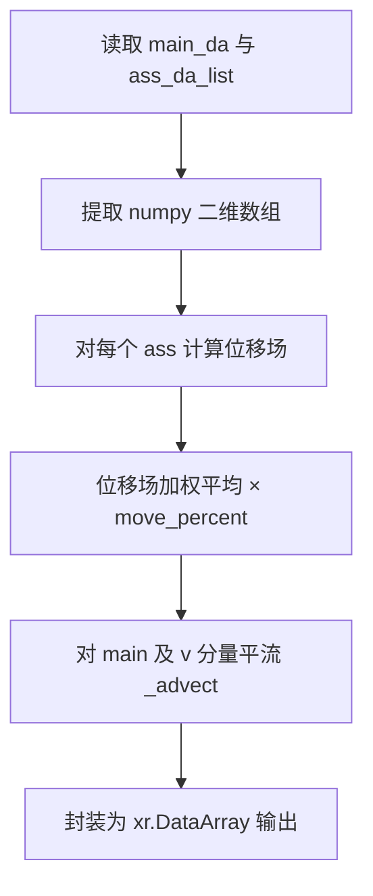

# FFT 特征匹配融合 — 程序说明

## 1. 适用场景

| 场景 | 说明 |
|------|------|
| **多源气象场空间对齐** | 将主预报场中的空间特征（如台风、锋面）向辅助预报场对齐，实现特征匹配后的融合。 |
| **UV 风场融合** | 输入 `member` 维度长度为 2 时，按 u/v 矢量联合处理，位移场同时作用于两个分量。 |
| **标量场融合** | 输入 `member` 维度长度为 1 时，按标量场处理。 |
| **集合预报融合** | 支持多个辅助场列表，对各辅助场分别计算位移后取平均，再对主数据进行平流变换。 |
| **区域裁剪加速** | 对大尺度格点数据，可裁剪关注区域进行融合，再将结果贴回全图以提升效率。 |

---

## 2. 算法原理

本算法基于谱方法与迭代优化理论，核心思想是通过最小化两个场之间的差异，在频域迭代求解位移场，实现空间对齐与融合。

### 2.1 总体思路

给定主数据场 `main` 与辅助数据场 `ass`，算法估计从 `main` 到 `ass` 特征位置的二维位移场 `(dx, dy)`，再按 `move_percent` 控制移动幅度，对主数据进行平流变换得到融合结果。

### 2.2 特征匹配（Field Alignment 2D）

1. **重采样**：将输入二维场双线性插值至 `feature_border × feature_border` 的统一网格，降低计算量并统一尺度。
2. **归一化**：对参考场与目标场做 min-max 归一化，消除量纲差异。
3. **迭代优化**：在每次迭代中：
   - 根据当前位移场，用双三次插值（`_bicutest`）将参考场平移到当前位置；
   - 计算有效区域内的场差 `dq = loc × (arr1 - arr2)` 作为 forcing；
   - 由场差的梯度构造 forcing 分量 `t1`、`t2`；
   - 对 forcing 做二维 FFT，在频域求解位移增量 `ux`、`uy`；
   - 应用幂律型平滑滤波（`power_model`、`weight_value`）保证位移场物理合理；
   - 累加位移并检查收敛条件（误差中位数、瞬时位移极值、误差变化率）。
4. **收敛判据**：达到 `max_iterations`，或误差中位数 `errl ≤ 1e-4`，或瞬时位移 `errv ≤ 1e-5`，或误差变化 `derrl ≥ 1e+1` 时停止。
5. **尺度还原**：将低分辨率位移场插值回原始网格尺寸，并按宽高比例缩放位移量。

### 2.3 多辅助场融合

对 `ass_da_list` 中每个辅助场分别计算位移场，对 x/y 方向位移取算术平均；若 `move_percent < 1`，则对平均位移按比例缩放。

### 2.4 平流变换

根据最终位移场，对主数据（及 v 分量）进行平流：

1. 反射边界扩展（默认 25 像素）抑制边缘效应；
2. 构建反向映射坐标 `new_x = x - dx`，`new_y = y - dy`；
3. 双线性插值采样得到平流后的场；
4. 对插值产生的 NaN/Inf 位置，回填原始值。

### 2.5 关键技术

| 技术 | 作用 |
|------|------|
| 双线性插值重采样 | 适应不同分辨率，统一特征检测网格 |
| 反射边界扩展 | 避免 FFT 与平流过程中的边缘伪影 |
| 双三次插值 | 亚像素级精确位移计算 |
| 频域求解 | 高效计算整场的位移增量 |
| 约束权重与平滑滤波 | 抑制位移场振荡，保证结果稳定 |

---

## 3. 实现方法与主流程

### 3.1 调用链

```
python -m cli / python cli/fft_merge_cli.py
    → fft_merge_cli.process()
    → fft_merge.FFTMergePlugin.__call__()
    → FFTMergePlugin.process()
    → _move_arr_with_several()
    → _calc_moved_arr() → _calc_moved_arr_with_2d_arr()
    → _advect()
```

### 3.2 `FFTMergePlugin.process` 流程

| 步骤 | 操作 |
|------|------|
| 1 | 校验 `move_percent ∈ (0, 1]` |
| 2 | 从 `main_da` 提取主分量数组；若 `member=2` 则同时提取 v 分量 |
| 3 | 从 `ass_da_list` 提取各辅助场数组 |
| 4 | 调用 `_move_arr_with_several` 计算融合后的 u/v 数组 |
| 5 | 通过 `meteva.base.grid_data` 封装为与原输入一致的 `xr.DataArray` 返回 |

### 3.3 数据流示意



### 3.4 输入数据格式

`main_da` 与 `ass_da_list` 中的每个 `xr.DataArray` 需包含以下维度（顺序固定）：

| 维度 | 要求 |
|------|------|
| `member` | 长度 1（标量）或 2（u/v 风） |
| `level` | 长度 1 |
| `time` | 长度 1 |
| `dtime` | 长度 1 |
| `lat` / `lon` | 空间格点维度，主辅场分辨率一致 |

### 3.5 类内部默认参数

`FFTMergePlugin.__init__` 中定义的内部常量（一般无需修改）：

| 属性 | 默认值 | 说明 |
|------|--------|------|
| `weight_value` | 0.1 | 频域求解 Tikhonov 型约束权重 |
| `power_model` | 2 | 平滑滤波幂律指数（2 或 4） |
| `l_scale` | 1 | FFT 谱域尺度比率 |

---

## 4. 目录与核心文件

| 路径 | 作用 |
|------|------|
| `fft_merge.py` | 核心算法，`FFTMergePlugin` 类 |
| `cli/fft_merge_cli.py` | 示例 CLI，读取 resource 样例并输出融合/线性对比结果 |
| `cli/__main__.py` | `python -m cli` 入口，转发至 `cli/fft_merge_cli.py` |
| `resource/sample_*_uv.m11` | Micaps11 格式示例 UV 风场 |
| `resource/sample_*_fft_uv.m11` | FFT 融合结果参考输出 |
| `resource/sample_*_line_uv.m11` | 线性平均结果参考输出 |
| `docs/FFT_MERGE_程序说明.md` | 程序说明文档 |
| `nbs/fft_merge_说明.ipynb` | 算法说明 Notebook |
| `test/test_fft_merge.py` | 核心算法单元测试 |
| `test/test_fft_merge_cli.py` | CLI 示例流程测试 |
| `requirements.txt` | Python 依赖 |

---

## 5. 参数说明

### 5.1 `FFTMergePlugin.__call__` / `process` 参数

| 参数 | 类型 | 默认值 | 说明 |
|------|------|--------|------|
| `main_da` | `xr.DataArray` | — | 主数据场，待融合调整的目标场 |
| `ass_da_list` | `list[xr.DataArray]` | — | 辅助数据列表，用于特征匹配参考 |
| `feature_border` | `int` | 192 | 内部重采样网格边长（像素）。值越小计算越快，但过小可能导致形变失真；128 约可提升 2/3 效率 |
| `max_iterations` | `int` | 1024 | 位移求解最大迭代次数。减少可加速，过少可能导致特征识别异常 |
| `move_percent` | `float` | 1.0 | 移动比例，取值 `(0, 1]`。1.0 表示完全移动到辅助场特征位置；0.5 表示移动到中间位置 |

### 5.2 CLI 参数

| 选项 | 默认值 | 说明 |
|------|--------|------|
| `--sample` | `b` | 示例数据集标识，可选 `a` 或 `b` |

### 5.3 代码调用示例

```python
import fft_merge

plugin = fft_merge.FFTMergePlugin()
merged_da = plugin(main_da, [ass_da], feature_border=128)
merged_uv_da = plugin(main_uv_da, [ass_uv_da], feature_border=128, move_percent=0.8)
merged_ensemble = plugin(main_da, [ass1_da, ass2_da], feature_border=128, max_iterations=512)
```

### 5.4 使用建议

1. 陆海差异较大时，建议分区单独处理，避免互相干扰。
2. 对强特征（台风、锋面）效果较好；弱梯度场位移估计可能接近零。
3. 大区域数据建议裁剪后融合再贴回，可显著缩短耗时。

---

## 6. 运行方式

### 6.1 安装依赖

```bash
pip install -r requirements.txt
```

依赖：`numpy`、`scipy`、`meteva`、`click`、`xarray`。

### 6.2 命令行示例

```bash
# 查看帮助
python -m cli --help
python cli/fft_merge_cli.py --help

# 运行示例 a
python -m cli --sample a

# 运行示例 b（默认）
python -m cli
python cli/fft_merge_cli.py --sample b
```

### 6.3 示例输出

示例程序在 `resource/` 目录生成以下文件：

| 文件 | 内容 |
|------|------|
| `sample_{a\|b}_fft_uv.nc` | FFT 融合 UV 风 NetCDF |
| `sample_{a\|b}_fft_uv.m11` | FFT 融合 UV 风 Micaps11 |
| `sample_{a\|b}_line_uv.nc` | 线性平均 UV 风 NetCDF（对比用） |
| `sample_{a\|b}_line_uv.m11` | 线性平均 UV 风 Micaps11（对比用） |

输入数据：`sample_{a\|b}1_uv.m11`（主数据）、`sample_{a\|b}2_uv.m11`（辅助数据）。

### 6.4 运行测试

```bash
python -m pytest test/ -v
```

或单独运行：

```bash
python test/test_fft_merge.py
python test/test_fft_merge_cli.py
```
