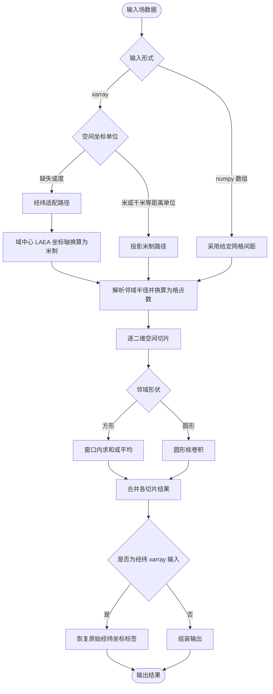

# 邻域处理算法技术说明

## 1. 概述

`nbhood` 模块迁移自 Improver 的 `improver.nbhood.nbhood`，用于二维空间网格上的邻域统计计算。

当前迁移版包含以下核心组件：

- `check_radius_against_distance`：邻域半径与空间域尺度校验
- `circular_kernel`：圆形邻域卷积核构造
- `BaseNeighbourhoodProcessing`：半径与时效解析、公共前置处理
- `NeighbourhoodProcessing`：邻域平均 / 邻域求和（方形或圆形）
- `GeneratePercentilesFromANeighbourhood`：圆形邻域百分位

内部工具（不对外导出，供算法层调用）：

- `neighbourhood_probability_processing/src/utils/_grid.py`：投影米制网格间距推断、坐标单位换算
- `neighbourhood_probability_processing/src/utils/_regrid.py`：经纬输入的 LAEA 坐标轴适配（计算前换米、计算后恢复经纬标签）

说明：

- 算法层未迁移 `MetaNeighbourhood` 类；原编排逻辑在 CLI 层实现（`neighbourhood_probability_processing/cli/ens_nbhood.py`）。
- **xarray 输入**按最后两维空间坐标的 `units` 属性分为两条路径：
  - **投影坐标**：两维均带有可换算到米的距离单位（如 `m`、`km`，且不含 `degree`）。直接读取坐标间距、将半径换算为格点数，在现有米制坐标轴上执行邻域统计；输出保持输入的投影坐标与 `units`。
  - **经纬坐标**：除上述投影情形外的 xarray 输入（典型为坐标无 `units`，或标注为 `degree_`*）。计算前：以域中心构造兰勃特等积方位投影 (Lambert Azimuthal Equal-Area)，将* `lat`*/*`lon` *坐标轴数值换算为米制并改写* `units`*（场数据与格点索引不变）；计算中：与投影路径相同的核心邻域统计；输出前：将结果空间坐标恢复为*输入时保存的经纬模板*（坐标数值与 `units` 有无均与输入一致），并去掉适配阶段临时写入的 `grid_mapping_attrs`。
- **numpy 输入**无坐标对象，须调用方显式传入米制 `grid_spacing`，不触发上述分支与经纬适配。


## 2. 输入输出总览


### 2.1 输入类型

- 支持 `xarray.DataArray`
- 支持 `numpy.ndarray`


### 2.2 输出类型

- 输入为 `numpy.ndarray`：输出为 `numpy.ndarray`（某些路径可能是 `numpy.ma.MaskedArray`）。
- 输入为 `xarray.DataArray`：
  - 当输入是标准 meb 六维（`member, level, time, dtime, lat, lon`）时，输出会重组为标准 meb 六维 `xarray.DataArray`。
  - 当输入不是标准 meb 六维时，默认会在输入校验阶段报错。


## 3. 核心类说明


### 3.1 BaseNeighbourhoodProcessing

职责：

- 校验 `radii` 与 `lead_times` 参数一致性；
- 按输入时效匹配或插值当前半径；
- 检查未掩码输入数据中的 `NaN`；
- 对 `xarray.DataArray` 输入执行网格格式检查。

主函数：

- `process(data, input_lead_times=None) -> data`

初始化参数表：


| 参数名          | 类型                      | 必填  | 默认值    | 说明                                        |
| ------------ | ----------------------- | --- | ------ | ----------------------------------------- |
| `radii`      | `float` 或 `list[float]` | 是   | -      | 邻域半径，单位米。可传单值或多值。                         |
| `lead_times` | `list[int]` 或 `None`    | 否   | `None` | 与 `radii` 对应的时效序列（小时）。若提供需与 `radii` 一一对应。 |


`process` 输入参数表：


| 参数名                | 类型                                   | 必填  | 默认值    | 说明                         |
| ------------------ | ------------------------------------ | --- | ------ | -------------------------- |
| `data`             | `xarray.DataArray` 或 `numpy.ndarray` | 是   | -      | 输入数据，最后两维应为空间维。            |
| `input_lead_times` | `float` 或 `numpy.ndarray` 或 `None`   | 否   | `None` | 本次处理对应的输入时效（小时），用于匹配或插值半径。 |


说明：

- 该类只负责公共前置校验与半径准备，不直接执行邻域统计。


### 3.2 NeighbourhoodProcessing

功能：

- 执行邻域平均或邻域求和；
- 支持方形邻域（`square`）与圆形邻域（`circular`）；
- 支持圆形核加权（`weighted_mode`，仅 `circular` 有效）；
- 支持外部掩码、`MaskedArray` 内部掩码和结果重掩码。

主函数：

- `process(data, mask=None, input_lead_times=None, grid_spacing=None)`

初始化参数表：


| 参数名                    | 类型                      | 必填  | 默认值     | 说明                                                                      |
| ---------------------- | ----------------------- | --- | ------- | ----------------------------------------------------------------------- |
| `neighbourhood_method` | `str`                   | 是   | -       | 邻域形状，支持 `square` 或 `circular`。                                          |
| `radii`                | `float` 或 `list[float]` | 是   | -       | 邻域半径，单位米。                                                               |
| `lead_times`           | `list[int]` 或 `None`    | 否   | `None`  | 与 `radii` 对应的时效序列（小时）。                                                  |
| `weighted_mode`        | `bool`                  | 否   | `False` | 是否使用加权圆核，仅 `circular` 有效。                                               |
| `sum_only`             | `bool`                  | 否   | `False` | `True` 输出邻域和，`False` 输出邻域平均。                                            |
| `re_mask`              | `bool`                  | 否   | `True`  | 是否将输入无效格点标记到输出。`MaskedArray` 路径以 `mask` 标记；`DataArray` 路径将无效格点写为 `NaN`。 |


`process` 输入参数表：


| 参数名                | 类型                                            | 必填  | 默认值    | 说明                                  |
| ------------------ | --------------------------------------------- | --- | ------ | ----------------------------------- |
| `data`             | `xarray.DataArray` 或 `numpy.ndarray`          | 是   | -      | 输入数据，最后两维为空间维。                      |
| `mask`             | `xarray.DataArray` 或 `numpy.ndarray` 或 `None` | 否   | `None` | 外部掩码，`0` 表示无效点。                     |
| `input_lead_times` | `float` 或 `numpy.ndarray` 或 `None`            | 否   | `None` | 输入时效（小时），用于时效半径映射。                  |
| `grid_spacing`     | `float` 或 `tuple[float, float]` 或 `None`      | 否   | `None` | `numpy` 路径必传，单位米；`xarray` 路径通常自动推断。 |


#### 内部掩码输入说明（仅 MaskedArray）

概念上，**内部掩码**指数据场自身携带的无效格点（相对外部 `mask=` 参数而言）。算法层仅通过 `numpy.ma.MaskedArray` 的 `mask` 位识别；与原IMPROVER方法实现一致，**所有输入路径均禁止裸** `NaN`。


| 输入类型                   | NaN 校验        | 内部掩码表示                  |
| ---------------------- | ------------- | ----------------------- |
| `xarray.DataArray`     | 含裸 `NaN` 报错   | 不支持（须先转为 `MaskedArray`） |
| `numpy.ma.MaskedArray` | 掩码外 `NaN` 仍报错 | 以 `mask` 位为准            |
| 普通 `numpy.ndarray`     | 含 `NaN` 报错    | 须无裸 `NaN`               |


##### 与原方法的差异：掩码表示与 re_mask

原 IMPROVER 全程用 `MaskedArray` 承载缺测，`re_mask=True` 就是把输入 `mask` 重新盖回输出（无效位保留统计数值，仅打 `mask` 标记）。

本模块新增了 `xr.DataArray` 输入分支以对接 `meteva_base` 六维网格，而 **xarray 不保留** `MaskedArray` **语义**：`DataArray.values` 是普通 `ndarray`，构造时的 `mask` 位会被丢弃（通常写成 `NaN`）；同时算法入口与原方法一致**拒绝裸** `NaN` **输入**。二者叠加，`DataArray` 分支既读不到 `mask` 位、也不能用 `NaN` 表达内部缺测，因此**内部掩码只能通过** `MaskedArray` **类型输入**（并显式给 `grid_spacing` 走 numpy 路径）。

`DataArray` **分支的 re_mask 输出**：`re_mask=True` 时把无效格点写为 `NaN`（有效格点为邻域统计值），而不是像 `MaskedArray` 那样返回带 `mask` 的数组——因为 `NaN` 能直接交给 `meteva_base.write_griddata_to_nc` 写盘（量化为哨兵、读回可还原）。`re_mask=False` 时无效位保留邻域统计值。

其余说明：

- **外部掩码输入**：两条路径都支持；与 `MaskedArray` 内部掩码同时给出时无效格点取并集。
- **内部掩码不经 CLI**：CLI 用 `meb.read_griddata_from_nc` + `check_for_meb_griddata` 读盘，会把大填充值夹成 `NaN`，无法承载 `MaskedArray` 内部掩码，故内部掩码仅作算法层演示；外部掩码不受影响。

要点：

- 对高维输入按「前导维逐片 + 最后两维空间场」处理。
- `xarray` 路径：按空间坐标 `units` 自动选择投影或经纬适配分支，并推断米制网格间距、校验半径范围。
- `numpy` 路径：无坐标对象，须显式提供 `grid_spacing`（米），不触发经纬适配。


### 3.3 GeneratePercentilesFromANeighbourhood

功能：

- 在圆形邻域内计算百分位；
- 支持多百分位批量计算。

主函数：

- `process(data, input_lead_times=None, grid_spacing=None)`

初始化参数表：


| 参数名           | 类型                      | 必填  | 默认值                   | 说明                     |
| ------------- | ----------------------- | --- | --------------------- | ---------------------- |
| `radii`       | `float` 或 `list[float]` | 是   | -                     | 邻域半径，单位米。              |
| `lead_times`  | `list[int]` 或 `None`    | 否   | `None`                | 与 `radii` 对应的时效序列（小时）。 |
| `percentiles` | `float` 或 `list[float]` | 否   | `DEFAULT_PERCENTILES` | 目标百分位序列。               |


`process` 输入参数表：


| 参数名                | 类型                                       | 必填  | 默认值    | 说明                                  |
| ------------------ | ---------------------------------------- | --- | ------ | ----------------------------------- |
| `data`             | `xarray.DataArray` 或 `numpy.ndarray`     | 是   | -      | 输入数据，最后两维为空间维。                      |
| `input_lead_times` | `float` 或 `numpy.ndarray` 或 `None`       | 否   | `None` | 输入时效（小时），用于时效半径映射。                  |
| `grid_spacing`     | `float` 或 `tuple[float, float]` 或 `None` | 否   | `None` | `numpy` 路径必传，单位米；`xarray` 路径通常自动推断。 |


要点：

- 仅支持圆形邻域。
- 输入若为 masked array 会抛 `NotImplementedError`。
- `numpy` 路径输出首轴为 `percentile`。
- `xarray + meb 六维` 路径输出会重组为 meb 六维。


## 4. 百分位（GeneratePercentilesFromANeighbourhood）输出


### 4.1 numpy 输入

输出首轴固定为 `percentile`：

- 输入 `(y, x)` -> 输出 `(n_percentiles, y, x)`
- 输入 `(*batch, y, x)` -> 输出 `(n_percentiles, *batch, y, x)`


### 4.2 xarray 六维网格输入

将`percentile`维度与输入数据的`member`维度联合后映射到新的 `member` 维。输出维度为标准六维：

- `member, level, time, dtime, lat, lon`

百分位信息通过以下坐标/属性保留：

- 坐标：`member_percentile`
- 坐标：`member_input_member`
- 属性：`member_is_stacked="True"`
- 属性：`member_stack_dims="member,percentile"`
- 属性：`member_units="%"`


## 5. 空间坐标与网格处理


### 5.1 设计原则

邻域统计在**原格点索引**上执行（方形窗口或圆形卷积），不在此模块内对场数据做插值重采样。坐标仅用于：

1. 将邻域半径（米）换算为格点数；
2. 校验半径是否超过空间域允许范围。

原 IMPROVER 假定输入为**等面积、等间距的投影米制网格**；迁移版通过两条路径满足该假定：


| 路径       | 触发条件（最后两维空间坐标 `units`）                            | 说明                     |
| -------- | ------------------------------------------------- | ---------------------- |
| **投影米制** | 两维均有 `units`，且为可换算到米的距离单位（`m`、`km` 等，且非 `degree`） | 已带米制坐标单位的投影网格数据        |
| **经纬适配** | `units` 缺失、`degree_`*，或其它非距离单位                    | 业务常见经纬网格；计算前换坐标轴，计算后恢复 |


**不用于分支判定**：`grid_mapping_attrs`、维名 `lat`/`lon`、坐标数值范围。投影业务数据可在规范中要求附带 `grid_mapping_attrs`，但 nbhood 只读坐标 `units`。

### 5.2 投影坐标输入

- 使用 CF `units` 将坐标值换算为米；
- 检查 x/y 等间距且间距一致；
- 在米制坐标轴上换算半径、执行邻域统计；
- 输出保持输入的投影米制坐标（及原有 attrs）。


### 5.3 经纬坐标输入

在**格点拓扑不变**（同一 `ny×nx`）前提下：

1. 取域中心经纬，构造 **兰勃特等积方位(Lambert Azimuthal Equal-Area)** 投影参数；
2. 将每条经纬格网线投影到 LAEA，得到米制坐标轴（x/y 间距取平均后统一为等间距，以满足算法要求）；
3. 场数值不变，仅替换空间坐标 `units` 为 `m`，并写入本次适配用的 `grid_mapping_attrs`；
4. 走与投影路径相同的核心邻域计算；
5. 将结果坐标轴恢复为**输入模板**的经纬标签（含无 `units` 的情况），移除临时 `grid_mapping_attrs`。

**精度说明**：经纬适配比「索引网格 + 局地度换算」更接近原算法几何假设，但仍在固定索引上统计，不等价于严格地面等距重采样；大域、大半径时需注意业务适用性。

### 5.4 可变半径与时效

配置多组 `radii` + `lead_times` 时：

- `xarray`：优先从 `dtime` 坐标（或 `dtime_units`）读取时效，再对半径线性插值；
- `numpy`：须显式传入 `input_lead_times`。


### 5.5 numpy 路径

- 必须传入 `grid_spacing`（标量或 `(dy, dx)`），单位米；
- 不执行经纬 / 投影分支判定。


## 6. 算法核心流程

以下流程图仅展示**核心计算链路**，省略网格格式校验、缺测检查、掩码广播、meb 六维重组等辅助步骤。

### 6.1 邻域平均 / 邻域求和（NeighbourhoodProcessing）




### 6.2 邻域百分位（GeneratePercentilesFromANeighbourhood）

坐标与半径处理与 6.1 相同；核心差异在切片统计阶段：


- 仅支持**圆形**邻域；
- 不支持 masked 输入；
- xarray + meb 六维输出时，将「成员 × 百分位」映射回标准六维 `member` 维。


## 7. 关键函数说明


### 7.1 check_radius_against_distance

用于检查邻域半径不超过空间域尺度，支持两类输入：

- `(y_coords, x_coords)`
- `(shape, grid_spacing)`


### 7.2 circular_kernel

用于生成圆形核：

- `weighted_mode=False`：二值核
- `weighted_mode=True`：中心权重更大、边缘权重更小


## 8. 插件类调用示例


### 8.1 NeighbourhoodProcessing（xarray · 投影米制）

```python
import numpy as np
import xarray as xr
from neighbourhood_probability_processing.src.nbhood import NeighbourhoodProcessing

da = xr.DataArray(
    np.random.rand(1, 1, 1, 1, 50, 60).astype(np.float32),
    dims=("member", "level", "time", "dtime", "lat", "lon"),
    coords={
        "member": [0],
        "level": [0.0],
        "time": [np.datetime64("2024-01-01T00:00:00")],
        "dtime": [0],
        "lat": xr.DataArray(
            np.linspace(-50000.0, 50000.0, 50, dtype=np.float32),
            dims=("lat",),
            attrs={"units": "m", "standard_name": "projection_y_coordinate"},
        ),
        "lon": xr.DataArray(
            np.linspace(-60000.0, 60000.0, 60, dtype=np.float32),
            dims=("lon",),
            attrs={"units": "m", "standard_name": "projection_x_coordinate"},
        ),
    },
    attrs={"units": "1"},
)

plugin = NeighbourhoodProcessing("square", radii=20000.0, sum_only=False)
result = plugin.process(da)
# 无外部 mask 时 re_mask 无无效格点可填；有 mask 时无效格点默认写 NaN
print(result.dims, result.shape)
```


### 8.2 NeighbourhoodProcessing（xarray · 经纬，无 units）

```python
import numpy as np
import xarray as xr
from neighbourhood_probability_processing.src.nbhood import NeighbourhoodProcessing

da = xr.DataArray(
    np.ones((1, 1, 1, 1, 50, 60), dtype=np.float32),
    dims=("member", "level", "time", "dtime", "lat", "lon"),
    coords={
        "member": [0],
        "level": [0.0],
        "time": [np.datetime64("2024-01-01T00:00:00")],
        "dtime": [0],
        "lat": np.linspace(30.0, 35.0, 50),
        "lon": np.linspace(110.0, 116.0, 60),
    },
    attrs={"units": "1"},
)

plugin = NeighbourhoodProcessing("square", radii=2000.0, sum_only=True, re_mask=False)
result = plugin.process(da)
# 输出坐标仍为原始经纬，且无 units 时保持无 units
```


### 8.3 NeighbourhoodProcessing（numpy 输入）

```python
import numpy as np
from neighbourhood_probability_processing.src.nbhood import NeighbourhoodProcessing

arr = np.random.rand(50, 60).astype(np.float32)
plugin = NeighbourhoodProcessing("circular", radii=3000.0)
result = plugin.process(arr, grid_spacing=1000.0)
print(type(result), result.shape)
```


### 8.4 GeneratePercentilesFromANeighbourhood（xarray 输入）

```python
import numpy as np
import xarray as xr
from neighbourhood_probability_processing.src.nbhood import GeneratePercentilesFromANeighbourhood

da = xr.DataArray(
    np.random.rand(2, 1, 1, 1, 50, 60).astype(np.float32),
    dims=("member", "level", "time", "dtime", "lat", "lon"),
    coords={
        "member": [0, 1],
        "level": [0.0],
        "time": [np.datetime64("2024-01-01T00:00:00")],
        "dtime": [0],
        "lat": np.linspace(30.0, 35.0, 50),
        "lon": np.linspace(110.0, 116.0, 60),
    },
    attrs={"units": "1"},
)

plugin = GeneratePercentilesFromANeighbourhood(radii=20000.0, percentiles=[25.0, 50.0, 75.0])
result = plugin.process(da)
print(result.dims, result.shape)
print("coords:", [c for c in result.coords if "percentile" in c or "member" in c])
```


### 8.5 GeneratePercentilesFromANeighbourhood（numpy 输入）

```python
import numpy as np
from neighbourhood_probability_processing.src.nbhood import GeneratePercentilesFromANeighbourhood

arr = np.random.rand(4, 50, 60).astype(np.float32)
plugin = GeneratePercentilesFromANeighbourhood(radii=20000.0, percentiles=[10.0, 50.0, 90.0])
result = plugin.process(arr, grid_spacing=1000.0)
print(result.shape)  # (3, 4, 50, 60)
```


## 9. CLI 用法

示例脚本：`neighbourhood_probability_processing/cli/ens_nbhood.py`

### 9.1 运行方式

```bash
python -m neighbourhood_probability_processing.cli.ens_nbhood
```

在代码中调用（方形邻域概率示例）：

```python
from neighbourhood_probability_processing.cli.ens_nbhood import process

# 预处理输入与 CLI 示例输出目录
input_base = "./nbhood/test_data/official_test_nbhood/cli_input/basic"
output_base = "./nbhood/test_data/official_test_nbhood/cli_output"
result = process(
    input_data_path=f"{input_base}/input.nc",
    neighbourhood_output="probabilities",
    radii=[20000.0],
    mask_path=None,
    output_path=f"{output_base}/cli_nbhood_square_result.nc",
    neighbourhood_shape="square",
)
```

其他场景（圆形、**外部掩码**、百分位等）见 `neighbourhood_probability_processing/nbs/nbhood.ipynb` CLI 验证小节；结果均写出到 `cli_output/`。CLI 仅支持外部掩码（`mask_path=`），不支持内部掩码（见 §3.2）。

### 9.2 `process()` 主要参数


| 参数                     | 类型          | 必填  | 默认值      | 说明                              |
| ---------------------- | ----------- | --- | -------- | ------------------------------- |
| `input_data_path`      | str         | 是   | -        | 输入 nc 路径                        |
| `neighbourhood_output` | str         | 是   | -        | `probabilities` 或 `percentiles` |
| `radii`                | list[float] | 是   | -        | 邻域半径（米）                         |
| `mask_path`            | str         | 否   | `None`   | 外部掩码 nc 路径                      |
| `output_path`          | str         | 否   | `None`   | 输出 nc 路径                        |
| `neighbourhood_shape`  | str         | 否   | `square` | `square` 或 `circular`           |
| `lead_times`           | list[int]   | 否   | `None`   | 与 `radii` 对应时效（小时）              |
| `weighted_mode`        | bool        | 否   | `False`  | 仅 `circular` 概率邻域有效             |
| `area_sum`             | bool        | 否   | `False`  | `True` 输出邻域和                    |
| `percentiles`          | list[float] | 否   | 模块默认     | 百分位模式参数                         |
| `degrees_as_complex`   | bool        | 否   | `False`  | 角度场转复数后再处理                      |
| `halo_radius`          | float       | 否   | `None`   | 结果去 halo 半径（米）                  |


PowerShell 直接运行内置方形邻域示例：

```powershell
python -m neighbourhood_probability_processing.cli.ens_nbhood
```


## 10. 注意事项

- `NeighbourhoodProcessing` 在 `square` 路径支持复数输入；`circular` 路径不支持复数输入。
- 百分位算法当前不支持 masked 输入。
- 若需要 meb 六维输出，请确保输入是标准 meb 六维 `xarray.DataArray`。
- `DataArray` 不支持内部掩码：xarray 不保留 `MaskedArray.mask`，且算法拒绝裸 `NaN`；内部掩码输入须先转为 `MaskedArray`。
- 经纬业务输入的邻域半径须小于 LAEA 适配后投影域允许的最大距离；域较小时宜减小半径。

