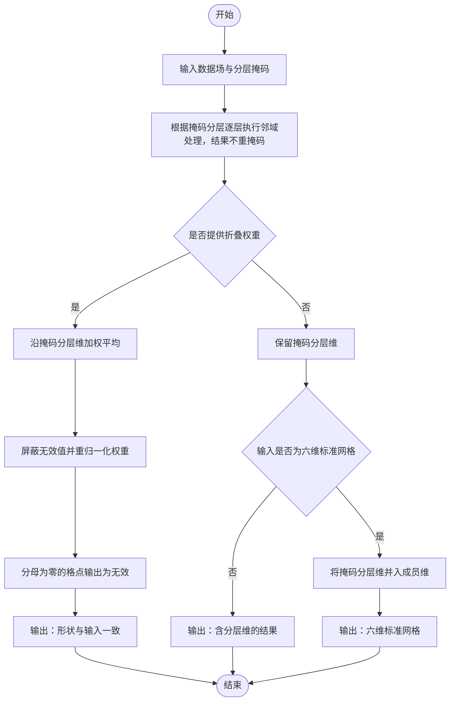

# 掩码分层邻域处理技术文档

## 1. 算法概述

`use_nbhood` 模块迁移自 IMPROVER 的 `improver.nbhood.use_nbhood`，核心类为 `ApplyNeighbourhoodProcessingWithAMask`。  
该算法用于在一组分层掩码上重复执行邻域处理，并可按权重将分层结果折叠回原网格场。

典型场景：地形带分层处理。  
输入掩码包含一个分层维（例如 `topographic_zone`），每层对应一张二维空间掩码。算法会逐层调用 `NeighbourhoodProcessing`，仅允许当前层有效点参与统计。

## 2. 核心算法说明

### 2.1 分层邻域处理

设输入数据为 `X`，分层掩码为 `M_k`，第 `k` 层处理结果记为 `Y_k`：

`Y_k = Neighbourhood(X, M_k)`

其中：

- `X`：输入网格场；
- `M_k`：第 `k` 个掩码层；
- `Y_k`：在第 `k` 层掩码约束下得到的邻域结果。

所有分层结果会沿掩码维拼接。

### 2.2 加权折叠

若提供分层权重 `W_k`，则沿分层维执行加权平均：

`Y = sum(Y_k * W_k) / sum(W_k)`

折叠时会忽略无效值（如 `NaN` / `Inf` / 被掩码值）。  
若某网格点有效权重和为 0，则该点输出为无效（`NaN` 或 masked）。

### 2.3 核心处理流程




要点：

- 邻域处理固定**不重掩码**；各层无效格点的数值仍可能来自邻域扩散，需结合对应层掩码解读（见 §6.1）。
- 仅当提供折叠权重时，才沿掩码分层维合并为与输入同形状的单场结果。


## 3. 组件说明


### 3.1 `ApplyNeighbourhoodProcessingWithAMask`

核心职责：

- 识别并规范化掩码分层维；
- 对每个掩码层重复执行邻域处理；
- 在提供权重时沿掩码分层维折叠；
- `xarray` 输入场景下尽量保持维度名与坐标信息。


### 3.2 `collapse_mask_coord`

该方法用于沿掩码分层维做加权折叠，处理流程包括：

- 广播分层结果与权重；
- 屏蔽无效值；
- 计算加权分子与分母；
- 对分母为 0 的点做无效处理。


## 4. 输入输出规范


### 4.1 初始化参数


| 参数                     | 类型                                  | 说明                            |
| ---------------------- | ----------------------------------- | ----------------------------- |
| `coord_for_masking`    | `str`                               | 掩码分层维名称，如 `topographic_zone`  |
| `neighbourhood_method` | `str`                               | 邻域方法，支持 `square` / `circular` |
| `radii`                | `float` 或 `list[float]`             | 邻域半径（米）                       |
| `lead_times`           | `list[int]` 或 `None`                | 与 `radii` 对应的时效（小时）           |
| `collapse_weights`     | `xr.DataArray` / `ndarray` / `None` | 分层折叠权重                        |
| `weighted_mode`        | `bool`                              | 是否启用圆形加权核                     |
| `sum_only`             | `bool`                              | 是否输出邻域和而非邻域平均                 |


### 4.2 `process` 输入参数


| 参数                 | 类型                                       | 说明               | 单位要求          |
| ------------------ | ---------------------------------------- | ---------------- | ------------- |
| `data`             | `xr.DataArray` 或 `ndarray`               | 输入数据，最后两维为 `y,x` | 由调用方保证        |
| `mask`             | `xr.DataArray` 或 `ndarray`               | 分层掩码             | `0` 无效，`1` 有效 |
| `input_lead_times` | `float` / `ndarray` / `None`             | 可变半径场景对应输入时效     | 小时            |
| `grid_spacing`     | `float` / `tuple[float, float]` / `None` | `numpy` 输入时网格分辨率 | 米             |


### 4.3 输出类型

- 输入为 `xarray.DataArray`：
  - 不折叠时返回 `xarray.DataArray`；
  - 折叠时返回 `xarray.DataArray`。
- 输入为 `numpy.ndarray`：
  - 返回 `numpy.ndarray` 或 `numpy.ma.MaskedArray`。


## 5. 输出形状规则


### 5.1 不折叠结果

未提供 `collapse_weights` 时，输出会在空间维前插入掩码分层维：

- 输入 `(y, x)` -> 输出 `(n_mask, y, x)`；
- 输入 `(*leading_dims, y, x)` -> 输出 `(*leading_dims, n_mask, y, x)`。

对 `xarray.DataArray`，不传 `collapse_weights` 时，输出不会保留 `topographic_zone` 维；而是将 `topographic_zone` 与输入 `member` 联合后映射到新的 `member` 维。

### 5.2 折叠结果

提供 `collapse_weights` 时，输出沿掩码分层维加权折叠，形状恢复为输入形状：

- 输入 `(y, x)` -> 输出 `(y, x)`；
- 输入 `(threshold, y, x)` -> 输出 `(threshold, y, x)`。


## 6. 掩码与权重规则


### 6.1 外部掩码语义

- `mask == 1`：当前层有效，参与邻域统计；
- `mask == 0`：当前层无效，不参与邻域统计。

**输出**：各层邻域处理后，原 mask==0 格点的数值仍可能为非 NaN 的邻域统计结果；未折叠时需用对应层的 mask 判断该层无效格点；折叠后无效由 collapse_mask_coord 与权重共同决定，部分格点可能为 NaN。输出本身不携带外部 mask 的无效标记。

### 6.2 内部掩码

概念上为数据场自带的无效格点（与外部 `mask=` 相对）。**算法层仅支持** `numpy.ma.MaskedArray` **的** `mask` **位**；与原IMPROVER方法实现一致，`DataArray` **与** `ndarray` **均不得含裸** `NaN`（未被掩码的NaN）。

- `numpy.ma.MaskedArray`：以 `mask` 位识别无效格点；掩码外不得含 `NaN`。
- **六维** `DataArray`：算法入口会拒绝裸 `NaN`；若读盘得到大填充值或需表达内部缺测，须在 **CLI/预处理** 转为 `MaskedArray` 后再调用。


#### 为何 `DataArray` 不支持内部掩码

1. **xarray 数据模型**：`DataArray.values` 是普通 `ndarray`，不携带 `MaskedArray.mask`。传入 `MaskedArray` 时，掩码位常被写成 `NaN`，掩码语义在 xarray 侧即丢失。
2. **算法契约**：`DataArray` 路径禁止裸 `NaN`，无法用 `NaN` 代替内部掩码；算法也未在 `DataArray` 分支读取内部 `mask` 位。
3. **推荐做法**：内部掩码在算法调用前转为 `MaskedArray`，并走 `grid_spacing` 的 numpy 路径；`DataArray` 仅用于外部掩码与六维网格工作流。

内部掩码可与外部掩码数据同时使用（仅 `MaskedArray` 路径）；无效格点取并集（内部 `mask` 或外部 `mask==0`）。

### 6.3 权重折叠

折叠权重要求可整理为 `(n_mask, y, x)`。  
算法在折叠时会自动按有效权重重归一化，避免部分分层无效导致整体结果偏差。

## 7. 与原算法关系

迁移版保留了以下核心行为：

- 按掩码分层重复执行邻域处理；
- 支持按权重折叠掩码分层维；
- 底层复用 `NeighbourhoodProcessing`。

主要差异：

- 去除 Iris Cube 依赖；
- 支持 `xarray.DataArray` 和 `numpy.ndarray`；
- `xarray` 输入时尽量保留维度名与坐标；
- 不处理 Iris `PostProcessingPlugin` 的元数据更新逻辑。


## 8. 使用示例


### 8.1 `numpy.ndarray` 输入，不折叠

```python
import numpy as np
from neighbourhood_probability_processing.src.use_nbhood import ApplyNeighbourhoodProcessingWithAMask

data = np.array(
    [[1, 1, 1],
     [1, 1, 0],
     [0, 0, 0]],
    dtype=np.float32,
)

mask = np.array(
    [
        [[0, 1, 0], [1, 1, 0], [0, 0, 0]],
        [[0, 0, 1], [0, 0, 1], [1, 1, 0]],
        [[0, 0, 0], [0, 0, 0], [0, 0, 1]],
    ],
    dtype=np.float32,
)

plugin = ApplyNeighbourhoodProcessingWithAMask(
    coord_for_masking="topographic_zone",
    neighbourhood_method="square",
    radii=1.0,
)

result = plugin.process(data, mask, grid_spacing=1.0)
```


### 8.2 `xarray.DataArray` 输入

该场景常用于“前导业务维 + 空间场 + 分层掩码”的生产输入。

关键要点：

- `data` 的最后两维应为空间维（示例中是 `y,x`）；
- `mask` 维度必须包含分层维（示例中是 `topographic_zone`）且空间维与 `data` 对齐；
- 建议 `y/x` 携带距离单位（`m`），便于网格间距推断；
- **不传** `collapse_weights` **时，输出不会保留** `topographic_zone` **维；而是将** `topographic_zone` **与输入** `member` **联合后映射到新的** `member` **维**；
- 输出中会附加用于还原联合关系的坐标/属性（如 `member_input_member`、`member_topographic_zone`、`member_is_stacked`）。

```python
import numpy as np
import xarray as xr
from neighbourhood_probability_processing.src.use_nbhood import ApplyNeighbourhoodProcessingWithAMask

# 1) 输入场（标准 meb 六维）
data = xr.DataArray(
    np.random.rand(2, 1, 1, 1, 3, 3).astype(np.float32),
    dims=("member", "level", "time", "dtime", "lat", "lon"),
    coords={
        "member": [0, 1],
        "level": [0.0],
        "time": [np.datetime64("2024-01-01T00:00:00")],
        "dtime": [0],
        "lat": xr.DataArray([30.0, 30.01, 30.02], dims=("lat",), attrs={"units": "degree_north"}),
        "lon": xr.DataArray([110.0, 110.01, 110.02], dims=("lon",), attrs={"units": "degree_east"}),
    },
    name="probability_of_event",
    attrs={"units": "1"},
)

# 2) 分层掩码（topographic_zone, lat, lon）
mask = xr.DataArray(
    np.array(
        [
            [[1, 1, 0], [1, 0, 0], [0, 0, 0]],
            [[0, 0, 1], [0, 1, 1], [1, 1, 0]],
            [[0, 0, 0], [0, 0, 0], [0, 0, 1]],
        ],
        dtype=np.float32,
    ),
    dims=("topographic_zone", "lat", "lon"),
    coords={
        "topographic_zone": [50.0, 100.0, 150.0],
        "lat": data.coords["lat"],
        "lon": data.coords["lon"],
    },
)

plugin = ApplyNeighbourhoodProcessingWithAMask(
    coord_for_masking="topographic_zone",
    neighbourhood_method="square",
    radii=1000.0,
    collapse_weights=None,  # 不折叠
)

result = plugin.process(data, mask)
print(result.dims)
print(result.shape)

# 当前实现下，输出示例：
# result.dims  -> ("member", "level", "time", "dtime", "lat", "lon")
# member 维长度 = 输入 member 数 * topographic_zone 层数
# 并通过附加坐标记录联合来源，例如：
#   result.coords["member_input_member"]
#   result.coords["member_topographic_zone"]
```


### 8.3 带权重折叠

该场景在分层处理后沿 `topographic_zone` 做加权折叠，得到与原输入同阶的输出。

关键要点：

- `collapse_weights` 的维度需可整理为 `(topographic_zone, y, x)`；
- 权重与分层结果逐层逐点相乘后再归一化；
- 折叠后 `topographic_zone` 维会被移除。

```python
import numpy as np
import xarray as xr
from neighbourhood_probability_processing.src.use_nbhood import ApplyNeighbourhoodProcessingWithAMask

# 复用 8.2 的 data 和 mask

weights = xr.DataArray(
    np.array(
        [
            [[0.8, 0.8, 0.0], [0.7, 0.0, 0.0], [0.0, 0.0, 0.0]],
            [[0.0, 0.0, 0.6], [0.0, 0.6, 0.6], [0.5, 0.5, 0.0]],
            [[0.0, 0.0, 0.0], [0.0, 0.0, 0.0], [0.0, 0.0, 0.4]],
        ],
        dtype=np.float32,
    ),
    dims=("topographic_zone", "y", "x"),
    coords=mask.coords,
    name="topographic_zone_weights",
    attrs={"units": "1"},
)

plugin = ApplyNeighbourhoodProcessingWithAMask(
    coord_for_masking="topographic_zone",
    neighbourhood_method="square",
    radii=1000.0,
    collapse_weights=weights,  # 启用折叠
    weighted_mode=False,
    sum_only=False,
)

collapsed = plugin.process(data, mask)
print(collapsed.dims)   # ("threshold", "y", "x")
print(collapsed.shape)  # (2, 3, 3)
```


## 9. CLI 应用说明

本文档相关示例脚本：


| 脚本                                           | 说明          |
| -------------------------------------------- | ----------- |
| `neighbourhood_probability_processing/cli/ens_nbhood_iterate_with_mask.py` | 按分层掩码逐层邻域处理 |
| `neighbourhood_probability_processing/cli/ens_nbhood_land_and_sea.py`      | 陆海分区邻域处理并合并 |


### 9.1 `ens_nbhood_iterate_with_mask.py`

用途：

- 按分层掩码逐层执行邻域处理；
- 可选按分层权重折叠输出。

运行内置示例（示例使用数据为方形邻域折叠相关数据）：

```bash
python -m neighbourhood_probability_processing.cli.ens_nbhood_iterate_with_mask
```

无权重（方形邻域）代码示例：

```python
from neighbourhood_probability_processing.cli.ens_nbhood_iterate_with_mask import process

scenario = "./neighbourhood_probability_processing/test_data/official_test_use_nbhood/iterate_with_mask"
input_dir = f"{scenario}/cli_input"
output_dir = f"{scenario}/cli_output"

process(
    input_data_path=f"{input_dir}/input.nc",
    mask_path=f"{input_dir}/mask.nc",
    coord_for_masking="topographic_zone",
    radii=[20000.0],
    output_path=f"{output_dir}/cli_unfolded_square_result.nc",
    neighbourhood_shape="square",
)
```

带权重折叠示例：

```python
from neighbourhood_probability_processing.cli.ens_nbhood_iterate_with_mask import process

scenario = "./neighbourhood_probability_processing/test_data/official_test_use_nbhood/iterate_with_mask"
input_dir = f"{scenario}/cli_input"
output_dir = f"{scenario}/cli_output"

process(
    input_data_path=f"{input_dir}/thresholded_input.nc",
    mask_path=f"{input_dir}/orographic_bands_mask.nc",
    coord_for_masking="topographic_zone",
    radii=[10000.0],
    weights_path=f"{input_dir}/orographic_bands_weights.nc",
    output_path=f"{output_dir}/cli_iterated_result.nc",
    neighbourhood_shape="square",
)
```

`**process()` 参数说明**


| 参数                    | 类型          | 必填  | 默认值      | 说明                          |
| --------------------- | ----------- | --- | -------- | --------------------------- |
| `input_data_path`     | str         | 是   | -        | 主输入 nc 路径                   |
| `mask_path`           | str         | 是   | -        | 分层掩码 nc 路径                  |
| `coord_for_masking`   | str         | 是   | -        | 掩码分层维名，如 `topographic_zone` |
| `radii`               | list[float] | 是   | -        | 邻域半径（米）                     |
| `weights_path`        | str         | 否   | `None`   | 分层折叠权重 nc 路径                |
| `output_path`         | str         | 否   | `None`   | 输出 nc 路径                    |
| `neighbourhood_shape` | str         | 否   | `square` | `square` 或 `circular`       |
| `lead_times`          | list[int]   | 否   | `None`   | 与 `radii` 对应时效（小时）          |
| `area_sum`            | bool        | 否   | `False`  | `True` 输出邻域和                |


说明：传 `weights_path` 时会沿掩码分层维折叠；不传时 xarray 路径下分层维会与输入 member 联合映射到新 member。

### 9.2 `ens_nbhood_land_and_sea.py`

用途：

- 分别在陆地和海洋子域执行邻域处理；
- 合并陆海结果；
- 支持普通陆海掩码和地形带输入。

运行内置示例：

```bash
python -m neighbourhood_probability_processing.cli.ens_nbhood_land_and_sea
```

简单陆海掩膜代码示例：

```python
from neighbourhood_probability_processing.cli.ens_nbhood_land_and_sea import process

scenario = "./neighbourhood_probability_processing/test_data/official_test_use_nbhood/land_and_sea"
input_dir = f"{scenario}/cli_input"
output_dir = f"{scenario}/cli_output"

process(
    input_data_path=f"{input_dir}/input.nc",
    mask_path=f"{input_dir}/ukvx_landmask.nc",
    radii=[20000.0],
    output_path=f"{output_dir}/cli_land_sea_result.nc",
    neighbourhood_shape="square",
)
```

地形带输入示例：

```python
from neighbourhood_probability_processing.cli.ens_nbhood_land_and_sea import process

scenario = "./neighbourhood_probability_processing/test_data/official_test_use_nbhood/land_and_sea"
input_dir = f"{scenario}/cli_input"
output_dir = f"{scenario}/cli_output"

process(
    input_data_path=f"{input_dir}/input.nc",
    mask_path=f"{input_dir}/topographic_bands_land.nc",
    weights_path=f"{input_dir}/weights_land.nc",
    radii=[20000.0],
    output_path=f"{output_dir}/cli_topographic_bands_result.nc",
    neighbourhood_shape="square",
)
```

`**process()` 参数说明**


| 参数                    | 类型          | 必填  | 默认值      | 说明                    |
| --------------------- | ----------- | --- | -------- | --------------------- |
| `input_data_path`     | str         | 是   | -        | 主输入 nc 路径             |
| `mask_path`           | str         | 是   | -        | 陆海掩码或地形带 nc 路径        |
| `radii`               | list[float] | 是   | -        | 邻域半径（米）               |
| `weights_path`        | str         | 否   | `None`   | 地形带权重 nc 路径           |
| `output_path`         | str         | 否   | `None`   | 输出 nc 路径              |
| `neighbourhood_shape` | str         | 否   | `square` | `square` 或 `circular` |
| `lead_times`          | list[int]   | 否   | `None`   | 与 `radii` 对应时效（小时）    |
| `area_sum`            | bool        | 否   | `False`  | `True` 输出邻域和          |


说明：纯陆海二值掩码通常可不传 `weights_path`；地形带场景建议成对提供 mask 与 weights。

## 10. 注意事项


### 10.1 输入前提

迁移版遵循“算法只处理已预处理好的输入数据”边界假设：

- 不自动识别 NetCDF `_FillValue`；
- 若输入存在填充值或内部缺测，应由调用方在进算法前转为 `MaskedArray`（`DataArray` 路径不得用 `NaN` 表达内部掩码，见 §6.2）。


### 10.2 `numpy` 输入要求

- 需显式提供 `grid_spacing`；
- 若使用可变半径，需显式提供 `input_lead_times`；
- 默认使用倒数第三维作为掩码分层维。


### 10.3 当前限制

- 当前未迁移原算法“相邻相同二维切片复用结果”的缓存优化；
- 权重数组当前要求可整理为 `(n_mask, y, x)`；
- 不处理 Iris `PostProcessingPlugin` 的元数据更新逻辑。


### 10.4 测试数据

`official_test_use_nbhood/` 与 `official_test_nbhood/` 目录约定：


| 路径                                                       | 内容                                                                         |
| -------------------------------------------------------- | -------------------------------------------------------------------------- |
| `*/cli_input/`                                           | Notebook 预处理后的六维输入（`member, level, time, dtime, lat, lon`），供算法与 CLI 使用     |
| `*/cli_output/`                                          | CLI 示例脚本写出结果                                                               |
| 场景子目录（如 `basic_collapse_bands/`、`no_topographic_bands/`） | 投影坐标下的 KGO、原算法参考；部分场景保留仅用于 `MaskedArray` 路径的原始输入（如 `mask/input_masked.nc`） |


`pytest` 对照说明：

- `neighbourhood_probability_processing/test/test_use_nbhood.py`：从 `iterate_with_mask/cli_input/` 读入，与 `basic_collapse_bands/` 中 KGO 比对
- `neighbourhood_probability_processing/test/test_nbhood.py`：六维输入取自 `official_test_nbhood/cli_input/`，参考结果取自 `basic/`、`mask/`、`percentile/` 等子目录

预处理流程见 `neighbourhood_probability_processing/nbs/use_nbhood.ipynb`。