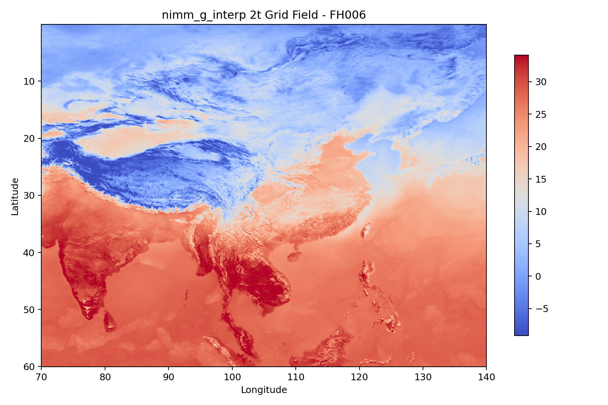
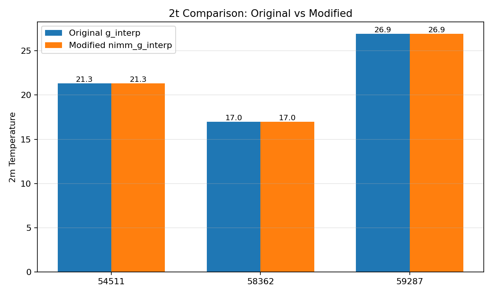

# 快速精细化插值算法说明

## 算法用途

`nimm_g_interp` 封装原 `g_interp` 快速精细化插值流程，用于基于模式场、
地形、站点或格点配置执行细网格/站点插值，以及可选的最优参数求解。

## 公开插件

公开类为 `FastRefineInterpPlugin`，位于 `src/fast_refine_interp_plugin.py`。
插件方法为 `process()`。

## 主要参数

- `work_dir`：业务运行目录，通常放置 `Fast_refine_interp_*.ini`。
- `root_path`：业务根目录，包含 `Parameter` 和 `lib`；不传时按旧规则推断。
- `model_region`：模式区域，例如 `EC_12P5KM`、`GRAPES_12P5KM`。
- `operation`：`i` 表示插值，`p` 表示求参，`ip` 表示两者都执行。
- `resolution`：`site`、`1km` 或 `5km`。
- `begin_date`：业务时间，格式 `YYYYMMDDHH`。

## 当前验证结论

原始代码可以完成语法编译；在默认 Python 环境缺少 `eccodes`，无法导入完整
业务模块。在本机 `pytorch` 环境中可以导入。原始工程依赖当前工作目录和目录名
推断模式区域，改造后已支持通过插件和 CLI 显式传入。

完整业务运行仍依赖真实模式数据、地形数据、站点文件和配置路径。

## 成果展示

以下图片展示 `nimm_g_interp` 对 2 米气温（`2t`）进行快速精细化插值的输出结果。

### FH006 原始 `g_interp` 格点场

### FH006 `nimm_g_interp` 格点场

### 原始算法与改进算法数值对比

站点 `54511`、`58362`、`59287` 的 2 米气温图示结果一致。

