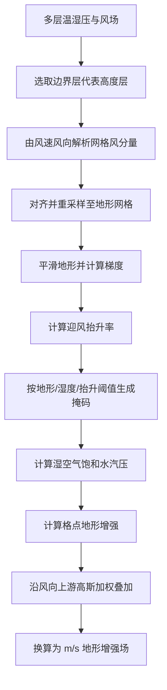
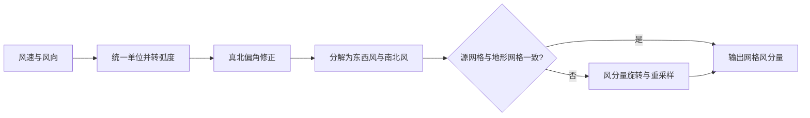
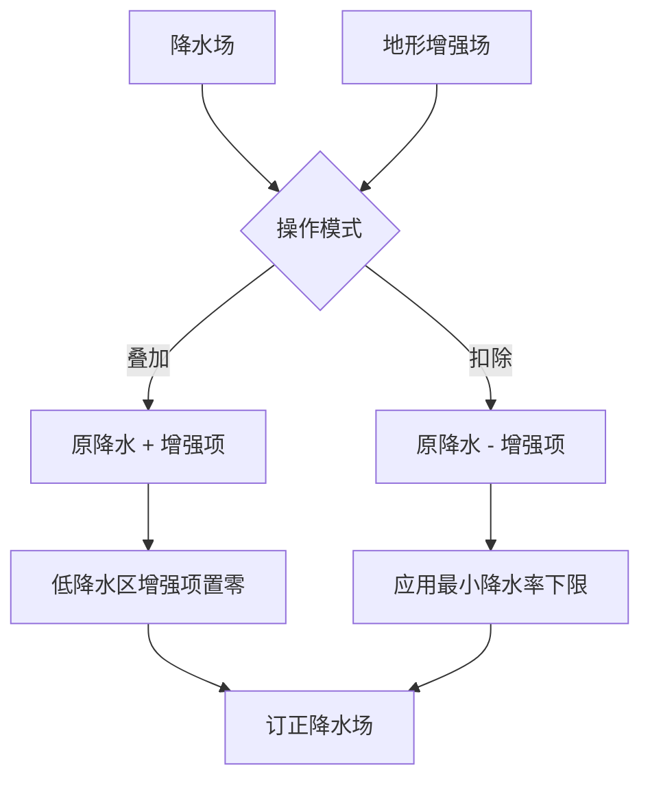

# 地形增强算法说明

## 1. 模块概览

`orographic_enhancement` 模块用于计算地形增强项（`m s-1`），并支持将增强项应用到降水场（叠加/扣除）。

当前迁移实现包含以下插件类：

- `ResolveWindComponents`
- `OrographicEnhancement`
- `MetaOrographicEnhancement`
- `ApplyOrographicEnhancement`

主要职责分工：

- `MetaOrographicEnhancement`：流程编排（边界层切片 -> 风分量解析 -> 主算法计算）。
- `ResolveWindComponents`：将 `wind_speed + wind_direction` 解析为 `u/v` 分量。
- `OrographicEnhancement`：执行地形增强核心数值计算。
- `ApplyOrographicEnhancement`：将地形增强项应用到降水场。

---

## 2. 核心计算公式与处理流程

本节说明地形增强数值核心的物理量关系与主链路，不涉及输入校验、网格格式转换与六维结果组装等适配步骤。

### 2.1 核心计算公式

公式采用与实现一致的英文符号；流程图（2.2 节）仅使用中文节点描述。

#### （1）边界层代表场

从多层 `temperature`、`humidity`、`pressure`、`wind_speed`、`wind_direction` 中，在 `level` 坐标上选取与边界层代表高度 `boundary_height`（默认 1000 m）最接近的一层，得到二维边界层场。

#### （2）网格风分量

由风速 `ws`（m/s）与风向 `wd`（相对真北，**from** 约定，单位 degree）得到网格坐标系风分量 `u`、`v`（m/s）：

```
theta = rad(wd) + alpha + pi          # alpha 为真北偏角（投影网格）
u = ws * sin(theta)
v = ws * cos(theta)
```

源网格与地形网格投影不一致时，对 `(u, v)` 做旋转并重采样到地形网格。

#### （3）地形梯度与迎风抬升率

地形高度 `Z`（m）沿 x、y 方向分别做 3 点一维平滑得 `Z_smooth`，再求梯度（m/m）：

```
grad_x = diff(Z_smooth, axis=x) / dx    # dx 为 x 方向格距（m）
grad_y = diff(Z_smooth, axis=y) / dy    # dy 为 y 方向格距（m）
```

迎风抬升率 `vgradz`（m/s）：

```
vgradz = u * grad_x + v * grad_y
```


#### （4）饱和水汽压

温度 `T`（K）、气压 `P`（Pa）下，先对 Goff-Gratch 纯水饱和水汽压查表（183.15–338.15 K，步长 0.1 K）并线性插值得 `SVP_water`，再作湿空气修正：

```
T_c = T - 273.15
correction = 1 + 1e-8 * P * (4.5 + 6e-4 * T_c^2)
SVP = SVP_water * correction
```


#### （5）有效计算掩码

`mask = True` 表示该格点**不参与**计算，满足以下任一条件时置掩码：

```
mean(Z, 3x3 neighbourhood) < orog_thresh     # orog_thresh = 20 m
RH < rh_thresh                               # rh_thresh = 0.8
abs(vgradz) < vgradz_thresh                  # vgradz_thresh = 0.0005 m/s
RH 或 vgradz 为非有限值
```


#### （6）格点地形增强

对 `mask = False` 的格点，格点尺度增强 `point_oe`（mm/h）：

```
R_v = 461.6    # J K^-1 kg^-1
point_oe = (3600 / R_v) * (RH * SVP * vgradz) / T
point_oe = max(point_oe, 0)
```


#### （7）上游叠加

沿风向在上游回溯，影响距离约 `upstream_range = 15 km`。设回溯格距为 `d`（格点），风速 `wind_speed = sqrt(u^2 + v^2)`，则高斯权重：

```
sigma = wind_speed * cloud_lifetime / grid_spacing    # cloud_lifetime = 102 s
variance = sigma^2
weight(d) = exp(-0.5 * d^2 / variance)
```

对上游各格点 `point_oe` 加权平均，再乘效率系数 `efficiency_factor = 0.23265`，得 `oe_mmh`（mm/h）。

#### （8）输出单位

```
oe_ms = oe_mmh / 3600000    # 输出地形增强，单位 m/s
```


#### （9）应用到降水场

降水率 `P_rate` 与地形增强项 `OE` 统一到相同单位后：

```
# 低降水阈值 min_rate ≈ 1/32 mm/h
OE_eff = 0                         if P_rate < min_rate else OE

# add 模式
P_corrected = P_rate + OE_eff

# subtract 模式
P_corrected = P_rate - OE_eff
P_corrected = max(P_corrected, min_rate)    # 不低于最小降水率
```

---


### 2.2 核心处理流程


#### 地形增强计算主流程




#### 风分量解析（子流程）




#### 降水订正（Apply 插件）




---


## 3. 类与主函数


### 3.1 MetaOrographicEnhancement

主函数：

- `process(temperature, humidity, pressure, wind_speed, wind_direction, orography) -> xr.DataArray`

功能：

1. 对输入场进行网格与维度检查（xarray 路径）。
2. 从多层场提取边界层代表高度切片（二维）。
3. 调用 `ResolveWindComponents` 计算地形网格上的 `uwind/vwind`（二维）。
4. 将二维温湿压、风分量与地形（保持原始维度）传入 `OrographicEnhancement` 计算；六维输出由主算法在地形模板上重组。

输出语义：

- 入口地形为六维单场时，主算法返回标准六维结果。
- 入口地形为二维时，主算法返回二维结果。


### 3.2 ResolveWindComponents

主函数：

- `process(wind_speed, wind_direction, target_grid) -> (uwind, vwind)`

功能：

1. 统一风速单位到 `m s-1`。
2. 识别风向 `from/to` 约定。
3. 在投影网格场景下处理真北偏角。
4. 必要时重采样到目标网格。


### 3.3 OrographicEnhancement

主函数：

- `process(temperature, humidity, pressure, uwind, vwind, topography) -> xr.DataArray`

功能：

1. 统一单位与网格。
2. 计算 `v·gradZ`、掩码、格点增强与上游贡献。
3. 输出 `orographic_enhancement`（单位 `m s-1`）。


### 3.4 ApplyOrographicEnhancement

主函数：

- `process(precip_data, orographic_enhancement_data, allowed_time_diff=1800) -> xr.DataArray | list[xr.DataArray]`

实现位置：

- `orographic_enhancement/src/apply_orographic_enhancement.py`

功能：

1. 按时间匹配增强场。
2. 以 `add/subtract` 方式作用到降水场。
3. `subtract` 模式下应用最小降水率下限保护。

---


## 4. 输入输出与参数说明


### 4.1 MetaOrographicEnhancement

输入输出总览：


| 项目        | 说明                                                                                |
| --------- | --------------------------------------------------------------------------------- |
| 主函数       | `process(temperature, humidity, pressure, wind_speed, wind_direction, orography)` |
| 输入类型      | `xr.DataArray` 或 `np.ndarray`                                                     |
| 输入数量      | 6 个场                                                                              |
| xarray 校验 | 使用 `check_for_meb_griddata` 执行标准六维网格检查                                            |
| 输出类型      | `xr.DataArray`                                                                    |
| 输出语义      | 优先输出标准六维网格；无可用模板时返回二维结果                                                           |
| 输出变量      | `orographic_enhancement`                                                          |
| 输出单位      | `m s-1`                                                                           |


参数表：


| 参数名                     | 单位                        | 必填  | 默认值      | 说明             |
| ----------------------- | ------------------------- | --- | -------- | -------------- |
| `temperature`           | `K` 或 `degC`              | 是   | 无        | 温度场，支持多层输入     |
| `humidity`              | `1` 或 `%`                 | 是   | 无        | 相对湿度场，支持多层输入   |
| `pressure`              | `Pa` / `hPa` / `kPa`      | 是   | 无        | 气压场，支持多层输入     |
| `wind_speed`            | `m s-1` / `km h-1`        | 是   | 无        | 风速场，支持多层输入     |
| `wind_direction`        | `degree`                  | 是   | 无        | 风向场（真北参考）      |
| `orography`             | `m` / `km`                | 是   | 无        | 地形高度场（目标网格）    |
| `boundary_height`       | 同 `boundary_height_units` | 否   | `1000.0` | 边界层代表高度（初始化参数） |
| `boundary_height_units` | -                         | 否   | `m`      | 边界层高度单位（初始化参数） |


### 4.2 OrographicEnhancement

输入输出总览：


| 项目     | 说明                                                                   |
| ------ | -------------------------------------------------------------------- |
| 主函数    | `process(temperature, humidity, pressure, uwind, vwind, topography)` |
| 输入类型   | `xr.DataArray` 或 `np.ndarray`                                        |
| 输入数量   | 6 个场                                                                 |
| 核心计算维度 | 二维（内部会将六维单场压缩到二维计算）                                                  |
| 输出类型   | `xr.DataArray`                                                       |
| 输出语义   | 地形为六维单场时重组为标准六维（模板仅取自地形）；否则返回二维，空间坐标来自地形，时间类辅助坐标可自气象场继承              |
| 输出变量   | `orographic_enhancement`                                             |
| 输出单位   | `m s-1`                                                              |


参数表：


| 参数名           | 单位                   | 必填  | 默认值 | 说明           |
| ------------- | -------------------- | --- | --- | ------------ |
| `temperature` | `K` 或 `degC`         | 是   | 无   | 温度场          |
| `humidity`    | `1` 或 `%`            | 是   | 无   | 相对湿度场        |
| `pressure`    | `Pa` / `hPa` / `kPa` | 是   | 无   | 气压场          |
| `uwind`       | `m s-1`              | 是   | 无   | 网格 `x` 方向风分量 |
| `vwind`       | `m s-1`              | 是   | 无   | 网格 `y` 方向风分量 |
| `topography`  | `m` / `km`           | 是   | 无   | 地形高度场，作为目标网格 |


### 4.3 ApplyOrographicEnhancement

输入输出总览：


| 项目   | 说明                                                                          |
| ---- | --------------------------------------------------------------------------- |
| 主函数  | `process(precip_data, orographic_enhancement_data, allowed_time_diff=1800)` |
| 输入类型 | `xr.DataArray` 或 `Sequence[xr.DataArray]`                                   |
| 时间匹配 | 多时次增强场按最近时间匹配，受 `allowed_time_diff` 约束                                      |
| 输出类型 | 单输入返回 `xr.DataArray`；序列输入返回 `list[xr.DataArray]`                            |


参数表：


| 参数名                           | 单位                 | 必填  | 默认值    | 说明                          |
| ----------------------------- | ------------------ | --- | ------ | --------------------------- |
| `precip_data`                 | `mm h-1`（或等效降水率单位） | 是   | 无      | 降水场（可单场或场列表）                |
| `orographic_enhancement_data` | `m s-1`            | 是   | 无      | 地形增强场（可单时次或多时次）             |
| `allowed_time_diff`           | `s`                | 否   | `1800` | 时间匹配容差（秒）                   |
| `operation`                   | -                  | 否   | `add`  | 初始化参数，支持 `add` / `subtract` |


---


## 5. 关键参数（与原算法保持一致）

- `OROG_THRESH_M = 20.0`
- `RH_THRESH_RATIO = 0.8`
- `VGRADZ_THRESH_MS = 0.0005`
- `UPSTREAM_RANGE_OF_INFLUENCE_KM = 15.0`
- `CLOUD_LIFETIME_S = 102.0`
- `EFFICIENCY_FACTOR = 0.23265`

---


## 6. CLI 用法

示例脚本：`orographic_precipitation_downscaling/cli/dsc_orographic_enhancement.py`

### 6.1 运行方式

```powershell
python -m orographic_precipitation_downscaling.cli.dsc_orographic_enhancement
```

在代码中调用：

```python
from orographic_precipitation_downscaling.cli.dsc_orographic_enhancement import process

result = process(
    temperature_path="temperature.nc",
    humidity_path="humidity.nc",
    pressure_path="pressure.nc",
    wind_speed_path="wind_speed.nc",
    wind_direction_path="wind_direction.nc",
    orography_path="orography.nc",
    output_path="result.nc",
    boundary_height=1000.0,
    boundary_height_units="m",
)
```


### 6.2 `process()` 参数


| 参数                      | 必填  | 说明                  |
| ----------------------- | --- | ------------------- |
| `temperature_path`      | 是   | 温度场 nc 路径           |
| `humidity_path`         | 是   | 相对湿度 nc 路径          |
| `pressure_path`         | 是   | 气压 nc 路径            |
| `wind_speed_path`       | 是   | 风速 nc 路径            |
| `wind_direction_path`   | 是   | 风向 nc 路径            |
| `orography_path`        | 是   | 地形 nc 路径            |
| `output_path`           | 否   | 输出 nc 路径            |
| `boundary_height`       | 否   | 边界层代表高度，默认 `1000.0` |
| `boundary_height_units` | 否   | 边界层高度单位，默认 `m`      |


使用测试数据的 PowerShell 示例（先改脚本底部路径，或直接运行内置样例）：

```powershell
./venv/Scripts/python.exe orographic_precipitation_downscaling/cli/dsc_orographic_enhancement.py
```

内置测试数据目录：输入 `orographic_precipitation_downscaling/test_data/orographic_enhancement_data/cli_input/`，CLI 输出 `cli_output/`。

---


## 7. Python 调用示例


### 7.1 计算地形增强

```python
import xarray as xr
from orographic_precipitation_downscaling.src.orographic_enhancement import MetaOrographicEnhancement

temperature = xr.open_dataset("temperature.nc")["air_temperature"]
humidity = xr.open_dataset("humidity.nc")["relative_humidity"]
pressure = xr.open_dataset("pressure.nc")["air_pressure"]
wind_speed = xr.open_dataset("wind_speed.nc")["wind_speed"]
wind_direction = xr.open_dataset("wind_direction.nc")["wind_from_direction"]
orography = xr.open_dataset("orography.nc")["surface_altitude"]

plugin = MetaOrographicEnhancement(boundary_height=1000.0, boundary_height_units="m")
oe = plugin(temperature, humidity, pressure, wind_speed, wind_direction, orography)
```


### 7.2 应用地形增强项

```python
import xarray as xr
from orographic_precipitation_downscaling.src.apply_orographic_enhancement import ApplyOrographicEnhancement

precip = xr.open_dataset("precip.nc")["lwe_precipitation_rate"]
oe = xr.open_dataset("orographic_precipitation_downscaling.nc")["orographic_enhancement"]

plugin = ApplyOrographicEnhancement(operation="add")
applied = plugin.process(precip, oe, allowed_time_diff=1800)
```

---


## 8. 验证建议

建议使用同一批标准化输入，对比：

- 迁移算法结果
- 原算法结果
- 官方 KGO 结果

建议检查：

- 数值误差（MAE / RMSE / max abs）
- 单位与变量名
- 空间坐标方向（lat/lon 是否升序）
- 六维结构是否完整（`member/level/time/dtime/lat/lon`）

---


## 9. 注意事项

若输出文件被占用（如被 Notebook 打开），CLI 写文件可能失败。