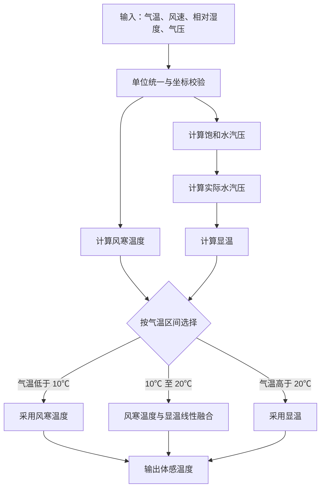

# 体感温度（Feels Like Temperature）算法说明

- 算法来源：Met Office Improver 中的体感温度计算，结合风寒指数（Osczevski & Bluestein，2005/2008）与遮阴条件下的显温公式（Steadman，1984）。
- 迁移目标：适配 meteva_base 的 grid_data（xarray.DataArray，维度为 member、level、time、dtime、lat、lon），同时支持纯 numpy 数组输入，尽量保持原函数逻辑与组织。

## 1. 组件说明

本模块包含以下组件：

- **calculate_feels_like_temperature 函数**：主函数，用于计算完整的体感温度
- **CalculateWindChill 插件类**：用于单独计算风寒指数，适配 meteva 数据结构

## 2. 核心计算公式

以下公式与 `temperature/src/feels_like_temperature.py` 中的实现一致。符号说明：$T$ 为气温（℃），$T_{\mathrm{K}}$ 为气温开尔文（K，$T_{\mathrm{K}}=T+273.15$，用于饱和水汽压查表），$V$ 为 10 m 风速（m/s），$V_{\mathrm{kmh}}$ 为风速（km/h），$RH$ 为相对湿度（0–1），$p$ 为气压（Pa），$e_s$ 为饱和水汽压（Pa），$e$ 为实际水汽压（hPa），$T_{\mathrm{wc}}$ 为风寒温度（℃），$T_{\mathrm{a}}$ 为显温（℃），$T_{\mathrm{flt}}$ 为体感温度（℃）。

### 2.1 风寒温度（Osczevski & Bluestein，2005）

先将风速换算为 km/h，并对下限做截断（对应步行引起的体感风速下限）：

$$
V_{\mathrm{eff}} = \max(V_{\mathrm{kmh}},\, 4.824)
$$

$$
T_{\mathrm{wc}} = 13.12 + 0.6215\,T - 11.37\,V_{\mathrm{eff}}^{0.16} + 0.3965\,T\,V_{\mathrm{eff}}^{0.16}
$$

### 2.2 显温（Steadman，1984，遮阴情形）

实际水汽压由空气中的饱和水汽压与相对湿度得到：

$$
e = 10^{-3}\, e_s(T,\, p)\, RH
$$

显温线性回归式为（$T_{\mathrm{a}}$ 为显温，单位 ℃）：

$$
T_{\mathrm{a}} = -2.7 + 1.04\,T + 2\,e - 0.65\,V
$$

其中 $e_s$ 由 Goff–Gratch 公式查表并做气压订正得到：以 $T_{\mathrm{K}}$（气温开尔文）查表得纯水饱和水汽压，再乘以气压订正因子 $1 + 10^{-8}\,p\,(4.5 + 6\times 10^{-4}\,T^2)$。

### 2.3 体感温度融合

$$
T_{\mathrm{flt}} =
\begin{cases}
T_{\mathrm{wc}}, & T < 10\ ^\circ\mathrm{C} \\[6pt]
\alpha\, T_{\mathrm{a}} + (1-\alpha)\, T_{\mathrm{wc}}, & 10 \le T \le 20\ ^\circ\mathrm{C} \\[6pt]
T_{\mathrm{a}}, & T > 20\ ^\circ\mathrm{C}
\end{cases}
$$

过渡权重为：

$$
\alpha = \dfrac{T - 10}{10}
$$

## 3. 处理流程

下图仅展示核心计算路径；单位换算、网格校验与结果封装等适配步骤未展开。



## 4. 输入/输出

### 4.1 calculate_feels_like_temperature 函数

#### 输入类型支持

- **xarray.DataArray**：用于 meteva_base grid_data，自动从 `.attrs["units"]` 提取单位信息
- **numpy.ndarray**：用于纯数组输入，使用默认单位（用户必须确保输入数组的单位正确）
注：若参数为xr.DataArray类型，须符合meteva_base网格数据格式

#### 输入参数


| 参数                | 类型                        | 说明       | 单位要求                                                   |
| ----------------- | ------------------------- | -------- | ------------------------------------------------------ |
| temperature       | xr.DataArray 或 np.ndarray | 气温数据     | - xarray: 支持 'degC' 或 'K' - numpy: 默认摄氏度 (degC)        |
| wind_speed        | xr.DataArray 或 np.ndarray | 10m 风速数据 | - xarray: 支持 'm s-1' 或 'km h-1' - numpy: 默认米/秒 (m s-1) |
| relative_humidity | xr.DataArray 或 np.ndarray | 相对湿度数据   | - xarray: 支持分数 '1' 或百分比 '%' - numpy: 默认分数 (0-1)        |
| pressure          | xr.DataArray 或 np.ndarray | 气压数据     | - xarray: 支持 'Pa', 'hPa', 'kPa' - numpy: 默认帕斯卡 (Pa)    |


#### 输出


| 输出项 | 类型                        | 说明     | 单位                                                                              |
| --- | ------------------------- | ------ | ------------------------------------------------------------------------------- |
| 返回值 | xr.DataArray 或 np.ndarray | 体感温度结果 | - xarray输入: 返回 DataArray，单位与输入temperature一致 - numpy输入: 返回 ndarray，单位为摄氏度 (degC) |


### 4.2 CalculateWindChill 插件类

#### 输入类型支持

- **xarray.DataArray**：用于 meteva_base grid_data，自动从 `.attrs["units"]` 提取单位信息
- **numpy.ndarray**：用于纯数组输入，使用默认单位（用户必须确保输入数组的单位正确）
注：若参数为xr.DataArray类型，须符合meteva_base网格数据格式

#### process 方法参数


| 参数                | 类型                        | 说明              | 单位要求                                        |
| ----------------- | ------------------------- | --------------- | ------------------------------------------- |
| temperature_data  | xr.DataArray 或 np.ndarray | 气温数据            | xarray 自动读单位；ndarray 使用 `temperature_units` |
| wind_speed_data   | xr.DataArray 或 np.ndarray | 10m 风速数据        | xarray 自动读单位；ndarray 使用 `wind_speed_units`  |
| temperature_units | str                       | ndarray 输入时温度单位 | 'degC' 或 'K' (默认: 'degC')                   |
| wind_speed_units  | str                       | ndarray 输入时风速单位 | 'm s-1' 或 'km h-1' (默认: 'm s-1')            |


#### 输出


| 输出项 | 类型                        | 说明     | 单位         |
| --- | ------------------------- | ------ | ---------- |
| 返回值 | xr.DataArray 或 np.ndarray | 风寒温度结果 | 摄氏度 (degC) |


## 5. 算法验证

- **核心算法保持**：完全保留了原 improver 库的 `_calculate_wind_chill`、`_calculate_apparent_temperature` 和 `_feels_like_temperature` 函数实现
- **SVP 计算迁移**：将原 improver 的 `calculate_svp_in_air` 及相关辅助函数完整迁移
- **Goff-Gratch 公式准确性**：已验证当前实现与 WMO 标准参考值的平均相对误差为 0.1641%，满足气象计算精度要求（< 0.5%）
- **单元测试覆盖**：包含完整的 pytest 单元测试，覆盖所有核心函数和边界条件
- **官方数据验证**：通过 Met Office 官方测试数据验证，结果与 KGO（Known Good Output）高度一致

## 6. 用法示例

### 6.1 使用主函数 calculate_feels_like_temperature

#### 使用 xarray.DataArray（meteva_base grid_data）

```python
import numpy as np
import meteva_base as meb
from temperature.src.feels_like_temperature import calculate_feels_like_temperature

# 构造一个简单网格
grid = meb.grid([100, 102, 1], [30, 31, 1])

# 生成示例数据（member=1, level=1, time=1, dtime=1, lat=2, lon=3）
shape = (1, 1, 1, 1, 2, 3)
t = meb.grid_data(grid, data=np.full((2, 3), 15.0, dtype=np.float32))  # 15℃ 常数场
w = meb.grid_data(grid, data=np.full((2, 3), 5.0, dtype=np.float32))   # 5 m/s
rh = meb.grid_data(grid, data=np.full((2, 3), 0.5, dtype=np.float32))  # 50%（分数）
p = meb.grid_data(grid, data=np.full((2, 3), 101325.0, dtype=np.float32))  # Pa

# 设置单位属性
t.attrs["units"] = "degC"
w.attrs["units"] = "m s-1"
rh.attrs["units"] = "1"
p.attrs["units"] = "Pa"

# 计算体感温度
flt = calculate_feels_like_temperature(t, w, rh, p)
print(flt.shape)  # 输出: (1, 1, 1, 1, 2, 3)
print("单位：", t.attrs.get("units"))
```

#### 使用 numpy.ndarray（纯数组输入）

```python
import numpy as np
from temperature.src.feels_like_temperature import calculate_feels_like_temperature

# 生成示例数组（必须确保单位正确：degC, m/s, fraction, Pa）
shape = (1, 1, 1, 1, 2, 3)
t = np.full(shape, 15.0, dtype=np.float32)      # 15℃
w = np.full(shape, 5.0, dtype=np.float32)       # 5 m/s  
rh = np.full(shape, 0.5, dtype=np.float32)      # 0.5 (fraction)
p = np.full(shape, 101325.0, dtype=np.float32)  # Pa

# 计算体感温度
flt = calculate_feels_like_temperature(t, w, rh, p)
print(flt.shape)  # 输出: (1, 1, 1, 1, 2, 3)
print(flt.dtype)  # 输出: float32
```

### 6.2 使用 CalculateWindChill 插件类

#### 单独计算风寒指数

```python
import numpy as np
import meteva_base as meb
from temperature.src.feels_like_temperature import CalculateWindChill

# 创建 CalculateWindChill 实例
wind_chill_calculator = CalculateWindChill()

# 生成示例网格与数据
grid = meb.grid([100, 102, 1], [30, 31, 1])
temp_xr = meb.grid_data(grid, data=np.full((2, 3), 2.0, dtype=np.float32))
wind_xr = meb.grid_data(grid, data=np.full((2, 3), 8.0, dtype=np.float32))

# 设置单位属性
temp_xr.attrs["units"] = "degC"
wind_xr.attrs["units"] = "m s-1"

# 风寒指数计算（xarray 输入）
wind_chill_result = wind_chill_calculator(temp_xr, wind_xr)
print(wind_chill_result.shape)  # (1, 1, 1, 1, 2, 3)
print("风寒指数:", wind_chill_result.values)

# numpy 输入（默认 temperature=degC, wind_speed=m s-1）
temp_np = np.full((1, 1, 1, 1, 2, 3), 2.0, dtype=np.float32)
wind_np = np.full((1, 1, 1, 1, 2, 3), 8.0, dtype=np.float32)

wind_chill_result_np = wind_chill_calculator(temp_np, wind_np)
print("风寒指数:", wind_chill_result_np)
```

## 7. CLI 应用示例

示例脚本：`temperature/cli/der_feel_like_temp.py`

### 7.1 运行方式

PowerShell：

```powershell
python -m temperature.cli.der_feel_like_temp
```

在代码中调用：

```python
from temperature.cli.der_feel_like_temp import process

result = process(
    temperature_path=".../temperature_at_screen_level.nc",
    wind_speed_path=".../wind_speed_at_10m.nc",
    relative_humidity_path=".../relative_humidity_at_screen_level.nc",
    pressure_path=".../pressure_at_mean_sea_level.nc",
    output_path=".../cli_feels_like_temp_result.nc",
)
```

### 7.2 `process()` 参数说明


| 参数                       | 是否必填 | 说明                      | 单位/格式                               |
| ------------------------ | ---- | ----------------------- | ----------------------------------- |
| `temperature_path`       | 是    | 气温输入 nc 文件              | `degC` 或 `K`（按 `attrs["units"]` 识别） |
| `wind_speed_path`        | 是    | 10 米风速 nc 文件            | `m s-1` 或 `km h-1`                  |
| `relative_humidity_path` | 是    | 相对湿度 nc 文件              | `1`（0–1）或 `%`                       |
| `pressure_path`          | 是    | 气压 nc 文件                | `Pa`、`hPa` 或 `kPa`                  |
| `output_path`            | 否    | 输出 nc 路径；`None` 则只返回不写盘 | `.nc`                               |


说明：

1. 脚本底部已配置 `temperature/test_data/feels_like_temp_data/normalized_meb6d/` 下的官方样例路径，可直接改路径后运行。
2. 若输入不是标准六维网格，请先做预处理再调用 `process()`。

## 8. 参考文献

### 风寒指数 (Wind Chill Index)

- **Osczevski, R. and Bluestein, M. (2005)**. THE NEW WIND CHILL EQUIVALENT TEMPERATURE CHART. Bulletin of the American Meteorological Society, 86(10), pp.1453-1458.
- **Osczevski, R. and Bluestein, M. (2008)**. Comments on Inconsistencies in the New Windchill Chart at Low Wind Speeds. Journal of Applied Meteorology and Climatology, 47(10), pp.2737-2738.

### 显温公式 (Apparent Temperature)

- **Steadman, R. (1984)**. A Universal Scale of Apparent Temperature. Journal of Climate and Applied Meteorology, 23(12), pp.1674-1687

### 饱和水汽压修正

- **Atmosphere-Ocean Dynamics, Adrian E. Gill**, International Geophysics Series, Vol. 30; Equation A4.7.

## 9. 注意事项

- 参数必须在空间与时间维度上对齐（与 temperature 坐标一致），否则请先做插值或重采样。
- 对于 **xarray.DataArray** 输入，单位会自动从 `.attrs["units"]` 提取并进行转换
- 对于 **numpy.ndarray** 输入，用户必须确保输入数组的单位正确：
  - 温度：摄氏度 (degC) - **注意：不是开尔文(K)**
  - 风速：米/秒 (m s-1) 
  - 相对湿度：分数 (0-1)
  - 气压：帕斯卡 (Pa)
- 如果输入单位不在支持列表中，算法将按上述默认值处理
- **测试文件位置**：所有算法验证和单元测试文件位于 `temperature/test/` 目录

