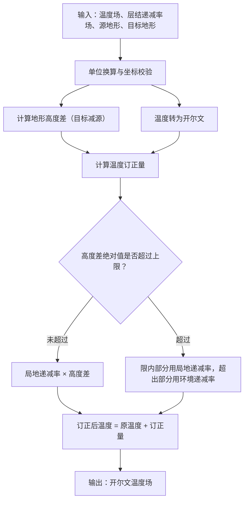
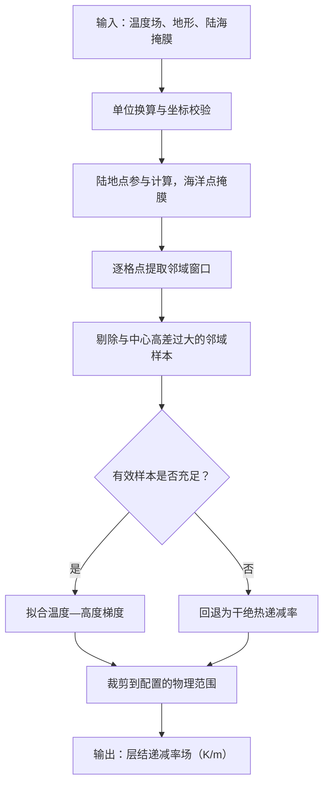

# 层结递减率算法技术文档

## 1. 算法概述

层结递减率（Lapse Rate）算法用于计算大气温度随高度变化的速率，是气象学中的重要参数。本算法基于 Met Office IMPROVER 库的实现，迁移适配到 meteva_base 的 grid_data 结构。

**参考文献**：

- Sheridan, P., S. Vosper, and S. Smith, 2018: A Physically Based Algorithm for Downscaling Temperature in Complex Terrain. J. Appl. Meteor. Climatol., 57, 1907–1929, [https://doi.org/10.1175/JAMC-D-17-0140.1](https://doi.org/10.1175/JAMC-D-17-0140.1).
- 基于2010年论文的方法：[https://rmets.onlinelibrary.wiley.com/doi/abs/10.1002/met.177](https://rmets.onlinelibrary.wiley.com/doi/abs/10.1002/met.177)

### 1.1 物理常数

- **DALR (干绝热递减率)**: $\Gamma_d = -0.0098  \text{K/m}$
- **ELR (环境递减率/标准大气递减率)**: $\Gamma_e = -0.0065  \text{K/m}$

## 2. 核心算法公式

### 2.1 层结递减率调整量计算

层结递减率调整量的计算公式如下：

$$
\Delta T = 
\begin{cases}
\Gamma \cdot \Delta z & \text{if } |\Delta z| \leq z_{\text{max}} 
\Gamma \cdot z_{\text{max}} + \Gamma_e \cdot (\Delta z - z_{\text{max}}) & \text{if } \Delta z > z_{\text{max}} 
\Gamma \cdot (-z_{\text{max}}) + \Gamma_e \cdot (\Delta z + z_{\text{max}}) & \text{if } \Delta z < -z_{\text{max}}
\end{cases}
$$

其中：

- $\Delta T$：温度调整量（K）
- $\Gamma$：层结递减率（K/m）
- $\Delta z$：地形高度差（m），$\Delta z = z_{\text{dest}} - z_{\text{source}}$
- $z_{\text{max}}$：最大垂直位移限制，默认为 50 米
- $\Gamma_e$：环境递减率（-0.0065 K/m）

### 2.2 层结递减率计算（邻域梯度法）

层结递减率通过邻域梯度方法计算：

$$
\Gamma = \frac{\partial T}{\partial z} = \frac{\text{cov}(T, z)}{\text{var}(z)}
$$

其中：

- $\Gamma$：计算得到的层结递减率（K/m）
- $T$：邻域内的温度值（K）
- $z$：邻域内的地形高度值（m）
- $\text{cov}(T, z)$：温度与地形高度的协方差
- $\text{var}(z)$：地形高度的方差

约束条件：
$$
\Gamma_{\text{min}} \leq \Gamma \leq \Gamma_{\text{max}}
$$

默认约束范围：

- $\Gamma_{\text{min}} = \text{DALR} = -0.0098  \text{K/m}$
- $\Gamma_{\text{max}} = -3 \times \text{DALR} = 0.0294  \text{K/m}$

### 2.3 陆地-海洋掩膜处理

对于海洋点，层结递减率直接设置为干绝热递减率：
$$
\Gamma_{\text{ocean}} = \text{DALR} = -0.0098  \text{K/m}
$$

## 3. 组件说明

本模块包含三个主要组件：

### 3.1 `compute_lapse_rate_adjustment` 函数

核心函数，用于计算层结递减率调整量。该函数将层结递减率乘以地形高度差，并对超过指定限制的垂直位移使用环境递减率进行校正。

### 3.2 `ApplyGriddedLapseRate` 类

插件类，用于将预计算的层结递减率校正应用到温度预报中。支持双输入类型（xarray.DataArray 和 numpy.ndarray）。

### 3.3 `LapseRate` 类

插件类，用于从地形和温度网格计算层结递减率。使用邻域梯度方法计算每个网格点的层结递减率。

## 4. 处理流程

下图仅展示核心计算路径；单位换算、网格校验与结果封装等适配步骤未展开。

### 4.1 温度地形订正（`ApplyGriddedLapseRate`）



### 4.2 层结递减率估计（`LapseRate`）



## 5. 输入/输出规范

### 5.1 `compute_lapse_rate_adjustment` 函数


| 参数                  | 类型         | 说明            | 单位要求        |
| ------------------- | ---------- | ------------- | ----------- |
| lapse_rate          | np.ndarray | 层结递减率数组       | K/m（开尔文每米）  |
| orog_diff           | np.ndarray | 地形高度差数组（目标减源） | m（米）        |
| max_orog_diff_limit | float      | 最大垂直位移限制      | m（米），默认50.0 |


| 输出项 | 类型         | 说明         | 单位     |
| --- | ---------- | ---------- | ------ |
| 返回值 | np.ndarray | 垂直层结递减率调整量 | K（开尔文） |


### 5.2 `ApplyGriddedLapseRate` 类

注：若参数类型为xr.DataArray ，则输入数据须符合meteva_base网格数据格式


| 参数          | 类型                        | 说明        | 单位要求                                                |
| ----------- | ------------------------- | --------- | --------------------------------------------------- |
| temperature | xr.DataArray 或 np.ndarray | 输入温度场     | - xarray: 支持 'K', 'degC' - numpy: 默认 'K'            |
| lapse_rate  | xr.DataArray 或 np.ndarray | 预计算的层结递减率 | - xarray: 支持 'K m-1', 'C m-1' - numpy: 默认 'K m-1'   |
| source_orog | xr.DataArray 或 np.ndarray | 源地形高度     | - xarray: 支持 'm', 'metres', 'meter' - numpy: 默认 'm' |
| dest_orog   | xr.DataArray 或 np.ndarray | 目标地形高度    | - xarray: 支持 'm', 'metres', 'meter' - numpy: 默认 'm' |


| 输出项 | 类型                        | 说明           | 单位                   |
| --- | ------------------------- | ------------ | -------------------- |
| 返回值 | xr.DataArray 或 np.ndarray | 层结递减率校正后的温度场 | K（开尔文），与上游 Improver 一致 |


### 5.3 `LapseRate` 类

注：若参数类型为xr.DataArray ，则输入数据须符合meteva_base网格数据格式


| 参数            | 类型                        | 说明         | 单位要求                                                |
| ------------- | ------------------------- | ---------- | --------------------------------------------------- |
| temperature   | xr.DataArray 或 np.ndarray | 空气温度数据     | - xarray: 支持 'K', 'degC' - numpy: 默认 'K'            |
| orography     | xr.DataArray 或 np.ndarray | 地形数据       | - xarray: 支持 'm', 'metres', 'meter' - numpy: 默认 'm' |
| land_sea_mask | xr.DataArray 或 np.ndarray | 二进制陆地-海洋掩膜 | - xarray: 任意单位 - numpy: 布尔数组                        |


| 输出项 | 类型                        | 说明        | 单位           |
| --- | ------------------------- | --------- | ------------ |
| 返回值 | xr.DataArray 或 np.ndarray | 计算的层结递减率值 | K m⁻¹（开尔文每米） |


## 6. 使用示例

### 6.1 `compute_lapse_rate_adjustment` 使用示例

```python
import numpy as np

from lapse_rate import compute_lapse_rate_adjustment

# 示例1: 使用核心函数
lapse_rate = np.array([0.01, 0.0065])  # K/m
orog_diff = np.array([100, 200])       # m
adjustment = compute_lapse_rate_adjustment(lapse_rate, orog_diff)
print(f"调整量: {adjustment}")  # [1.0, 1.3]
```

### 6.2 ApplyGriddedLapseRate 使用示例

```python
import numpy as np
import xarray as xr
from orographic_temperature_downscaling.src.lapse_rate import ApplyGriddedLapseRate

# 示例2: ApplyGriddedLapseRate 类使用
plugin = ApplyGriddedLapseRate()

# xarray 输入
temp_xr = xr.DataArray(
    np.full((1, 1, 1, 1, 2, 3), 280.0),
    dims=("member", "level", "time", "dtime", "lat", "lon"),
    attrs={"units": "K"}
)
lapse_xr = xr.DataArray(
    np.full((1, 1, 1, 1, 2, 3), 0.01),
    dims=("member", "level", "time", "dtime", "lat", "lon"),
    attrs={"units": "K m-1"}
)
orog_xr = xr.DataArray(
    np.full((1, 1, 1, 1, 2, 3), 100.0),
    dims=("member", "level", "time", "dtime", "lat", "lon"),
    attrs={"units": "m"}
)

result_xr = plugin(temp_xr, lapse_xr, orog_xr, orog_xr + 100)

# numpy 输入
temp_np = np.full((1, 1, 1, 1, 2, 3), 280.0)
lapse_np = np.full((1, 1, 1, 1, 2, 3), 0.01)
orog_np = np.full((1, 1, 1, 1, 2, 3), 100.0)

result_np = plugin(temp_np, lapse_np, orog_np, orog_np + 100)
```

### 6.3 `LapseRate` 类使用示例

```python
import numpy as np
import xarray as xr
from orographic_temperature_downscaling.src.lapse_rate import LapseRate

# 示例3: LapseRate 类使用
plugin = LapseRate(max_height_diff=35.0, nbhood_radius=7)

# xarray 输入
temp_xr = xr.DataArray(
    np.full((1, 1, 1, 1, 2, 3), 280.0, dtype=np.float32),
    dims=("member", "level", "time", "dtime", "lat", "lon"),
    attrs={"units": "K"},
)
orog_xr = xr.DataArray(
    np.array([[[[[[100.0, 150.0, 200.0], [120.0, 170.0, 220.0]]]]]], dtype=np.float32),
    dims=("member", "level", "time", "dtime", "lat", "lon"),
    attrs={"units": "m"},
)
land_xr = xr.DataArray(
    np.array([[[[[[1.0, 1.0, 0.0], [1.0, 1.0, 1.0]]]]]], dtype=np.float32),
    dims=("member", "level", "time", "dtime", "lat", "lon"),
    attrs={"units": "1"},
)
result_xr = plugin(temp_xr, orog_xr, land_xr)

# numpy 输入
temp_np = np.full((1, 1, 1, 1, 2, 3), 280.0, dtype=np.float32)
orog_np = np.array([[[[[[100.0, 150.0, 200.0], [120.0, 170.0, 220.0]]]]]], dtype=np.float32)
land_np = np.array([[[[[[1.0, 1.0, 0.0], [1.0, 1.0, 1.0]]]]]], dtype=np.float32)
result_np = plugin(temp_np, orog_np, land_np)

print(result_xr.shape, result_xr.dtype)
print(result_np.shape, result_np.dtype)
```

## 7. CLI 应用示例

温度模块提供两个示例脚本，均通过 `process()` 读 nc 路径、做输入检验、调用插件，并可选择写出结果。


| 脚本                                       | 对应插件                    | 说明                 |
| ---------------------------------------- | ----------------------- | ------------------ |
| `orographic_temperature_downscaling/cli/anc_lapse_rate.py`      | `ApplyGriddedLapseRate` | 应用已计算的层结递减率        |
| `orographic_temperature_downscaling/cli/dsc_temp_lapse_rate.py` | `LapseRate`             | 从温度、地形和海陆掩膜计算层结递减率 |


### 7.1 运行方式

**方式 1：直接运行示例脚本**（在脚本底部 `if __name__ == "__main__"` 中修改路径与参数）

PowerShell 示例（应用层结递减率）：

```powershell
python -m orographic_temperature_downscaling.cli.anc_lapse_rate
```

**方式 2：在代码中调用 `process()`**

```python
from orographic_temperature_downscaling.cli.anc_lapse_rate import process

result = process(
    temperature_path=".../ukvx_temperature.nc",
    lapse_rate_path=".../ukvx_lapse_rate.nc",
    source_orography_path=".../ukvx_orography.nc",
    target_orography_path=".../highres_orog.nc",
    output_path=".../cli_apply_lapse_rate_result.nc",  # 可选，None 则只返回不写盘
)
```

### 7.2 ApplyGriddedLapseRate（`anc_lapse_rate.py`）

`process()` 参数说明：


| 参数                      | 类型  | 必填  | 说明                    |
| ----------------------- | --- | --- | --------------------- |
| `temperature_path`      | str | 是   | 温度场 nc 文件路径           |
| `lapse_rate_path`       | str | 是   | 层结递减率场 nc 文件路径        |
| `source_orography_path` | str | 是   | 源地形高度场 nc 文件路径        |
| `target_orography_path` | str | 是   | 目标地形高度场 nc 文件路径       |
| `output_path`           | str | 否   | 输出 nc 路径；`None` 时不写文件 |


脚本内置测试数据目录：输入 `orographic_temperature_downscaling/test_data/apply_lapse_rate_data/cli_input/`，CLI 输出 `cli_output/`。

### 7.3 LapseRate（`dsc_temp_lapse_rate.py`）

`process()` 参数说明：


| 参数                   | 类型    | 必填  | 说明                                       |
| -------------------- | ----- | --- | ---------------------------------------- |
| `temperature_path`   | str   | 是   | 温度场 nc 文件路径                              |
| `orography_path`     | str   | 否   | 地形高度场 nc 文件路径（`dry_adiabatic=True` 时可不传） |
| `land_sea_mask_path` | str   | 否   | 陆海掩膜 nc 文件路径（`dry_adiabatic=True` 时可不传）  |
| `output_path`        | str   | 否   | 输出 nc 路径                                 |
| `max_height_diff`    | float | 否   | 邻域样本允许最大高差（m），默认 `35.0`                  |
| `nbhood_radius`      | int   | 否   | 邻域半径（格点数），默认 `7`                         |
| `max_lapse_rate`     | float | 否   | 层结递减率上限（K/m），默认 `0.0294`                 |
| `min_lapse_rate`     | float | 否   | 层结递减率下限（K/m），默认 `-0.0098`                |
| `dry_adiabatic`      | bool  | 否   | 为真时直接输出干绝热递减率场                           |


脚本内置测试数据目录：输入 `orographic_temperature_downscaling/test_data/temp_lapse_rate_data/cli_input/`，CLI 输出 `cli_output/`。

## 8. 算法验证

### 8.1 单元测试结果

- `17 passed`
- 覆盖 `compute_lapse_rate_adjustment`、`ApplyGriddedLapseRate`、`LapseRate` 关键分支
- 覆盖官方样例数据对照（KGO 与 original result）

### 8.2 官方数据对照结论

- `ApplyGriddedLapseRate`：迁移版输出与 `kgo.nc`、`original_algorithm_result.nc` 一致（设定容差内）。
- `LapseRate`：迁移版输出与 `kgo.nc`、`original_lapse_rate_result.nc` 一致（设定容差内）。

## 9. 物理常数

- **DALR (干绝热递减率)**: -0.0098 K/m
- **ELR (环境递减率/标准大气递减率)**: -0.0065 K/m

## 10. 注意事项

### 10.1 单位要求

- 所有 xarray 输入必须在 `attrs["units"]` 中指定正确的单位
- numpy 输入假设使用默认单位，用户需确保输入数据单位正确
- `ApplyGriddedLapseRate` 输出固定为开尔文（K）；`LapseRate` 输出层结递减率单位为 K/m

### 10.2 坐标验证

- xarray 输入必须符合 meteva_base 的 grid_data 结构（维度顺序：member, level, time, dtime, lat, lon）
- 所有输入网格的空间坐标（lat, lon）必须匹配
- 时间坐标通过 `check_for_xy_coordinates` 工具函数验证

### 10.3 性能考虑

- 使用 float32 数据类型以优化内存使用
- 邻域计算使用 numpy 的 sliding_window_view 实现高效滚动窗口
- 大规模数据处理时建议分批处理

### 10.4 限制条件

- 最大高度差限制：默认 50 米，超过此值使用环境递减率
- 层结递减率约束：默认范围 [DALR, -3×DALR] = [-0.0098, 0.0294] K/m
- 陆地/海洋掩膜：海洋点自动设置为 DALR 值

