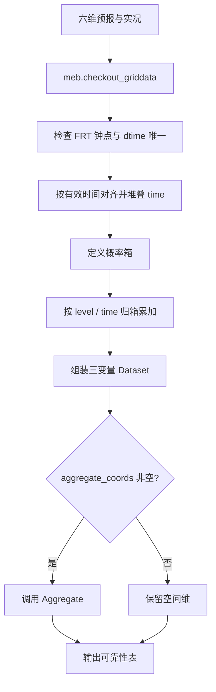
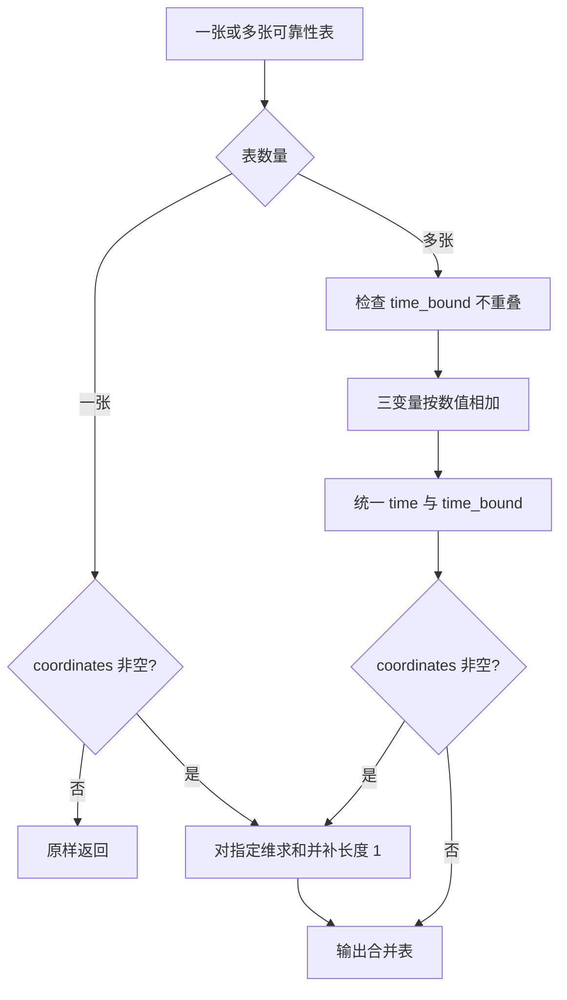
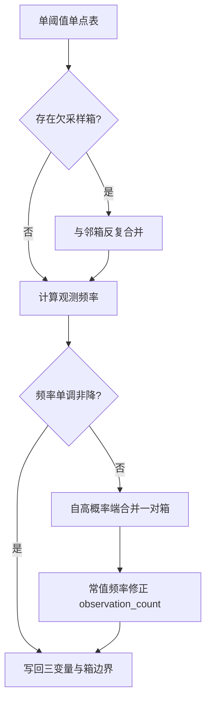
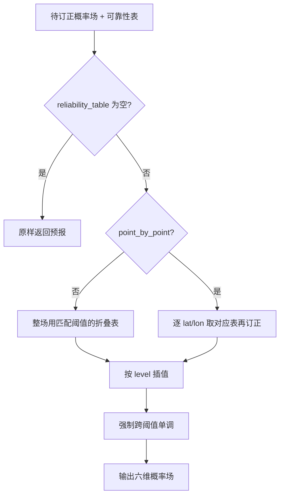

# 可靠性订正（probability_reliability_correction）

本模块实现概率预报的可靠性订正：用历史概率预报与阈值化实况构建可靠性表，整理后映射到待发布概率场。  
算法思想来自 Flowerdew (2014)；实现位于 `probability_reliability_correction/src/`，同时支持：

- **网格**：meb 六维 `xarray`（`member × level × time × dtime × lat × lon`）
- **站点**：meb 六列 `pandas.DataFrame`（`level, time, dtime, id, lon, lat` + 要素列）

二者共用 `src/utils/` 下按阶段拆分的数值内核（`construct` / `manipulate` / `apply`）；Aggregate 以编排层适配为主。`process` 按输入类型分发。网格与站点的数据约定见第 2 节。

文献：Flowerdew J. 2014. *Calibrating ensemble reliability whilst preserving spatial structure*. Tellus A, 66.

---

## 1. 模块概览

### 1.1 插件

| 类 | 作用 |
| ---- | ---- |
| `ConstructReliabilityCalibrationTables` | 历史概率预报 + 阈值化实况 → 可靠性表 |
| `AggregateReliabilityCalibrationTables` | 多表和/或指定坐标求和 |
| `ManipulateReliabilityTable` | 合并欠采样箱、强制观测频率单调 |
| `ApplyReliabilityCalibration` | 用可靠性表插值订正概率预报 |

### 1.2 典型流水线

#### 网格


#### 站点

同一套插件，输入为 `DataFrame`；Manipulate 输出仍为一张长表。


代码入口：

```python
from probability_reliability_correction import (
    ConstructReliabilityCalibrationTables,
    AggregateReliabilityCalibrationTables,
    ManipulateReliabilityTable,
    ApplyReliabilityCalibration,
)
```

---

## 2. 数据约定（当前实现）

网格与站点为**并行** I/O 约定，业务主路径**不互相转换**（可提供显式转换仅用于对照测试）。  
共性：输入须已阈值化；Construct 要求起报钟点唯一、`dtime` 唯一；按有效时间对齐；`relative_to_threshold` 语义一致。

### 2.1 网格分支

#### 2.1.1 预报 / 实况：`xarray.DataArray`

六维顺序固定为：

```text
member × level × time × dtime × lat × lon
```

| 维 | 含义（本模块） |
| ---- | ---------------- |
| `member` | 概率场长度须为 **1**（不支持多样本成员维） |
| `level` | 诊断阈值；预报与实况须 `float32` **精确相等** |
| `time` | 起报时间（FRT） |
| `dtime` | 预报时效（小时）；建表时长度须为 **1** |
| `lat` / `lon` | 空间网格 |

补充：

- 有效时间 = `time + dtime`。Construct 按有效时间对齐预报与实况。  
- 输入须为**已阈值化的概率/事件场**（概率约在 0–1；实况事件为 1、否则为 0）。  
- 实况缺测用 **NaN（非有限值）** 表示，不使用 `MaskedArray`。  
- `attrs["relative_to_threshold"]`：阈值方向。支持 `above` / `below`，以及别名 `greater_than`、`greater_than_or_equal_to`、`less_than`、`less_than_or_equal_to`。Apply 订正后强制跨阈值单调时**必须**有该属性。

#### 2.1.2 可靠性表：`xarray.Dataset`（三变量 × 六维）

Construct / Aggregate 的输出，以及 Manipulate / Apply 的表输入，均为一张 `Dataset`，内含三个同形变量：

- `observation_count`
- `sum_of_forecast_probabilities`
- `forecast_count`

每个变量仍是 meb 六维，维语义与预报场不同处如下：

| meb 维 | 在可靠性表中的含义 |
| -------- | -------------------- |
| `member` | **概率箱**索引 `0..n_bin-1`；辅坐标 `probability_bin`（箱中点）、`probability_bin_bound_lower` / `probability_bin_bound_upper` |
| `level` | 诊断阈值 |
| `time` | 统一起报代表点（通常长度 1；取参与训练起报时间的最大值） |
| `dtime` | 单一时效（通常长度 1） |
| `lat` / `lon` | 空间；空间求和后长度仍保持为 1 |

标量坐标（若有）：

- `time_bound_lower` / `time_bound_upper`：训练所用起报时间范围

Manipulate 默认输出为 **按阈值拆开的 `list[Dataset]`**（各阈值 `member` 箱数可因合并而不同）。

### 2.2 站点分支

站点路径以 meb 站点表 `pandas.DataFrame` 为 I/O。

#### 2.2.1 预报 / 实况（输入）

| 列 | 含义 | dtype |
| ---- | ------ | --------------- |
| `level` | 诊断阈值 | `float32` |
| `time` | 预报：起报时间；实况：有效时间 | `datetime64` |
| `dtime` | 预报：时效（小时）；实况：通常为 `0` | `int32` |
| `id` | 站点编号 | `int32` |
| `lon` / `lat` | 站点经纬度 | `float32` |
| `<要素列>` | 概率或事件（0/1） | `float32` |

对齐键：`(id, 有效时间)`，有效时间 = `time + dtime`（小时）。  
阈值：`level` 按 `float32` 精确相等。  
`relative_to_threshold` 写在 `DataFrame.attrs`（与网格 attrs 同名同语义）。

#### 2.2.2 可靠性表（核心长表）

**一行 = 一个阈值 × 一个空间单元 × 一个概率箱。**

空间单元：

- 逐站建表：一个 `id`  
- 全站聚合后：哨兵站 `id=-1`

列定义：

| 列 | 必填 | 含义 | 对应网格侧 |
| ---- | ------ | ------ | ------------ |
| `level` | 是 | 诊断阈值 | `level` |
| `time` | 是 | 统一起报代表点（通常取训练 FRT 最大） | `time` |
| `dtime` | 是 | 单一时效（小时） | `dtime` |
| `id` | 是 | 站点号；全站聚合后为哨兵 `-1` | （网格无 `id`） |
| `lon` / `lat` | 是 | 站点经纬度；聚合后可为 `NaN` | `lon` / `lat` |
| `bin_index` | 是 | 概率箱序号，从 `0` 起 | `member` |
| `probability_bin` | 是 | 箱中点 | 辅坐标 `probability_bin` |
| `probability_bin_bound_lower` | 是 | 箱下界 | `probability_bin_bound_lower` |
| `probability_bin_bound_upper` | 是 | 箱上界 | `probability_bin_bound_upper` |
| `observation_count` | 是 | 观测发生次数 | 同名变量 |
| `sum_of_forecast_probabilities` | 是 | 预报概率之和 | 同名变量 |
| `forecast_count` | 是 | 预报落入次数 | 同名变量 |

建议 dtype：`bin_index`/`id`/`dtime` → `int32`；计数与概率箱相关列 → `float32`。

行键与排序：

- 逐站表唯一键：`(level, id, bin_index)`  
- 聚合表唯一键：`(level, bin_index)`（此时 `id == -1`）  
- 推荐排序：`level` → `id` → `bin_index`

同一 `(level, id)` 下 `bin_index` 连续从 0 到 `n_bin-1`；Manipulate 合并箱后 `n_bin` 可变，长表天然支持「不同阈值箱数不同」。

`DataFrame.attrs`（表级元数据）：

| 键 | 含义 |
| ---- | ------ |
| `title` | 建议 `"Reliability calibration data table"` |
| `spatial_kind` | `"station"`（逐站）或 `"aggregated"`（已对站点求和） |
| `relative_to_threshold` | `above` / `below` 及网格侧已支持的别名 |
| `time_bound_lower` / `time_bound_upper` | 训练起报时间范围（标量时间戳） |

不把 `time_bound_*` 做成逐行列，避免与 meb 六列语义混淆；读写文件时随表属性一并保存。

#### 2.2.3 与插件的对应关系

| 插件 | 站点输入 | 站点输出 |
| ------ | ---------- | ---------- |
| ConstructReliabilityCalibrationTables | 预报表 + 实况表 | 可靠性长表（默认逐站；`aggregate_coords=["id"]` → `aggregated`/`id=-1`） |
| AggregateReliabilityCalibrationTables | 一张或多张可靠性长表 | 合并后的长表；`coordinates=["id"]` 对全部站点求和 |
| ManipulateReliabilityTable | 可靠性长表 | 仍为一张长表（默认要求已聚合；`point_by_point=True` 时按 `id` 逐站整理） |
| ApplyReliabilityCalibration | 待订正预报表 + 可靠性长表 | 订正后的预报表（六列 + 要素列） |

ApplyReliabilityCalibration：

- 表为 `aggregated`：所有站共用该表  
- 表为 `station` 且 `point_by_point=True`：按 `id` 匹配各站曲线  
- 表为 `station` 且未设 `point_by_point`：报错（对齐网格侧不自动空间聚合）

示例：

```python
from probability_reliability_correction import (
    AggregateReliabilityCalibrationTables,
    ApplyReliabilityCalibration,
    ConstructReliabilityCalibrationTables,
    ManipulateReliabilityTable,
)

table = ConstructReliabilityCalibrationTables().process(
    forecast_df, truth_df, aggregate_coords=["id"]
)
table = ManipulateReliabilityTable(minimum_forecast_count=200).process(table)
calibrated = ApplyReliabilityCalibration().process(forecast_df, table)
```

#### 2.2.4 长表示例（示意）

逐站、单阈值、3 箱时，每个站 3 行：

```text
level  time                 dtime  id    lon    lat   bin_index  probability_bin  ...  forecast_count
273.0  2020-01-10 12:00:00  6      83001 116.3  39.9  0          0.167            ...  120
273.0  2020-01-10 12:00:00  6      83001 116.3  39.9  1          0.500            ...  80
273.0  2020-01-10 12:00:00  6      83001 116.3  39.9  2          0.833            ...  40
273.0  2020-01-10 12:00:00  6      83002 117.1  40.2  0          0.167            ...  100
...
```

全站聚合后同一阈值仅剩 `id=-1` 的 `n_bin` 行，`attrs["spatial_kind"]="aggregated"`。

### 2.3 网格与站点对照

| 概念 | 网格 | 站点长表 |
| ------ | ------ | ---------- |
| 容器 | `xr.Dataset` 三变量 | 单张 `DataFrame` |
| 概率箱维 | `member` | 列 `bin_index`（多行） |
| 空间 | `lat`×`lon` | 列 `id`（多行）或哨兵 `-1` |
| 三行统计 | 三个 DataArray | 三列 |
| Manipulate 默认输出 | 按阈值拆开的 `list[Dataset]` | 仍为一张长表 |

---

## 3. 算法原理

### 3.1 可靠性图

对某一固定阈值，将预报概率分到若干概率箱。每个箱统计：

| 变量 | 含义 |
| ------ | ------ |
| `forecast_count` | 落入该箱的预报次数 |
| `sum_of_forecast_probabilities` | 落入该箱的预报概率之和 |
| `observation_count` | 落入该箱且实况事件发生的次数 |

箱内平均预报概率与观测频率：

$$
\overline{P}_{\mathrm{bin}}
= \frac{\texttt{sum\_of\_forecast\_probabilities}}{\texttt{forecast\_count}},
\qquad
f_{\mathrm{obs}}
= \frac{\texttt{observation\_count}}{\texttt{forecast\_count}}
$$

理想可靠时 $f_{\mathrm{obs}} \approx \overline{P}_{\mathrm{bin}}$。订正用经验关系
$(\overline{P}_{\mathrm{bin}},\, f_{\mathrm{obs}})$ 映射原始概率。

### 3.2 建表时间语义

- 沿**多个有效时间样本**（对齐后堆在 `time` 维上）累加三行统计。  
- 要求：所有样本起报 **小时钟点唯一**；`dtime` 唯一。  
- 输出表上 `time` 为代表起报；`time_bound_*` 覆盖参与训练的起报范围。

### 3.3 订正映射

对每个阈值，若该表至少有 2 个概率箱：

$$
P_{\mathrm{cal}}
= \mathrm{clip}\!\left(
  \mathrm{interp}\bigl(P_{\mathrm{raw}};\;
  \overline{P}_{\mathrm{bin}} \rightarrow f_{\mathrm{obs}}\bigr),\;
  0,\; 1
\right)
$$

分段线性插值；端点先外推再裁剪到 $[0,1]$。箱数不足 2 时该阈值保持原值并告警。  
订正后按 `above`/`below` 强制跨阈值概率单调。

---

## 4. 各插件流程（当前实现）

### 4.1 ConstructReliabilityCalibrationTables



#### 概率分箱

在 $[0,1]$ 上划分 `n_probability_bins` 个互不重叠区间（默认等宽）。相邻边界用浮点最小间隔错开。

可选单值端点箱（宽 `1e-6`）：

- `single_value_lower_limit`：增加 $[0,\,10^{-6}]$  
- `single_value_upper_limit`：增加 $[1-10^{-6},\,1]$  

此时 `n_probability_bins` 为**最终总箱数**（含端点箱）。

归箱：由各箱下界构造边沿，对预报做 `searchsorted`；实况不参与选箱。

#### 缺测

实况含 NaN 时走掩码合并路径：某空间点仅在「累计表与新表均缺测」时仍为无效；上一时刻缺测、下一时刻有效时可恢复。掩码下数据置 0 再累加。

#### 空间聚合

- 默认：每个格点各自沿有效时间累加，**不**自动对 `lat`/`lon` 求和。  
- `aggregate_coords`（如 `["lat","lon"]`）非空时，建表后立刻调用 Aggregate。

### 4.2 AggregateReliabilityCalibrationTables



要点：

- 多表相加用 `.values` 数值求和，**不用** `ds[name] + other[name]`，避免不同 `time` 坐标对齐出 NaN。  
- 多表要求 `time_bound` 不重叠，防止同一历史双计。  
- 空间求和后 `lat`/`lon` 仍保留为长度 1 的维。

### 4.3 ManipulateReliabilityTable

前置（默认）：`lat`、`lon` 长度均为 1；否则报错。  
`point_by_point=True`：对每个 `(level, lat, lon)` 单独整理，输出多张单点表。



1. **欠采样合并**：`forecast_count < minimum_forecast_count`（默认 200）时合并邻箱，直到达标或只剩一箱。  
2. **非单调**：自高概率端合并**一对**下降邻箱。  
3. **仍非单调**：从样本较多端向另一端用常值频率覆盖，再反推 `observation_count`。

### 4.4 ApplyReliabilityCalibration



- 非 `point_by_point`：表的 `lat`/`lon` 须已为长度 1；**不会**自动聚合。  
- `point_by_point`：预报与表空间点须可一一对应；已拆开的单点表按 `lat`/`lon` **精确匹配**（非整场误用第一张表）。  
- 阈值匹配：`level` 做 `float32` 精确相等。  
- `reliability_table=None`：返回原预报（对齐原版 CLI 行为）。

---

## 5. 参数一览

### ConstructReliabilityCalibrationTables

| 参数 | 含义 | 默认 |
| ------ | ------ | ------ |
| `n_probability_bins` | 概率箱总数（含可选单值端点箱） | `5` |
| `single_value_lower_limit` | 是否使用接近 0 的单值箱 | `False` |
| `single_value_upper_limit` | 是否使用接近 1 的单值箱 | `False` |
| `aggregate_coords`（`process`） | 建表后要求和的坐标；`None` 不聚合 | `None` |

### AggregateReliabilityCalibrationTables

| 参数 | 含义 | 默认 |
| ------ | ------ | ------ |
| `coordinates`（`process`） | 要求和的维名（如 `lat`/`lon`） | `None`（单表则不聚合） |

### ManipulateReliabilityTable

| 参数 | 含义 | 默认 |
| ------ | ------ | ------ |
| `minimum_forecast_count` | 箱内最小 `forecast_count` | `200` |
| `point_by_point` | 是否逐空间点整理 | `False` |

### ApplyReliabilityCalibration

| 参数 | 含义 | 默认 |
| ------ | ------ | ------ |
| `point_by_point` | 是否逐空间点用各自的表订正 | `False` |

---

## 6. CLI 与验证

| 示例脚本 | 插件 |
| ---------- | ------ |
| `cli/prb_construct_reliability_tables.py` | Construct |
| `cli/prb_aggregate_reliability_tables.py` | Aggregate |
| `cli/prb_manipulate_reliability_table.py` | Manipulate |
| `cli/prb_apply_reliability_calibration.py` | Apply |

用法：在仓库根目录修改脚本底部路径后执行，例如：

```text
python probability_reliability_correction/cli/prb_construct_reliability_tables.py
```

也可：

```python
from probability_reliability_correction.cli.prb_construct_reliability_tables import process
ds = process(forecast_path, truth_path, output_path="out.nc")
```

说明：

- 输入由后缀区分：网格 ``.nc``（`test_data/.../cli_input/`）；站点 ``.csv``（meb 表头 attrs，读写见 `cli/io.py`）。  
- `process` 只做「读 → 插件 → 写」；格式分支封装在 `cli/io.py`。  
- Manipulate：网格的 `output_path` 为**目录**（按阈值多文件）；站点为**单个 csv**。  
- 站点可靠性表经 Manipulate 后仍为一张长表，Apply 直接读该 csv 即可。  
- 列出脚本：`python -m probability_reliability_correction.cli`  
- 对照与绘图：`nbs/reliability_calibration_validation.ipynb`  
- 测试：`pytest probability_reliability_correction/test`

---

## 7. 注意事项

- 插件不负责从连续量生成概率；输入须已阈值化。  
- Construct：预报/实况阈值 `float32` 精确一致；FRT 钟点与 `dtime` 唯一；有效时间可对齐。  
- 空间求和由 `aggregate_coords` 或后续 Aggregate 决定，不是 Construct 固定步骤。  
- Manipulate 默认要求空间已折叠；欠采样合并可能导致某阈值不足 2 箱，Apply 将跳过该阈值。  
- Apply 缺少 `relative_to_threshold` 时，跨阈值单调检查会报错。  
- CLI 通过 `cli/io.py` 按后缀读写站点 csv，与网格共用各 `prb_*.py` 的 `process`。  
- 测试：`pytest probability_reliability_correction/test`（含网格与站点单测）。  
- 官方 Iris 样例 → meb：`python probability_reliability_correction/cli/preprocess_test_data.py`
  （写出各用例 `cli_input/`；Iris→meb 仅在此脚本维护。Construct 的 Iris 源为已拼接的多时效
  `forecast.nc` / `truth.nc`。验证 Notebook 只读取 `cli_input/`，不再内嵌转换代码）。
