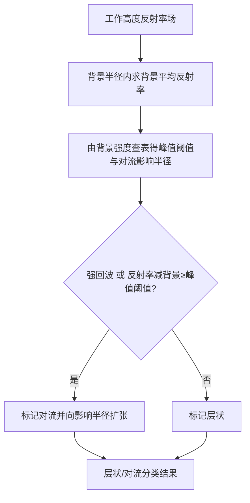
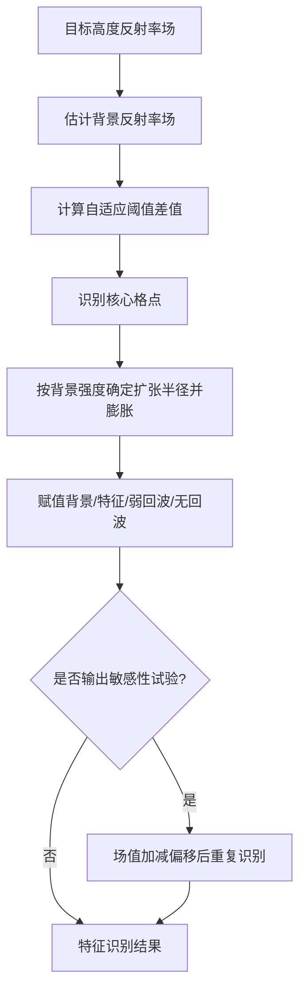
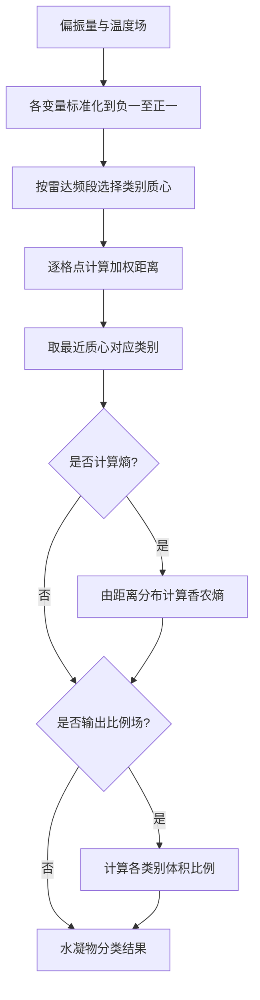
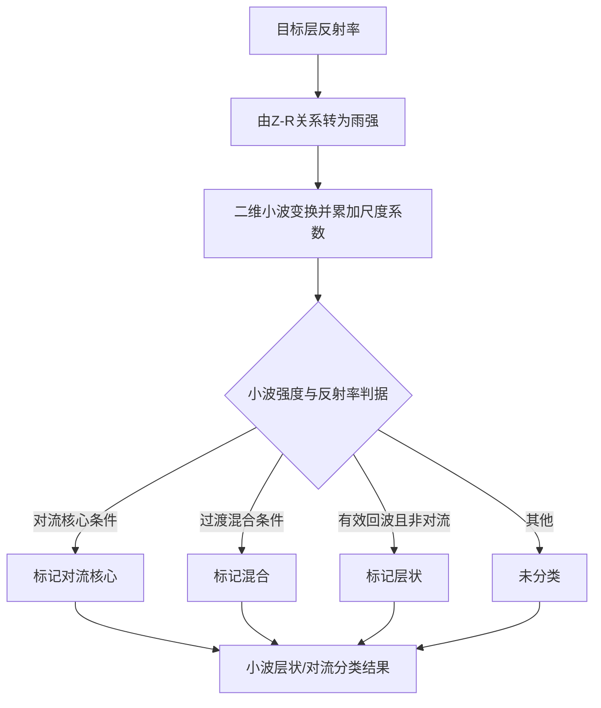

# Echo Class 算法使用说明

本文档说明 `radar_echo_classification.src.echo_class` 的已迁移算法、插件类以及 CLI 应用使用方式。当前实现以 `meteva_base` 六维网格数据（`grid_data`）作为统一输入输出格式。

## 1. 模块定位

`echo_class` 模块用于雷达回波分类与结构识别，包含层状/对流分类、特征识别和半监督水凝物分类等算法。迁移过程中保留原 Py-ART 主要计算逻辑，重点适配 `meteva_base.grid_data` 输入输出。

当前公开入口包括：

|入口|说明|
|------|----------------------------------------|
|算法函数|直接调用单个算法函数，适合调试和精细集成。|
|插件类|每个算法对应一个插件类，便于在 NIMM 插件体系中统一调用。|
|CLI 应用|通过各 `radar_echo_classification/cli/*_main.py` 示例脚本的 `process()` 读取网格文件并输出 nc。|

## 2. 输入输出约定

输入数据应为 `xarray.DataArray`，并符合 `meteva_base.grid_data` 六维结构：

```text
member, level, time, dtime, lat, lon
```

输出保持 `xarray.DataArray` 或 `dict[str, xarray.DataArray]`（由具体算法决定）。

需要注意：

|项目|说明|
|----|------------------------------------------------|
|单场约束|当前实现默认 `member/time/dtime` 为单值场，算法会进行上下文检查。|
|缺测值|建议在调用前清洗 `_FillValue`、`missing_value` 和异常极值。|
|空间坐标|若不传 `dx/dy`，部分算法会根据 `lat/lon` 自动估算；坐标应尽量等距。|
|时间类型|`time` 建议为 `datetime64`，避免 `meteva_base` 网格反推失败。|

## 3. 算法函数清单

|函数|主要输入|功能|
|---------------------------|------------------------------|---------------|
|`steiner_conv_strat`|`refl`|Steiner 层状/对流分类|
|`feature_detection`|`field_data`|自适应特征识别，支持多输出|
|`hydroclass_semisupervised`|`refl,zdr,rhv,kdp,(temp/iso0)`|半监督水凝物分类|
|`conv_strat_raut`|`refl`|Raut 小波层状/对流分类|

## 4. 计算公式

下文约定：$Z_{\mathrm{dBZ}}$ 表示反射率（dBZ）；$Z = 10^{Z_{\mathrm{dBZ}}/10}$ 为线性反射率因子；$R_{\mathrm{bkg}}$ 表示背景场；$r$ 为水平距离（m 或 km，随上下文注明）。公式使用 `$...$` / `$$...$$` 书写，与源码实现一致；部分算法含分段查表或形态学后处理，表中只写核心判据。

各算法小节末尾附**核心处理流程图**（仅展示主要计算步骤，不含网格校验、坐标估算、写盘等外围流程；节点名称均为中文）。

### 4.1 `steiner_conv_strat` — Steiner 层状/对流分类

在工作高度 `work_level` 对应的 `level` 层上取二维反射率场 $Z_{\mathrm{dBZ}}(x,y)$，对每个格点 $(i,j)$ 在背景半径 $R_{\mathrm{bkg}}$（默认 11000 m）内计算背景平均反射率（先在线性 $Z$ 空间平均，再转回 dBZ）：

$$
Z_{\mathrm{bkg}} = 10 \log_{10} \left( \frac{1}{n} \sum_{r \le R_{\mathrm{bkg}}} 10^{Z_{\mathrm{dBZ}}/10} \right)
$$

根据 $Z_{\mathrm{bkg}}$ 查表得到对流影响半径 $R_{\mathrm{conv}}$（`area_relation`：`small`/`medium`/`large`/`sgp`）和峰值阈值 $\Delta Z_{\mathrm{peak}}$（`peak_relation`：`default`/`sgp`）。`default` 峰值关系为：

$$
\Delta Z_{\mathrm{peak}} =
\begin{cases}
10, & Z_{\mathrm{bkg}} < 0 \\
10 - Z_{\mathrm{bkg}}^{2}/180, & 0 \le Z_{\mathrm{bkg}} < 42.43 \\
0, & Z_{\mathrm{bkg}} \ge 42.43
\end{cases}
$$

对流判据（满足其一即标为对流，并向 $R_{\mathrm{conv}}$ 范围内扩张）。默认强回波阈值为 42 dBZ：

$$
Z_{\mathrm{dBZ}} \ge Z_{\mathrm{intense}}
\quad
\left(\mathtt{use\_intense}=\mathtt{True},\ 
Z_{\mathrm{intense}}=42\ \mathrm{dBZ}\right)
$$

$$
Z_{\mathrm{dBZ}} - Z_{\mathrm{bkg}} \ge \Delta Z_{\mathrm{peak}}
$$

否则该格点为层状。输出编码：0 = 未定义，1 = 层状，2 = 对流。

> 实现说明：`steiner_class_buff` 内部调用 `_steiner_conv_strat` 时固定 $R_{\mathrm{bkg}}=11000$ m、`use_intense=True`；`steiner_conv_strat` 形参中的 `bkg_rad`、`use_intense` 当前不传入底层计算。汇总见 §10。

**核心处理流程**



### 4.2 `feature_detection` — 自适应特征识别

在目标高度对应单层上，先以半径 $R_{\mathrm{bkg}}$（`bkg_rad_km`，默认 11 km）的圆形窗口求背景场。`dB_averaging=True`（默认）时：

$$
Z_{\mathrm{bkg}} = 10 \log_{10} \left( \mathrm{mean}_{\mathrm{footprint}} \left( 10^{Z_{\mathrm{dBZ}}/10} \right) \right)
$$

**核心识别**（`use_cosine=True` 为默认，Yuter & Houze 1997 余弦判据）：

$$
\Delta Z(x,y) = a \cos\!\left( \frac{\pi \, Z_{\mathrm{bkg}}}{2 b} \right), \quad \Delta Z \leftarrow \max(\Delta Z,\, 0)
$$

其中 $a$ = `max_diff`（默认 5），$b$ = `zero_diff_cos_val`（默认 55）。$Z_{\mathrm{bkg}}<0$ 时令 $\Delta Z = a$。核心格点：

$$
Z_{\mathrm{dBZ}} \ge Z_{\mathrm{core}} \quad \lor \quad Z_{\mathrm{dBZ}} - Z_{\mathrm{bkg}} \ge \Delta Z
$$

$Z_{\mathrm{core}}$ = `always_core_thres`（默认 42 dBZ）。

`use_cosine=False` 时使用标量差值判据（`use_addition=True` 时 $\Delta Z = a$；`False` 时 $\Delta Z = \max(a \cdot Z_{\mathrm{bkg}} - Z_{\mathrm{bkg}},\, 0)$）。

**半径扩张**：按 $Z_{\mathrm{bkg}}$ 分段赋予扩张半径 $R_{\mathrm{feat}}$（km，最大 `max_rad_km`，默认 5 km），对核心做二值膨胀，将邻域标为特征回波。

**最终分类**（默认标签值）：先赋背景 `bkgd_val`=1；核心及扩张区为 `feat_val`=2；$Z_{\mathrm{dBZ}} < \mathtt{weak\_echo\_thres}$（默认 5）为 `weakecho`=3；$Z_{\mathrm{dBZ}} < \mathtt{min\_val\_used}$（默认 5）为 `nosfcecho`=0。

`estimate_flag=True` 时，另对 $Z_{\mathrm{dBZ}} \pm \mathtt{estimate\_offset}$（默认 5 dBZ）各运行一次，输出 `feature_under` / `feature_over`。

**核心处理流程**



### 4.3 `hydroclass_semisupervised` — 半监督水凝物分类

对 `var_names` 中每个变量先标准化到 $[-1,1]$，再与各类质心 $\mathbf{c}_k$ 计算加权欧氏距离，取最近质心为类别。

**相对高度 `relH`**（由温度场构造，`temp_ref=temperature`）：

$$
\mathrm{relH} = T \cdot \frac{1000}{\mathtt{lapse\_rate}}, \quad \hat{x} = \frac{2}{1 + e^{-0.005 \cdot \mathrm{relH}}} - 1
$$

默认 `lapse_rate` = $-6.5$ °C/km。

**Zh、ZDR**（线性缩放到 $[-1,1]$，超出界截断）：

$$
\hat{x} = 2 \cdot \frac{x - x_{\min}}{x_{\max} - x_{\min}} - 1
$$

默认界：Zh $x_{\max}=60,\ x_{\min}=-10$；ZDR $5,\ -1.5$。

入参预检（`_check_single_context`）只剔除明显填充/异常值，范围宽于上表标准化界；超出标准化界的有效观测由 `_standardize` 饱和到 $\pm 1$，与官方 Py-ART 一致。当前预检：Zh $(-200,200)$，ZDR $(-50,50)$，KDP $(-100,100)$，RhoHV $(-0.5,1.5)$，温度 $(-200,100)$，相对高度 iso0 $(-10000,10000)$。

**KDP**（先截断再对数变换，再线性缩放）：

$$
\mathrm{KDP}' = \max(\mathrm{KDP},\, -0.5), \quad x' = 10 \log_{10}(\mathrm{KDP}' + 0.6)
$$

**RhoHV**：

$$
\rho' = \min(\rho_{\mathrm{HV}},\, 1), \quad x' = 10 \log_{10}(1.0000000000001 - \rho')
$$

**加权距离与分类**（$w_j$ = `weights`，默认 $(1, 1, 1, 0.75, 0.5)$）：

$$
d_k = \sqrt{ \sum_{j} w_j \left( \hat{x}_j - c_{k,j} \right)^2 }
$$

$$
H = \arg\min_k d_k + 1 \quad (\text{缺测格点 } H=0)
$$

质心矩阵 `mass_centers` 未给定时，按输入 `frequency`（Hz）或 `radar_freq` 选择 S/C/X 频段默认质心；无法识别时用 C 波段。

**可选熵场**（`compute_entropy=True`）：先计算各类变换系数 $t_k$（由质心间次小距离与 `value` 默认 50 确定，$t_k = \ln(\mathtt{value})/d_{k,2}$），再得各类占比

$$
p_k = \frac{\exp(-t_k \, d_k)}{\sum_j \exp(-t_j \, d_j)}, \quad
S = -\sum_k \frac{p_k \ln p_k}{\ln N_{\mathrm{class}}}
$$

`output_distances=True` 时输出 $100 \cdot p_k$（%）作为各类比例场。类别编号 1–9 对应 `hydro_names`（AG、CR、LR、RP、RN、VI、WS、MH、IH/HDG）。

**核心处理流程**



### 4.4 `conv_strat_raut` — Raut 小波层状/对流分类

在 `cappi_level` 对应层上，先将 dBZ 经 Z-R 关系转为雨强（默认 Marshall 形式 $Z = a R^b$，$a$=`zr_a`=200，$b$=`zr_b`=1.6）：

$$
R = \left( \frac{10^{Z_{\mathrm{dBZ}}/10}}{a} \right)^{1/b}
$$

对 $R$ 做二维平稳小波变换（ATWT），累加尺度 $1 \ldots s_{\mathrm{break}}$ 的小波系数得 $W$：

$$
W = \sum_{s=1}^{s_{\mathrm{break}}} \mathrm{WT}_s(R)
$$

尺度分界（`conv_scale_km` 默认 25 km，分辨率 $\Delta x$ 单位 m）：

$$
s_{\mathrm{break}} = \mathrm{round}\!\left( \frac{\ln(L_{\mathrm{conv}} / (\Delta x/1000))}{\ln 2} + 1 \right)
$$

分类判据（按源码 `label_classes` 顺序求值；默认阈值；`override_checks=False` 时部分阈值会被夹紧到推荐范围）：

|条件|类别|
|----|----|
|$W \ge W_{\mathrm{core}}$ 且 $Z_{\mathrm{dBZ}} \ge Z_{\mathrm{conv\_min}}$|3 对流核心|
|$W_{\mathrm{conv}} \le W < W_{\mathrm{core}}$ 且 $Z_{\mathrm{dBZ}} \ge Z_{\mathrm{conv\_min}}$|2 过渡混合|
|以上均不满足且 $Z_{\mathrm{dBZ}} \ge Z_{\mathrm{min}}$|1 层状|
|其他|0 未分类（缺测掩膜）|

默认：$W_{\mathrm{core}}$=`core_wt_threshold`=5，$W_{\mathrm{conv}}$=`conv_wt_threshold`=1.5，$Z_{\mathrm{min}}$=`min_reflectivity`=5，$Z_{\mathrm{conv\_min}}$=`conv_min_refl`=25 dBZ。`conv_core_threshold`（默认 42 dBZ）在实现中会被后续判据覆盖，一般不单独生效（汇总见 §10）。

**核心处理流程**



## 5. 插件类说明

当前插件类（位于 `radar_echo_classification.src.echo_class`）：

|插件类|对应算法函数|说明|
|--------------------------------|---------------------------|----------------|
|`SteinerConvStratPlugin`|`steiner_conv_strat`|Steiner 层状/对流分类。|
|`FeatureDetectionPlugin`|`feature_detection`|特征识别，返回多字段字典。|
|`HydroclassSemisupervisedPlugin`|`hydroclass_semisupervised`|水凝物分类，返回多字段字典。|
|`ConvStratRautPlugin`|`conv_strat_raut`|小波层状/对流分类。|

统一说明：

- 插件类仅做参数转发，不新增算法计算逻辑；参数语义与对应算法函数一致。
- 文档分层与 `qpe` 插件对齐，便于 IDE 提示：
  - **类 docstring**：算法功能概述、核心流程、输出类别/字段含义；
  - **`__init__` docstring**：构造参数说明（实例化 `Plugin(...)` 时可见）；
  - **`process` docstring**：运行时输入与返回值（调用 `.process(...)` 时可见）。
- 各算法核心处理流程见 §4 各小节流程图；插件 `process` 内部调用同名算法函数。

### 5.1 插件类参数对照

#### a) `SteinerConvStratPlugin`

|插件参数|对应算法函数参数|说明|
|---------------|-----------------------------------|----------------|
|`dx`, `dy`|`steiner_conv_strat(dx, dy)`|网格分辨率（米），可空自动估算。|
|`intense`|`steiner_conv_strat(intense)`|强对流阈值（dBZ）。|
|`work_level`|`steiner_conv_strat(work_level)`|计算高度（米）。|
|`peak_relation`|`steiner_conv_strat(peak_relation)`|峰值关系方案。|
|`area_relation`|`steiner_conv_strat(area_relation)`|面积关系方案。|
|`bkg_rad`|`steiner_conv_strat(bkg_rad)`|背景半径（米）。|
|`use_intense`|`steiner_conv_strat(use_intense)`|是否启用强对流快速判别。|

#### b) `FeatureDetectionPlugin`

|插件参数|对应算法函数参数|说明|
|------------------------------------------------------------------------------------------|------------------------------------|------------|
|`dx`, `dy`, `level_m`|`feature_detection(dx, dy, level_m)`|空间分辨率与目标高度。|
|`always_core_thres`, `bkg_rad_km`|`feature_detection(...)`|强核心阈值与背景半径。|
|`use_cosine`, `max_diff`, `zero_diff_cos_val`, `scalar_diff`, `use_addition`, `calc_thres`|`feature_detection(...)`|阈值修正相关参数。|
|`weak_echo_thres`, `min_val_used`, `dB_averaging`|`feature_detection(...)`|弱回波与平均策略参数。|
|`remove_small_objects`, `min_km2_size`, `binary_close`|`feature_detection(...)`|小目标过滤与形态学参数。|
|`val_for_max_rad`, `max_rad_km`|`feature_detection(...)`|半径控制参数。|
|`core_val`, `nosfcecho`, `weakecho`, `bkgd_val`, `feat_val`|`feature_detection(...)`|输出标签值参数。|
|`estimate_flag`, `estimate_offset`|`feature_detection(...)`|估算输出控制参数。|

#### c) `HydroclassSemisupervisedPlugin`

|插件参数|对应算法函数参数|说明|
|---------------------------------|---------------------------------------------|-------------------------|
|`hydro_names`|`hydroclass_semisupervised(hydro_names)`|输出类别名序列。|
|`var_names`|`hydroclass_semisupervised(var_names)`|参与分类变量序列。|
|`mass_centers`|`hydroclass_semisupervised(mass_centers)`|分类质心矩阵。|
|`weights`|`hydroclass_semisupervised(weights)`|变量权重，长度需与 `var_names` 一致。|
|`value`, `lapse_rate`, `temp_ref`|`hydroclass_semisupervised(...)`|温度构造与引用参数。|
|`radar_freq`|`hydroclass_semisupervised(radar_freq)`|雷达频率（Hz）；未给定时尝试从输入网格 `frequency` 属性读取。|
|`compute_entropy`|`hydroclass_semisupervised(compute_entropy)`|是否输出熵场。|
|`output_distances`|`hydroclass_semisupervised(output_distances)`|是否输出距离场。|
|`vectorize`|`hydroclass_semisupervised(vectorize)`|是否使用矢量化路径。|

#### d) `ConvStratRautPlugin`

|插件参数|对应算法函数参数|说明|
|----------------------------------------------------------|------------------------------------|-----------------|
|`cappi_level`|`conv_strat_raut(cappi_level)`|计算层号/层位。|
|`zr_a`, `zr_b`|`conv_strat_raut(zr_a, zr_b)`|Z-R 关系系数。|
|`core_wt_threshold`|`conv_strat_raut(core_wt_threshold)`|小波核心阈值。|
|`conv_wt_threshold`|`conv_strat_raut(conv_wt_threshold)`|对流阈值。|
|`conv_scale_km`|`conv_strat_raut(conv_scale_km)`|对流尺度参数（km）。|
|`min_reflectivity`, `conv_min_refl`, `conv_core_threshold`|`conv_strat_raut(...)`|反射率与核心判据阈值。|
|`override_checks`|`conv_strat_raut(override_checks)`|是否跳过部分检查。|

### 5.2 插件调用示例

```python
import meteva_base as meb
from radar_echo_classification.src.echo_class import (
    SteinerConvStratPlugin,
    FeatureDetectionPlugin,
    HydroclassSemisupervisedPlugin,
    ConvStratRautPlugin,
)

refl = meb.read_griddata_from_nc(
    "radar_echo_classification/test_data/echo_class/cli_input/ACHN_CREF000_20240612_070000_small.nc"
)

# Steiner
steiner = SteinerConvStratPlugin(work_level=0.0)
steiner_cls = steiner(refl)

# Feature detection
feat = FeatureDetectionPlugin(level_m=0.0)
feat_dict = feat(refl)
feat_main = feat_dict["feature_detection"]

# Hydroclass（官方示例预处理后的 cli_input 网格）
refl_h = meb.read_griddata_from_nc(
    "radar_echo_classification/test_data/echo_class/cli_input/hydro_corrected_reflectivity.nc"
)
zdr_h = meb.read_griddata_from_nc(
    "radar_echo_classification/test_data/echo_class/cli_input/hydro_corrected_differential_reflectivity.nc"
)
kdp_h = meb.read_griddata_from_nc(
    "radar_echo_classification/test_data/echo_class/cli_input/hydro_specific_differential_phase.nc"
)
rhv_h = meb.read_griddata_from_nc(
    "radar_echo_classification/test_data/echo_class/cli_input/hydro_uncorrected_cross_correlation_ratio.nc"
)
temp_h = meb.read_griddata_from_nc(
    "radar_echo_classification/test_data/echo_class/cli_input/hydro_temperature.nc"
)

hydro_plugin = HydroclassSemisupervisedPlugin(radar_freq=5.45e9)
hydro_dict = hydro_plugin(refl=refl_h, zdr=zdr_h, kdp=kdp_h, rhv=rhv_h, temp=temp_h)
hydro = hydro_dict["hydro"]

# Raut
raut = ConvStratRautPlugin(cappi_level=0)
raut_cls = raut(refl)
```

## 6. 直接调用算法函数

```python
from radar_echo_classification.src.echo_class import (
    steiner_conv_strat,
    feature_detection,
    hydroclass_semisupervised,
    conv_strat_raut,
)

steiner_cls = steiner_conv_strat(refl, work_level=3000.0)
feat_dict = feature_detection(refl, level_m=3000.0)
hydro_dict = hydroclass_semisupervised(refl, zdr, rhv, kdp, temp=temp)
raut_cls = conv_strat_raut(refl, cappi_level=0)
```

## 7. CLI 应用

各算法对应独立示例脚本，统一入口函数为 `process()`；内部构造对应插件并完成读入、计算与写盘。

|脚本|算法|
|---|---|
|`radar_echo_classification/cli/steiner_conv_strat_main.py`|Steiner 对流/层状分类|
|`radar_echo_classification/cli/feature_detection_main.py`|自适应特征识别|
|`radar_echo_classification/cli/conv_strat_raut_main.py`|Raut 小波对流/层状分类|
|`radar_echo_classification/cli/hydroclass_semisupervised_main.py`|半监督水凝物分类|

也可直接运行示例脚本（需先修改脚本底部路径与参数）：

```powershell
python radar_echo_classification/cli/steiner_conv_strat_main.py
python radar_echo_classification/cli/feature_detection_main.py
python radar_echo_classification/cli/conv_strat_raut_main.py
python radar_echo_classification/cli/hydroclass_semisupervised_main.py
```

查看可用脚本列表：

```powershell
python -m radar_echo_classification.cli
```

### 7.1 steiner_conv_strat 示例

```python
from radar_echo_classification.cli.steiner_conv_strat_main import process

process(
    "radar_echo_classification/test_data/echo_class/cli_input/ACHN_CREF000_20240612_070000_small.nc",
    work_level=0.0,
    output_path="radar_echo_classification/test_data/echo_class/cli_output/achn_steiner_cli.nc",
)
```

### 7.2 feature_detection 示例

```python
from radar_echo_classification.cli.feature_detection_main import process

process(
    "radar_echo_classification/test_data/echo_class/cli_input/ACHN_CREF000_20240612_070000_small.nc",
    level_m=0.0,
    result_key="feature_detection",
    output_path="radar_echo_classification/test_data/echo_class/cli_output/achn_feature_cli.nc",
)
```

### 7.3 conv_strat_raut 示例

```python
from radar_echo_classification.cli.conv_strat_raut_main import process

process(
    "radar_echo_classification/test_data/echo_class/cli_input/ACHN_CREF000_20240612_070000_small.nc",
    cappi_level=0,
    output_path="radar_echo_classification/test_data/echo_class/cli_output/achn_raut_cli.nc",
)
```

### 7.4 hydroclass_semisupervised（5 变量）示例

```python
from radar_echo_classification.cli.hydroclass_semisupervised_main import process

process(
    refl_path="radar_echo_classification/test_data/echo_class/cli_input/hydro_corrected_reflectivity.nc",
    zdr_path="radar_echo_classification/test_data/echo_class/cli_input/hydro_corrected_differential_reflectivity.nc",
    kdp_path="radar_echo_classification/test_data/echo_class/cli_input/hydro_specific_differential_phase.nc",
    rhv_path="radar_echo_classification/test_data/echo_class/cli_input/hydro_uncorrected_cross_correlation_ratio.nc",
    temp_path="radar_echo_classification/test_data/echo_class/cli_input/hydro_temperature.nc",
    var_names=("Zh", "ZDR", "KDP", "RhoHV", "relH"),
    weights=(1.0, 1.0, 1.0, 0.75, 0.5),
    output_path="radar_echo_classification/test_data/echo_class/cli_output/hydro_cli.nc",
)
```

### 7.5 CLI 参数说明（按脚本 `process`）

|脚本 `process`|必需输入参数|关键可选参数|
|---|---|---|
|`steiner_conv_strat_main`|`refl_path`|`dx` `dy` `intense` `work_level` `peak_relation` `area_relation` `bkg_rad` `use_intense`|
|`feature_detection_main`|`field_data_path`|`result_key` `dx` `dy` `level_m` `remove_small_objects` `binary_close` 等|
|`conv_strat_raut_main`|`refl_path`|`cappi_level` 及各阈值参数|
|`hydroclass_semisupervised_main`|多变量输入（至少与 `var_names` 对齐）|`var_names` `weights` `mass_centers_path` `radar_freq` `vectorize` `result_key`|

说明：

- 布尔参数直接以 Python 关键字传入，例如 `use_intense=True`、`binary_close=False`（默认与算法一致）。
- 未显式传入的算法参数均使用插件/原版默认值；示例脚本只覆盖输入路径与必要层位。
- `feature_detection`、`hydroclass_semisupervised` 默认输出多字段；如需单字段输出请使用 `result_key`。
- `output_path` 非空时写出 NetCDF（`save_echo_class_grid_to_netcdf`：float32 + CF 缺测）；为空则只返回内存结果。CLI 样例输入也应用同一写盘方式，避免 `meteva_base.write_griddata_to_nc` 默认 int32/`scale_factor=0.001` 量化导致边界格点分类翻转。

### 7.6 CLI 参数详表

#### a) `steiner_conv_strat_main.process`

|参数|类型|必填|默认值|说明|
|---|---|---|---|---|
|`refl_path`|文件路径|是|-|反射率网格数据文件（单要素）。|
|`dx`|`float`|否|`None`|网格 x 向分辨率（米），为空时自动估算。|
|`dy`|`float`|否|`None`|网格 y 向分辨率（米），为空时自动估算。|
|`intense`|`float`|否|`42.0`|强对流阈值（dBZ）。|
|`work_level`|`float`|否|`3000.0`|分类工作高度（米）。|
|`peak_relation`|`str`|否|`default`|峰值关系方案。|
|`area_relation`|`str`|否|`medium`|面积关系方案。|
|`bkg_rad`|`float`|否|`11000.0`|背景半径（米）。|
|`use_intense`|`bool`|否|`True`|是否启用强对流快速判别。|
|`output_path`|文件路径|否|-|输出 nc 路径。|

#### b) `feature_detection_main.process`

|参数|类型|必填|默认值|说明|
|---|---|---|---|---|
|`field_data_path`|文件路径|是|-|主输入网格数据（通常反射率）。|
|`overest_field_path`|文件路径|否|`None`|过估辅助场。|
|`underest_field_path`|文件路径|否|`None`|低估辅助场。|
|`result_key`|`str`|否|`None`|指定后仅输出单字段（如 `feature_detection`）。|
|`remove_small_objects`|`bool`|否|`True`|是否移除小目标。|
|`binary_close`|`bool`|否|`False`|是否执行闭运算。|
|`output_path`|文件路径|否|-|输出 nc 路径。|

#### c) `hydroclass_semisupervised_main.process`

|参数|类型|必填|默认值|说明|
|---|---|---|---|---|
|`refl_path` / `zdr_path` / `rhv_path` / `kdp_path`|文件路径|按 `var_names`|`None`|参与分类的主变量输入。|
|`temp_path` / `iso0_path`|文件路径|否|`None`|温度或 0℃层输入。|
|`var_names`|序列|否|`("Zh", "ZDR", "KDP", "RhoHV", "relH")`|分类变量序列。|
|`mass_centers_path`|文件路径|否|`None`|质心文件（`.npy/.txt/.csv`）。|
|`weights`|序列|否|`(1.0, 1.0, 1.0, 0.75, 0.5)`|变量权重。|
|`result_key`|`str`|否|`None`|指定后仅输出单字段。|
|`output_path`|文件路径|否|-|输出 nc 路径。|

#### d) `conv_strat_raut_main.process`

|参数|类型|必填|默认值|说明|
|---|---|---|---|---|
|`refl_path`|文件路径|是|-|反射率网格数据文件。|
|`cappi_level`|`float`|否|`0`|参与计算层号/层位。|
|`zr_a` / `zr_b`|`float`|否|`200` / `1.6`|Z-R 关系系数。|
|`output_path`|文件路径|否|-|输出 nc 路径。|

## 8. 数据预处理建议

建议将原始数据预处理为标准 `meteva_base.grid_data` 后再调用算法/CLI：

|内容|建议|
|-----|----------------------------------------------|
|维度补齐|统一为 `member, level, time, dtime, lat, lon`。|
|坐标处理|保持坐标单调、尽量等间隔，避免明显浮点尾差。|
|缺测清洗|将 `_FillValue`、`missing_value` 和异常极值清洗为 `NaN`。|
|单要素文件|CLI 推荐单文件单物理量，避免歧义。|

## 9. 测试情况

自动化测试位于 `radar_echo_classification/test/`，运行：

```powershell
python -m pytest radar_echo_classification/test -q
```

|测试文件|覆盖内容|用例数|
|--------|--------|------|
|`test_echo_class.py`|算法函数：与底层核心逻辑一致、输出形状/字段；水凝物频段选择（attrs / `radar_freq` / C 波段回退）|9|
|`test_echo_class_plugin.py`|四个插件类可构造并返回正确网格或结果字典|4|
|`test_echo_class_cli.py`|四个 CLI `process` 与对应插件结果一致（输入来自 `cli_input/`）|4|

**当前结果**：`17 passed`（本地全量跑通）。

与官方 Py-ART 的样例场逐格对比见 `radar_echo_classification/nbs/echo_class.ipynb`，不纳入上述 pytest 统计。

## 10. 已知限制

下列行为与当前实现一致；调用时请注意参数是否真正生效。

|问题|说明|
|----|----|
|Steiner：`bkg_rad`、`use_intense` 不生效|`steiner_conv_strat` / 插件虽暴露这两个参数，并传入 `steiner_class_buff`，但后者调用 `_steiner_conv_strat` 时写死为 `bkg_rad=11000`、`use_intense=True`，与公开形参无关。修改二者不会改变分类结果。详见 §4.1。|
|Raut：`conv_core_threshold` 基本不单独生效|默认 42 dBZ；`label_classes` 中后续反射率与小波阈值判据会覆盖该参数的独立作用。详见 §4.4。|

其余算法参数（含 Feature / Hydro 及 Raut 的其它阈值）按形参传入并参与计算。若需 Steiner 背景半径或强回波开关可配置，需改 `steiner_class_buff` 将参数真正下传到底层。
