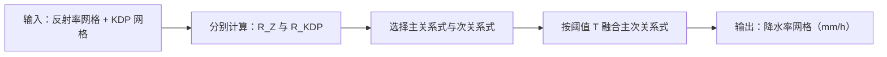
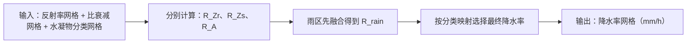

# QPE 算法使用说明

本文档说明 `qpe.src.qpe` 中已迁移的定量降水估计算法、`QPEPlugin` 插件类以及 CLI 应用的使用方式。当前算法以 `meteva_base` 的六维网格数据 `grid_data` 作为输入和输出。

## 1. 模块定位

QPE 模块用于根据雷达反射率、KDP、比衰减和水凝物分类等网格数据估算降水率。迁移后的代码保留原 Py-ART 算法的主要计算逻辑，重点修改输入输出，使算法可以直接处理 `meteva_base.grid_data`。

当前公开入口包括三类：

|入口|说明|
|---|---|
|算法函数|直接调用某一个 QPE 算法，适合调试、验证和细粒度集成。|
|`EstimateRainRate*` / `EstimateZtoR`|与算法函数一一对应的独立插件类，供 Python 或 CLI 封装调用。|
|`QPEPlugin`|通过 `method` 统一分发到不同 QPE 算法（兼容旧用法）。|
|CLI 应用|通过 `qpe/cli/qpe.py` 中的 Python 函数读取网格文件并输出 nc。|

## 2. 输入输出约定

输入数据应为 `xarray.DataArray`，并符合 `meteva_base.grid_data` 的六维网格结构：

```text
member, level, time, dtime, lat, lon
```

算法内部会检查输入是否为单要素网格数据，并在输出时使用输入网格信息重组结果。输出仍为 `xarray.DataArray`，数据含义为降水率，通常单位为 `mm/h`。

需要注意：

|项目|说明|
|---|---|
|缺测值|建议在算法调用前完成缺测值、异常填充值和维度类型预处理。|
|时间维|`meteva_base` 默认要求 `time` 为 `datetime64` 类型。|
|频率和频段|`est_rain_rate_kdp`、`est_rain_rate_a`、`est_rain_rate_zkdp`、`est_rain_rate_za`、`est_rain_rate_hydro` 会从输入数据 `attrs` 中读取 `frequency` 或 `band`，用于自动选择默认系数。|
|坐标精度|算法不主动修正经纬度浮点尾差；如果原始数据存在坐标或维度类型问题，应在预处理阶段解决。|

## 3. 算法函数清单

|函数|主要输入|功能|
|---|---|---|
|`est_rain_rate_z`|`refl`|根据反射率和幂律 Z-R 关系估算降水率。|
|`est_rain_rate_zpoly`|`refl`|根据反射率多项式经验关系估算降水率。|
|`est_rain_rate_kdp`|`kdp`|根据 KDP 估算降水率。|
|`est_rain_rate_a`|`att`|根据比衰减估算降水率。|
|`est_rain_rate_zkdp`|`refl`, `kdp`|根据阈值在 Z-R 与 KDP-R 结果之间选择。|
|`est_rain_rate_za`|`refl`, `att`|根据阈值在 Z-R 与 A-R 结果之间选择。|
|`est_rain_rate_hydro`|`refl`, `att`, `hydro`|结合水凝物分类、反射率和比衰减估算降水率。|
|`ZtoR`|`refl`|使用 `Z = aR^b` 形式将反射率转换为降水率。|

## 4. 计算公式

下文约定：$Z_{\mathrm{dBZ}}$ 表示反射率（单位 dBZ），$Z$ 表示线性反射率因子（无量纲，$Z = 10^{Z_{\mathrm{dBZ}}/10}$）；$R$ 表示降水率（单位 mm/h）；$\mathrm{KDP}$ 表示比差分相移率；$A$ 表示比衰减。算法参数 $\alpha$、$\beta$ 等与源码中同名参数一致。

### 4.1 `est_rain_rate_z` — 幂律 Z-R 关系

先将 dBZ 转为线性反射率因子，再套用幂律关系：

$$
Z = 10^{Z_{\mathrm{dBZ}}/10}
$$

$$
R = \alpha \, Z^{\beta}
$$

默认系数：$\alpha = 0.0376$，$\beta = 0.6112$。

核心计算流程图（仅展示主计算链路）：

```mermaid
flowchart LR
    A[输入：反射率网格（dBZ）]
    B[反射率转换：Z = 10^(Z_dBZ/10)]
    C[降水率估算：R = α × Z^β]
    D[输出：降水率网格（mm/h）]
    A --> B --> C --> D
```

### 4.2 `est_rain_rate_zpoly` — 反射率多项式关系

直接以 dBZ 为自变量，使用四次多项式经验关系（系数已固化在代码中）：

$$
R = 10^{-2.3 + 0.17\,Z_{\mathrm{dBZ}} - 5.1\times10^{-3}\,Z_{\mathrm{dBZ}}^{2} + 9.8\times10^{-5}\,Z_{\mathrm{dBZ}}^{3} - 6\times10^{-7}\,Z_{\mathrm{dBZ}}^{4}}
$$

核心计算流程图（仅展示主计算链路）：

```mermaid
flowchart LR
    A[输入：反射率网格（dBZ）]
    B[多项式计算：R = 10^(...Z_dBZ多项式...)]
    C[输出：降水率网格（mm/h）]
    A --> B --> C
```

### 4.3 `est_rain_rate_kdp` — KDP-R 关系

对负值 KDP 先置零，再计算：

$$
\mathrm{KDP}^{\prime} = \max(\mathrm{KDP},\, 0)
$$

$$
R = \alpha \, (\mathrm{KDP}^{\prime})^{\beta}
$$

核心计算流程图（仅展示主计算链路）：

```mermaid
flowchart LR
    A[输入：KDP 网格]
    B[非负约束：KDP' = max(KDP, 0)]
    C[降水率估算：R = α × (KDP')^β]
    D[输出：降水率网格（mm/h）]
    A --> B --> C --> D
```

未显式给定 $\alpha$、$\beta$ 时，根据输入网格 `attrs` 中的 `frequency`（Hz）推断 S/C/X 频段并选择默认系数；无法识别时默认使用 C 波段：

|频段|$\alpha$|$\beta$|
|---|---|---|
|S|50.70|0.8500|
|C|29.70|0.8500|
|X|15.81|0.7992|

### 4.4 `est_rain_rate_a` — 比衰减 A-R 关系

$$
R = \alpha \, A^{\beta}
$$

核心计算流程图（仅展示主计算链路）：


未显式给定系数时，同样根据 `frequency` 推断频段；无法识别时默认 C 波段：

|频段|$\alpha$|$\beta$|
|---|---|---|
|S|3100.0|1.03|
|C|250.0|0.91|
|X|45.5|0.83|

### 4.5 `est_rain_rate_zkdp` — Z 与 KDP 融合

先分别计算：

$$
R_Z = \alpha_z \, Z^{\beta_z} = \alpha_z \cdot 10^{\beta_z Z_{\mathrm{dBZ}}/10}, \quad R_{\mathrm{KDP}} = \alpha_{\mathrm{KDP}} \, (\mathrm{KDP}^{\prime})^{\beta_{\mathrm{KDP}}}
$$

其中 $R_Z$ 与 $R_{\mathrm{KDP}}$ 分别对应 `est_rain_rate_z` 与 `est_rain_rate_kdp` 的结果。`main_field` 指定哪一套估算结果作为**主关系式** $R_{\mathrm{main}}$（另一套为 $R_{\mathrm{sec}}$）：默认或未指定时为 $R_Z$，亦可设为 $R_{\mathrm{KDP}}$。阈值 $T$ 与 $R_{\mathrm{main}}$ 同单位（mm/h），**不是** dBZ 或 $\mathrm{KDP}$ 原始量。

缺测补齐：主关系式为 NaN 且次关系式有效时，先用次关系式填补：

$$
R_{\mathrm{main}} \leftarrow R_{\mathrm{sec}}, \quad \text{若 } \mathrm{NaN}(R_{\mathrm{main}}) \land \mathrm{finite}(R_{\mathrm{sec}})
$$

阈值切换（`thresh_max=True` 为默认；在缺测补齐**之后**执行）：

$$
R =
\begin{cases}
R_{\mathrm{sec}}, & R_{\mathrm{main}} > T \\
R_{\mathrm{main}}, & \text{其他}
\end{cases}
$$

当 `thresh_max=False` 时，切换条件改为 $R_{\mathrm{main}} < T$。$T$ 由参数 `thresh` 指定；未指定 `main_field` 时默认以 $R_Z$ 为 $R_{\mathrm{main}}$（示例中常用 $T = 40.0$ mm/h）。

核心计算流程图（仅展示主计算链路）：



### 4.6 `est_rain_rate_za` — Z 与比衰减融合

先分别计算 $R_Z$（同 4.1）与 $R_A$（同 4.4），再按与 4.5 相同的缺测补齐与阈值切换逻辑融合（$T$ 同样作用于 $R_{\mathrm{main}}$，单位 mm/h）。未指定 `main_field` 时默认 $R_{\mathrm{main}} = R_A$；`thresh_max=False` 为默认（未知 `main_field` 时回退 $T = 0.04$ mm/h）。

核心计算流程图（仅展示主计算链路）：


### 4.7 `est_rain_rate_hydro` — 水凝物分类

算法对每个格点只输出**一个**降水率 $R$（mm/h）；该格点使用哪套关系式，由其水凝物类别 $H$（`hydro` 网格取值 1–9）决定。$H$ 不在 1–9 的格点保持缺测（`NaN`）。

先由反射率、比衰减分别计算三套中间场（$Z = 10^{Z_{\mathrm{dBZ}}/10}$）：

$$
R_{Z_r} = \alpha_{zr} \, Z^{\beta_{zr}}, \qquad
R_{Z_s} = \alpha_{zs} \, Z^{\beta_{zs}}, \qquad
R_A = \alpha_a \, A^{\beta_a}
$$

|中间量|代码参数|默认值|用途|
|---|---|---|---|
|$R_{Z_r}$|`alphazr`, `betazr`|0.0376, 0.6112|液态降水 Z-R|
|$R_{Z_s}$|`alphazs`, `betazs`|0.1, 0.5|冰相/雪相 Z-R|
|$R_A$|`alphaa`, `betaa`|按频段（见 4.4）|比衰减 A-R|

对小雨（LR）、大雨（RN）类别，先用 $R_{Z_r}$ 与 $R_A$ 做与 4.6 相同的融合，得到 $R_{\mathrm{rain}}$（缺测补齐 + 阈值切换；默认 $R_{\mathrm{main}}=R_A$，$\texttt{thresh\_max}=\texttt{False}$）：

$$
R_{\mathrm{rain}} =
\begin{cases}
R_{Z_r}, & R_A < T \\
R_A, & \text{其他}
\end{cases}
\quad\text{（默认切换逻辑；}\texttt{main\_field}\texttt{、}\texttt{thresh\_max}\texttt{ 可改，见 4.6）}
$$

湿雪（WS）、大冰雹（MH）使用液态 Z-R 并乘以混合相修正系数 $f_{\mathrm{mp}}$（`mp_factor`，默认 0.6）。

按类别 $H$ 映射最终降水率（类别编号与 Py-ART 一致）：

|类别 $H$|名称|计算公式|
|---|---|---|
|1 (DS)|干雪|$R = \alpha_{zs} \, Z^{\beta_{zs}}$|
|2 (CR)|冰晶|$R = \alpha_{zs} \, Z^{\beta_{zs}}$|
|3 (LR)|小雨|$R = R_{\mathrm{rain}}$|
|4 (GR)|霰|$R = \alpha_{zs} \, Z^{\beta_{zs}}$|
|5 (RN)|大雨|$R = R_{\mathrm{rain}}$|
|6 (VI)|垂直冰|$R = \alpha_{zs} \, Z^{\beta_{zs}}$|
|7 (WS)|湿雪|$R = f_{\mathrm{mp}} \cdot \alpha_{zr} \, Z^{\beta_{zr}}$|
|8 (MH)|大冰雹|$R = f_{\mathrm{mp}} \cdot \alpha_{zr} \, Z^{\beta_{zr}}$|
|9 (IH)|小冰雹|$R = \alpha_{zs} \, Z^{\beta_{zs}}$|

代入默认系数可写为：冰相/雪相类别（DS、CR、GR、VI、IH）$R = 0.1 \cdot Z^{0.5}$；湿雪、大冰雹 $R = 0.6 \times 0.0376 \cdot Z^{0.6112}$。

核心计算流程图（仅展示主计算链路）：



### 4.8 `ZtoR` — 经典 NWS Z-R 关系

采用 $Z = a R^{b}$ 形式（$Z$ 为线性反射率因子），由反射率反算降水率：

$$
R = \left(\frac{Z}{a}\right)^{1/b} = \left(\frac{10^{Z_{\mathrm{dBZ}}/10}}{a}\right)^{1/b}
$$

核心计算流程图（仅展示主计算链路）：

```mermaid
flowchart LR
    A[输入：反射率网格（dBZ）]
    B[反射率转换：Z = 10^(Z_dBZ/10)]
    C[反算降水率：R = (Z/a)^(1/b)]
    D[输出：降水率网格（mm/h）]
    A --> B --> C --> D
```

默认系数：$a = 300.0$，$b = 1.4$。该公式方向与 `est_rain_rate_z` 的 $R(Z)$ 幂律不同，系数参数独立，不可与 `z_alpha`/`z_beta` 混用。

## 5. QPEPlugin 插件类

`QPEPlugin` 是 QPE 算法的统一插件入口。插件类只负责根据 `method` 分发算法，不重新实现具体降水率公式。

### 5.1 初始化参数

```python
QPEPlugin(
    method,
    model_id_attr=None,
    z_alpha=0.0376,
    z_beta=0.6112,
    kdp_alpha=None,
    kdp_beta=None,
    a_alpha=None,
    a_beta=None,
    snow_alpha=0.1,
    snow_beta=0.5,
    ztor_a=300.0,
    ztor_b=1.4,
    rr_field=None,
    main_field=None,
    thresh=None,
    thresh_max=None,
    mp_factor=None,
)
```

|参数|类型|说明|
|---|---|---|
|`method`|`str`|算法名称。支持 `z`、`zpoly`、`kdp`、`a`、`zkdp`、`za`、`hydro`、`ztor`。|
|`model_id_attr`|`str` 或 `None`|预留的模式标识属性名，当前 QPE 计算中不直接使用。|
|`z_alpha`, `z_beta`|`float`|Z-R 关系系数，用于 `z`、`zkdp`、`za` 和 `hydro` 中的液态降水部分。默认值为 `0.0376` 和 `0.6112`。|
|`kdp_alpha`, `kdp_beta`|`float` 或 `None`|KDP-R 关系系数，用于 `kdp` 和 `zkdp`。|
|`a_alpha`, `a_beta`|`float` 或 `None`|A-R 关系系数，用于 `a`、`za` 和 `hydro`。|
|`snow_alpha`, `snow_beta`|`float`|冰相或雪相 Z-R 关系系数，用于 `hydro`。默认值为 `0.1` 和 `0.5`。|
|`ztor_a`, `ztor_b`|`float`|`ZtoR` 专用系数，对应 `Z = aR^b`。该公式方向与 `est_rain_rate_z` 不同，因此不与 `z_alpha/z_beta` 混用。默认值为 `300.0` 和 `1.4`。|
|`rr_field`|`str` 或 `None`|降水率输出字段名，`ztor` 方法中会映射为 `ZtoR(save_name=...)`。|
|`main_field`, `thresh`, `thresh_max`|可选|融合算法中的主判据字段、阈值和切换方向。|
|`mp_factor`|`float` 或 `None`|`hydro` 方法中的混合相修正系数。|

### 5.2 process 参数

```python
plugin.process(refl=None, kdp=None, att=None, hydro=None)
```

|参数|类型|说明|
|---|---|---|
|`refl`|`xarray.DataArray` 或 `None`|反射率网格数据，通常单位为 `dBZ`。|
|`kdp`|`xarray.DataArray` 或 `None`|比差分相移率网格数据。|
|`att`|`xarray.DataArray` 或 `None`|比衰减网格数据。|
|`hydro`|`xarray.DataArray` 或 `None`|水凝物分类网格数据。|

### 5.3 method 与输入对应关系

|`method`|必需输入|调用算法|
|---|---|---|
|`z`|`refl`|`est_rain_rate_z`|
|`zpoly`|`refl`|`est_rain_rate_zpoly`|
|`kdp`|`kdp`|`est_rain_rate_kdp`|
|`a`|`att`|`est_rain_rate_a`|
|`zkdp`|`refl`, `kdp`|`est_rain_rate_zkdp`|
|`za`|`refl`, `att`|`est_rain_rate_za`|
|`hydro`|`refl`, `att`, `hydro`|`est_rain_rate_hydro`|
|`ztor`|`refl`|`ZtoR`|

### 5.4 插件使用示例

```python
import meteva_base as meb

from qpe.src.qpe import QPEPlugin

refl = meb.read_griddata_from_nc(
    "qpe/test_data/qpe/cli_input/ACHN_CREF000_20240612_070000.nc"
)

plugin = QPEPlugin(
    method="z",
    z_alpha=0.0376,
    z_beta=0.6112,
)
rain_rate = plugin.process(refl=refl)
```

`Z-KDP` 融合算法示例：

```python
plugin = QPEPlugin(
    method="zkdp",
    z_alpha=0.0376,
    z_beta=0.6112,
    thresh=40.0,
    thresh_max=True,
)
rain_rate = plugin.process(refl=refl, kdp=kdp)
```

水凝物分类算法示例：

```python
plugin = QPEPlugin(
    method="hydro",
    z_alpha=0.0376,
    z_beta=0.6112,
    snow_alpha=0.1,
    snow_beta=0.5,
)
rain_rate = plugin.process(refl=refl, att=att, hydro=hydro)
```

`ZtoR` 的系数建议使用专门参数，避免和普通 Z-R 关系混淆：

```python
plugin = QPEPlugin(
    method="ztor",
    ztor_a=300.0,
    ztor_b=1.4,
    rr_field="NWS_primary_prate",
)
rain_rate = plugin.process(refl=refl)
```

### 5.5 独立插件类（与 CLI 子命令对应）

除 `QPEPlugin` 外，每个算法另有独立插件类，参数名与 CLI 子命令一致：

|插件类|CLI 函数|
|---|---|
|`EstimateRainRateZ`|`est_rain_rate_z`|
|`EstimateRainRateZPoly`|`est_rain_rate_zpoly`|
|`EstimateRainRateKdp`|`est_rain_rate_kdp`|
|`EstimateRainRateA`|`est_rain_rate_a`|
|`EstimateRainRateZKdp`|`est_rain_rate_zkdp`|
|`EstimateRainRateZA`|`est_rain_rate_za`|
|`EstimateRainRateHydro`|`est_rain_rate_hydro`|
|`EstimateZtoR`|`ztor`|

```python
from qpe.src.qpe import EstimateRainRateZ

rain_rate = EstimateRainRateZ(alpha=0.0376, beta=0.6112).process(refl)
```

## 6. 直接调用算法函数

如果不需要插件分发，也可以直接调用具体函数：

```python
from qpe.src.qpe import est_rain_rate_z, est_rain_rate_zpoly, ZtoR

rain_rate_z = est_rain_rate_z(refl)
rain_rate_zpoly = est_rain_rate_zpoly(refl)
rain_rate_ztor = ZtoR(refl, a=300.0, b=1.4)
```

使用 KDP 算法示例：

```python
from qpe.src.qpe import est_rain_rate_kdp

rain_rate_kdp = est_rain_rate_kdp(kdp)
```

如果 `alpha` 或 `beta` 未显式给定，算法会尝试从输入数据的 `attrs` 中读取 `frequency` 或 `band`；仍无法判断时，会使用默认系数兜底。频率和频段信息建议在数据预处理阶段写入网格数据属性中。

## 7. CLI 应用

CLI 入口位于 `qpe/cli/qpe.py`，当前仅保留统一函数 `process()`。
`process()` 内部会构造 `QPEPlugin(method=...)` 并完成参数转发、结果写盘。

也可直接运行示例脚本（需先修改脚本底部路径与参数）：

```powershell
python qpe/cli/qpe.py
```

查看可用脚本列表：

```powershell
python -m qpe.cli
```

### 7.1 统一入口签名

```python
from qpe.cli.qpe import process

result = process(
    method,
    refl_path=None,
    kdp_path=None,
    att_path=None,
    hydro_path=None,
    z_alpha=0.0376,
    z_beta=0.6112,
    kdp_alpha=None,
    kdp_beta=None,
    a_alpha=None,
    a_beta=None,
    snow_alpha=0.1,
    snow_beta=0.5,
    ztor_a=300.0,
    ztor_b=1.4,
    rr_field=None,
    main_field=None,
    thresh=None,
    thresh_max=None,
    mp_factor=0.6,
    output_path=None,
)
```

### 7.2 method 与必需输入

|`method`|必需路径参数|说明|
|---|---|---|
|`z`|`refl_path`|反射率幂律 Z-R|
|`zpoly`|`refl_path`|反射率多项式关系|
|`kdp`|`kdp_path`|KDP-R|
|`a`|`att_path`|A-R|
|`zkdp`|`refl_path`、`kdp_path`|Z 与 KDP 融合|
|`za`|`refl_path`、`att_path`|Z 与 A 融合|
|`hydro`|`refl_path`、`att_path`、`hydro_path`|水凝物分类融合|
|`ztor`|`refl_path`|经典 `Z=aR^b`|

### 7.3 参数约定

- 路径参数均为 NetCDF 文件路径字符串。
- `output_path` 非空时会写出 NetCDF；为空则只返回内存结果 `xarray.DataArray`。
- 系数参数命名与 `QPEPlugin` 一致（如 `z_alpha`、`kdp_alpha`、`ztor_a` 等）。
- `ztor` 默认输出字段名为 `NWS_primary_prate`；可用 `rr_field` 覆盖。

### 7.4 使用示例（`cli_input`）

```python
from qpe.cli.qpe import process

# z
process(
    "z",
    refl_path="qpe/test_data/qpe/cli_input/ACHN_CREF000_20240612_070000.nc",
    output_path="qpe/test_data/qpe/cli_output/est_rain_rate_z.nc",
)

# zkdp
process(
    "zkdp",
    refl_path="qpe/test_data/qpe/cli_input/Z9010_20250724192400_refl_volume.nc",
    kdp_path="qpe/test_data/qpe/cli_input/Z9010_20250724192400_kdp_volume.nc",
    thresh=40.0,
    output_path="qpe/test_data/qpe/cli_output/est_rain_rate_zkdp.nc",
)

# hydro
process(
    "hydro",
    refl_path="qpe/test_data/qpe/cli_input/hydro_corrected_reflectivity.nc",
    att_path="qpe/test_data/qpe/cli_input/hydro_specific_attenuation.nc",
    hydro_path="qpe/test_data/qpe/cli_input/hydro_radar_echo_classification.nc",
    thresh=0.04,
    output_path="qpe/test_data/qpe/cli_output/est_rain_rate_hydro.nc",
)

# ztor
process(
    "ztor",
    refl_path="qpe/test_data/qpe/cli_input/ACHN_CREF000_20240612_070000.nc",
    ztor_a=300.0,
    ztor_b=1.4,
    output_path="qpe/test_data/qpe/cli_output/ztor.nc",
)
```

## 8. 数据预处理建议

CLI 和插件类都假定输入已经是可用的 `meteva_base.grid_data`。如果原始数据不是六维网格结构，建议先使用预处理脚本或 `meteva_base` 读取接口转换。

常见预处理内容包括：

|内容|建议|
|---|---|
|维度补齐|将普通二维或三维数据补齐为 `member, level, time, dtime, lat, lon`。|
|时间类型|将 `time` 转换为 `datetime64`。|
|预报时效|将 `dtime` 转换为整数类型。|
|缺测值|将 `_FillValue`、`missing_value` 和异常极值清洗为 `NaN`。|
|经纬度|保持坐标有序、等间隔，并避免明显的浮点尾差问题。|

## 9. 验证说明

当前验证由三类测试脚本组成，分别覆盖算法函数、插件分发和 CLI 统一入口：

|测试脚本|验证范围|
|---|---|
|`qpe/test/test_qpe.py`|算法函数级验证：`est_rain_rate_z`、`est_rain_rate_zpoly`、`est_rain_rate_kdp`、`est_rain_rate_a`、`est_rain_rate_zkdp`、`est_rain_rate_za`、`est_rain_rate_hydro`、`ZtoR`，包含公式一致性、默认参数与异常输入检查。|
|`qpe/test/test_qpe_plugin.py`|插件级验证：`QPEPlugin` 对各 `method` 的分发是否正确、系数参数透传是否正确、缺少必需输入时是否抛出预期异常。|
|`qpe/test/test_qpe_cli.py`|CLI 级验证：统一入口 `process` 在 `z/zpoly/kdp/zkdp/hydro/ztor` 多方法下与 `QPEPlugin` 结果一致；输入数据目录使用 `qpe/test_data/qpe/cli_input`。|

最近一次本地回归：

|命令|结果|
|---|---|
|`python -m pytest qpe/test/test_qpe.py qpe/test/test_qpe_plugin.py`|`32 passed`|
|`python -m pytest qpe/test/test_qpe_cli.py`|`6 passed`|

建议在每次核心逻辑变更后至少执行以上两条命令，确保算法函数、插件分发和 CLI 统一入口都完成回归验证。
