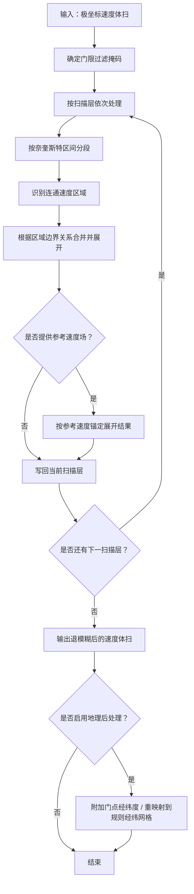

# `radar_wind_dealiasing` 使用说明

## 1. 模块作用

`radar_wind_dealiasing` 用于将 Py-ART 中基于区域连通关系的多普勒速度退模糊算法迁移到 `meteva_base.grid_data` 输入输出体系中。

迁移后的实现保留原算法核心流程：

- 按奈奎斯特区间对速度场分段。
- 在二维扫描层平面上识别连通区域。
- 根据相邻区域边界关系逐步合并并展开速度。
- 在提供参考速度场时，对结果进行整体或分区锚定。

核心处理流程如下（仅展示主链路，不含输入校验等细节）：



当前模块提供三个主要入口：

|入口|类型|作用|
|---|---|---|
|`dealias_region_based(...)`|函数|核心区域退模糊算法，输入输出均为 `meteva_base.grid_data`。|
|`RegionDealiasPlugin`|插件类|封装核心算法调用，并可附加门点经纬度或重映射到规则经纬网格。|
|`GridGateFilter`|过滤器类|为 `meteva_base.grid_data` 构造退模糊所需的门限过滤掩码。|

## 2. 输入输出约定

### 2.1 网格结构

算法输入必须是 `meteva_base.grid_data` 风格的六维
`xarray.DataArray`，维度及顺序固定为：

```text
member, level, time, dtime, lat, lon
```

一个输入对象只表示一个雷达体扫，因此 `member`、`level`、`time`、
`dtime` 的长度都必须为 1。这里的 `level=0` 只是体扫容器的占位值，
不表示某一仰角层。

所有 sweep 按原始顺序沿 `lat` 维连续拼接，数据平面的实际形状为：

```text
(体扫总射线数, 最大距离库数)
```

不同 sweep 的射线数可以不同，由 sweep 边界属性确定。若不同 sweep
的距离库数不同，应在 `lon` 维补齐到最大距离库数，补齐位置必须写为
`NaN`、填充值或在 `GridGateFilter` 中排除，不能参与区域识别。

### 2.2 空间维语义

虽然容器维度名仍为 `lat/lon`，但它们在核心算法中不是地理坐标：

|维度名|核心算法语义|说明|
|---|---|---|
|`lat`|ray 索引|按 sweep 顺序拼接全部射线；每个 sweep 内保持原始方位顺序。|
|`lon`|gate 索引|对应每条射线上的距离库序号。|

因此，输入必须保留原始“射线 × 距离库”拓扑，不能先插值为规则经纬度网格。

### 2.3 必需的体扫属性

`velocity.attrs` 必须能够确定 sweep 边界和 Nyquist 速度：

|属性|格式|约束|
|---|---|---|
|`sweep_start_ray_index`|一维整数序列|每个 sweep 的起始 ray 下标，第一个值必须为 0。|
|`sweep_end_ray_index`|一维整数序列|每个 sweep 的结束 ray 下标（含端点），最后一个值必须为 `nrays - 1`。|
|`nyquist_velocity` 或 `nyquist_vel`|标量或一维浮点序列|标量表示所有 sweep 共用；序列长度必须等于 sweep 数。|

相邻 sweep 的 ray 范围必须连续且不能重叠。仅有一个 sweep 时可以省略
两个边界属性，此时整个 `lat/lon` 平面按一个 sweep 处理。

以下元数据不参与核心退模糊计算，但建议保留：

- `fixed_angle`：每个 sweep 的固定仰角，长度等于 sweep 数。
- `scan_type`：用于推断方位角是否首尾相接（仅当 `scan_type == "ppi"` 时为 True，与 Py-ART 一致）。
- `azimuth(lat)`：每条 ray 的真实方位角辅助坐标。
- `elevation(lat)`：每条 ray 的真实仰角辅助坐标。
- `antenna_transition(lat)`：每条 ray 的天线过渡旗标（`1`=过渡，`0`=正常）；缺失时不排除过渡射线。
- `range(lon)`：所有 sweep 共用距离轴时使用的一维距离辅助坐标。
- `radar_lon`、`radar_lat`：雷达站点经纬度，用于可选地理后处理。

如果各 sweep 的实际距离轴不同，核心算法仍可按 gate 索引运行，但不能用
一个共享的 `range(lon)` 表示其物理距离；此时调用方应在算法外保留各
sweep 的距离元数据。当前规则经纬网格后处理要求输入具有共享的一维
`range(lon)`。

### 2.4 辅助场与过滤掩码

`ref_velocity`、`refl`、`ncp`、`rhv` 若提供，必须与 `velocity`
具有相同六维形状、核心坐标和 sweep 排列。

显式过滤掩码在常规路径下应为二维 `(nrays, ngates)`。
`GridGateFilter.from_mask` 仍允许传入与速度场同形的六维掩码；
此时 `dealias_region_based` 会取前四维的 `[0, 0, 0, 0]` 平面参与计算。
在当前体扫约束（前四维长度均为 1）下，二维与六维语义等价。

### 2.5 结构示例

```text
DataArray velocity
dimensions: (member=1, level=1, time=1, dtime=1,
             lat=6120, lon=983)
coordinates:
  lat           = 0 ... 6119              # ray 索引
  lon           = 0 ... 982               # gate 索引
  azimuth(lat)  = 每条射线的方位角
  elevation(lat)= 每条射线的仰角
  antenna_transition(lat) = 可选，1=过渡射线
  range(lon)    = 每个距离库的物理距离
attributes:
  sweep_start_ray_index = [0, 360, ...]
  sweep_end_ray_index   = [359, 719, ...]
  nyquist_velocity      = [16.52, 16.52, ...]
  fixed_angle           = [0.75, 1.20, ...]
  scan_type             = "ppi"
```

数据来源如何转换为上述结构不属于算法接口约束；无论输入来自 Py-ART
`Radar`、CINRAD `xarray.Dataset` 还是其他格式，只要满足此约定即可。

### 2.6 输出

`dealias_region_based(...)` 返回退模糊后的 `meteva_base.grid_data`。
极坐标输出保持输入的六维形状、sweep 排列及辅助坐标不变，仅替换速度值
并更新结果属性。

若通过 `RegionDealiasPlugin` 启用地理后处理，则结果可能额外包含：

- `gate_lon`
- `gate_lat`

若启用规则经纬网格重映射，则返回的 `lat/lon` 会变成真实规则经纬度坐标，
各 sweep 使用 `fixed_angle` 展开到输出 `level` 维。

### 2.7 转换与校验工具

`radar_wind_dealiasing.cli.polar_volume_main` 提供以下输入准备工具：

- `pyart_radar_to_polar_volume(...)`：将 Py-ART `Radar` 中的一个字段转换为约定的六维极坐标体扫。
- `validate_polar_volume(...)`：校验内存中的 `DataArray` 并返回 sweep 布局信息。
- `read_polar_volume(...)`：从 NetCDF 读取极坐标体扫；文件校验可在读取后显式调用 `validate_polar_volume(...)`。
- `process(...)`：读取 Py-ART 支持的雷达文件，完成转换、校验及可选 NetCDF 写出。

```python
import pyart

from radar_wind_dealiasing.cli.polar_volume_main import (
    pyart_radar_to_polar_volume,
    validate_polar_volume,
)

radar = pyart.io.read_cfradial(
    "radar_wind_dealiasing/test_data/region_dealias/cli_input/radar_fixed.cfradial.nc"
)
radar_sweep = radar.extract_sweeps([0])
velocity = pyart_radar_to_polar_volume(radar_sweep, "velocity")
validate_polar_volume(velocity, require_geolocation=True)
velocity.to_dataset(name="velocity").to_netcdf(
    "radar_wind_dealiasing/test_data/region_dealias/cli_input/velocity_sweep0.nc"
)
```

该工具是 CLI 层的数据预处理入口，不属于核心退模糊算法。
仓库样例由 `polar_volume_main.py` 的 `__main__`（或 notebook）生成：
优先复用固定 CfRadial，再 `extract_sweeps([0])` 转换并写出单层
`cli_input/velocity_sweep0.nc`，避免完整体扫占用过大空间。
反射率等辅助场可在内存中现转现用，不必单独写出。

若直接对完整体扫文件调用 `process(...)`，仍会转换全部扫描层；
生成轻量样例时请先截取单层，或运行上述 `__main__`。

## 3. `dealias_region_based` 接口

### 3.1 函数签名

```python
dealias_region_based(
    velocity,
    ref_velocity=None,
    interval_splits=3,
    interval_limits=None,
    skip_between_rays=100,
    skip_along_ray=100,
    centered=True,
    nyquist_velocity=None,
    gatefilter=False,
    refl=None,
    ncp=None,
    rhv=None,
    min_ncp=0.5,
    min_rhv=None,
    min_refl=-20.0,
    max_refl=100.0,
    rays_wrap_around=None,
    keep_original=False,
    set_limits=True,
    data_name="corrected_velocity",
    attrs=None,
)
```

### 3.2 参数说明

|参数|类型|默认值|说明|
|---|---|---|---|
|`velocity`|`xr.DataArray`|必填|待退模糊完整极坐标体扫，结构必须满足第 2 章约定。|
|`ref_velocity`|`xr.DataArray` 或 `None`|`None`|参考速度场，用于结果锚定。若提供，网格坐标必须与 `velocity` 一致。|
|`interval_splits`|`int`|`3`|每个 Nyquist 区间内的初始分段数。|
|`interval_limits`|array-like 或 `None`|`None`|自定义速度分段边界。未提供时由 Nyquist 速度自动生成。|
|`skip_between_rays`|`int`|`100`|跨射线方向连接区域时允许跨越的最大缺测间隔。|
|`skip_along_ray`|`int`|`100`|沿径向方向连接区域时允许跨越的最大缺测间隔。|
|`centered`|`bool`|`True`|是否将整体展开圈数居中到 0 附近。|
|`nyquist_velocity`|`float`、array-like 或 `None`|`None`|Nyquist 速度。可为所有 sweep 共用的标量，也可为每个 sweep 一个值；若不传，则从 `attrs["nyquist_velocity"]` 或 `attrs["nyquist_vel"]` 读取。|
|`gatefilter`|`None`、`False` 或 `GridGateFilter`|`False`|门限过滤器。`False` 表示不启用自动过滤；`None` 表示基于 `refl/ncp/rhv` 自动构造（缺字段则跳过对应规则，仍会 `exclude_transition`）；`GridGateFilter` 表示使用显式过滤器。|
|`refl`|`xr.DataArray` 或 `None`|`None`|反射率场，仅在 `gatefilter=None` 时用于自动过滤。|
|`ncp`|`xr.DataArray` 或 `None`|`None`|归一化相干功率场，仅在 `gatefilter=None` 时用于自动过滤。|
|`rhv`|`xr.DataArray` 或 `None`|`None`|相关系数字段，仅在 `gatefilter=None` 时用于自动过滤。|
|`min_ncp`|`float` 或 `None`|`0.5`|自动过滤时保留的 NCP 最小阈值。|
|`min_rhv`|`float` 或 `None`|`None`|自动过滤时保留的 RhoHV 最小阈值。|
|`min_refl`|`float` 或 `None`|`-20.0`|自动过滤时保留的反射率下限。|
|`max_refl`|`float` 或 `None`|`100.0`|自动过滤时保留的反射率上限。|
|`rays_wrap_around`|`bool` 或 `None`|`None`|是否将方位向首尾视为相邻。`None` 时仅当 `scan_type == "ppi"` 推断为 True（与 Py-ART 一致）。|
|`keep_original`|`bool`|`False`|被过滤格点是否保留原始速度值。`False` 时输出缺测。|
|`set_limits`|`bool`|`True`|是否在输出属性中写入 `valid_min` 和 `valid_max`。|
|`data_name`|`str`|`"corrected_velocity"`|输出数据名称。|
|`attrs`|`dict` 或 `None`|`None`|附加到输出结果的额外属性。|

### 3.3 输出属性

|属性|说明|
|---|---|
|`long_name`|输出字段长名称。|
|`units`|继承输入速度场单位。|
|`nyquist_velocity`|使用的 Nyquist 速度；若所有切片一致则为标量，否则保留为数组。|
|`_FillValue`|输出缺测填充值，优先继承输入属性。|
|`valid_min` / `valid_max`|当 `set_limits=True` 时写入的有效范围。|

## 4. `RegionDealiasPlugin` 接口

### 4.1 插件定位

`RegionDealiasPlugin` 只做参数收口、核心算法调用和可选地理后处理，不重复实现退模糊逻辑。

### 4.2 初始化参数

`RegionDealiasPlugin.__init__` 的参数可分为两类：

|参数|类型|默认值|说明|
|---|---|---|---|
|`interval_splits`|`int`|`3`|转发给 `dealias_region_based`。|
|`interval_limits`|array-like 或 `None`|`None`|转发给 `dealias_region_based`。|
|`skip_between_rays`|`int`|`100`|转发给 `dealias_region_based`。|
|`skip_along_ray`|`int`|`100`|转发给 `dealias_region_based`。|
|`centered`|`bool`|`True`|转发给 `dealias_region_based`。|
|`nyquist_velocity`|`float`、array-like 或 `None`|`None`|转发给 `dealias_region_based`。|
|`gatefilter`|`None`、`False` 或 `GridGateFilter`|`False`|转发给 `dealias_region_based`。|
|`min_ncp`|`float` 或 `None`|`0.5`|转发给 `dealias_region_based`。|
|`min_rhv`|`float` 或 `None`|`None`|转发给 `dealias_region_based`。|
|`min_refl`|`float` 或 `None`|`-20.0`|转发给 `dealias_region_based`。|
|`max_refl`|`float` 或 `None`|`100.0`|转发给 `dealias_region_based`。|
|`rays_wrap_around`|`bool` 或 `None`|`None`|转发给 `dealias_region_based`。|
|`keep_original`|`bool`|`False`|转发给 `dealias_region_based`。|
|`set_limits`|`bool`|`True`|转发给 `dealias_region_based`。|
|`data_name`|`str`|`"corrected_velocity"`|转发给 `dealias_region_based`。|
|`attrs`|`dict` 或 `None`|`None`|转发给 `dealias_region_based`。|
|`radar_lon` / `radar_lat`|`float` 或 `None`|`None`|雷达站点经纬度，用于附加门点经纬度或重映射。|
|`elevation_deg`|`float`|`0.0`|仰角，用于门点经纬度转换。|
|`azimuth_deg`|array-like 或 `None`|`None`|显式方位角序列；未传时使用输入 `lat` 轴。|
|`range_m`|array-like 或 `None`|`None`|显式径距序列，单位为米；未传时从输入 `lon` 轴及单位属性推断。|
|`target_lon` / `target_lat`|array-like 或 `None`|`None`|目标规则经纬网格坐标。若提供，则执行规则经纬网格重映射。|
|`geo_method`|`str`|`"nearest"`|门点到规则经纬网格的插值方法。|
|`geo_resolution_deg`|`float` 或 `None`|`0.01`|自动生成目标经纬网格时使用的分辨率。|
|`geo_nlon` / `geo_nlat`|`int` 或 `None`|`None`|自动生成目标经纬网格时使用的格点数。|
|`auto_remap_to_latlon`|`bool`|`False`|是否自动根据门点经纬度范围生成规则经纬网格并重映射。|

### 4.3 `process` 参数

|参数|类型|默认值|说明|
|---|---|---|---|
|`velocity`|`xr.DataArray`|必填|待退模糊速度场。|
|`ref_velocity`|`xr.DataArray` 或 `None`|`None`|可选参考速度场。|
|`refl`|`xr.DataArray` 或 `None`|`None`|自动过滤时使用的反射率场。|
|`ncp`|`xr.DataArray` 或 `None`|`None`|自动过滤时使用的 NCP 场。|
|`rhv`|`xr.DataArray` 或 `None`|`None`|自动过滤时使用的 RhoHV 场。|

### 4.4 地理重映射说明

插件地理后处理分为两步：

|步骤|触发条件|结果|
|---|---|---|
|附加门点经纬度|提供或可从属性推断 `radar_lon/radar_lat`|输出保留原极坐标拓扑，并附加二维 `gate_lon/gate_lat` 坐标。|
|重映射到规则经纬网格|提供 `target_lon/target_lat`，或 `auto_remap_to_latlon=True`|输出变为规则经纬网格，覆盖范围外固定掩码处理。|

覆盖范围外的目标格点没有业务意义，因此当前实现始终进行掩码处理。

## 5. `GridGateFilter` 接口

### 5.1 类说明

`GridGateFilter` 是参考 Py-ART `GateFilter` 思路，为 `meteva_base.grid_data` 构建的轻量过滤器。天线过渡射线通过可选坐标 `antenna_transition(lat)`（或显式数组）支持；其余逻辑聚焦退模糊所需的门限过滤。

### 5.2 构造与属性

|接口|说明|
|---|---|
|`GridGateFilter(grid_data, exclude_based=True, gate_excluded=None)`|基于模板网格创建过滤器（速度、反射率等均可）。|
|`GridGateFilter.from_mask(grid_data, mask)`|基于布尔掩码创建过滤器；`True` 表示该格点被过滤。|
|`copy()`|返回过滤器副本。|
|`gate_excluded`|被过滤格点布尔数组副本。|
|`gate_included`|参与计算格点布尔数组副本。|

`mask` 可以是二维平面掩码，也可以是与 `grid_data` 完全同形状的六维掩码。
在当前体扫输入约束下，默认构造结果为二维 `(ray, gate)`；
六维掩码会在 `dealias_region_based` 入口规范为前四维第 0 层平面。

### 5.3 常用过滤方法

|方法|作用|
|---|---|
|`exclude_below(grid_data, value)`|过滤小于阈值的格点。|
|`exclude_above(grid_data, value)`|过滤大于阈值的格点。|
|`exclude_inside(grid_data, v1, v2)`|过滤区间内格点。|
|`exclude_outside(grid_data, v1, v2)`|过滤区间外格点。|
|`exclude_equal(grid_data, value)`|过滤等于指定值的格点。|
|`exclude_not_equal(grid_data, value)`|过滤不等于指定值的格点。|
|`exclude_masked(grid_data)`|过滤掩码格点。|
|`exclude_invalid(grid_data)`|过滤 `NaN`、`Inf` 等非法值。|
|`exclude_gates(mask)`|按外部布尔数组过滤格点。|
|`exclude_transition(...)`|过滤天线过渡射线上的全部格点。|
|`exclude_all()` / `exclude_none()`|过滤全部格点 / 清空过滤状态。|
|`include_below(grid_data, value)`|仅保留小于阈值的格点。|
|`include_above(grid_data, value)`|仅保留大于阈值的格点。|
|`include_inside(grid_data, v1, v2)`|仅保留区间内格点。|
|`include_outside(grid_data, v1, v2)`|仅保留区间外格点。|
|`include_equal(grid_data, value)`|仅保留等于指定值的格点。|
|`include_not_equal(grid_data, value)`|仅保留不等于指定值的格点。|
|`include_not_masked(grid_data)`|仅保留非掩码格点。|
|`include_valid(grid_data)`|仅保留有限值格点。|
|`include_gates(mask)`|按外部布尔数组保留格点。|
|`include_not_transition(...)`|仅保留非过渡射线上的格点。|
|`include_all()` / `include_none()`|清空过滤状态 / 过滤全部格点。|

`exclude_transition` / `include_not_transition` 优先使用显式传入的长度
为 `nrays` 的旗标数组；未传入时读取 `grid_data.coords['antenna_transition']`；
两者皆无时与 Py-ART 一致：不排除任何过渡射线。
`gatefilter=None` 自动构造过滤器时，会先调用 `exclude_transition()`。

## 6. 缺测值处理

|阶段|处理方式|
|---|---|
|输入掩码|通过 `GridGateFilter.exclude_masked(...)` 排除。|
|输入 `NaN` / `Inf`|通过 `GridGateFilter.exclude_invalid(...)` 排除。|
|数值型填充值|读取 `_FillValue` / `missing_value`，并在核心计算前排除。|
|输出缺测|内存结果优先继承输入 `_FillValue` / `missing_value`，否则使用 `-9999.0`。CLI 落盘（`_write_griddata_to_nc`）对齐 qpe：float32 + CF `NC_FILL_FLOAT`。|
|地理重映射插值|插值前剔除 `NaN`、`_FillValue`、`missing_value`。|
|覆盖范围外格点|固定掩码处理，不作为可选参数暴露。|

## 7. 使用示例

### 7.1 直接调用核心函数

```python
from radar_wind_dealiasing import dealias_region_based

corrected = dealias_region_based(
    velocity=velocity,
    centered=False,
)
```

### 7.2 使用显式过滤器

```python
import numpy as np

from radar_wind_dealiasing import GridGateFilter, dealias_region_based

mask = np.load(
    "radar_wind_dealiasing/test_data/region_dealias/cli_input/"
    "grid_gatefilter_mask_sweep0.npy"
).astype(bool)
gatefilter = GridGateFilter.from_mask(velocity, mask)

corrected = dealias_region_based(
    velocity=velocity,
    gatefilter=gatefilter,
    centered=False,
)
```

### 7.3 自动构造过滤器

```python
corrected = dealias_region_based(
    velocity=velocity,
    gatefilter=None,
    refl=refl,
    ncp=ncp,
    rhv=rhv,
    min_ncp=0.5,
    min_refl=0.0,
    max_refl=80.0,
)
```

### 7.4 插件调用

```python
from radar_wind_dealiasing import RegionDealiasPlugin

plugin = RegionDealiasPlugin(
    centered=False,
    gatefilter=gatefilter,
)

corrected = plugin.process(
    velocity=velocity,
    ref_velocity=ref_velocity,
)
```

### 7.5 插件输出规则经纬网格

```python
plugin = RegionDealiasPlugin(
    centered=False,
    gatefilter=gatefilter,
    radar_lon=116.0,
    radar_lat=40.0,
    auto_remap_to_latlon=True,
    geo_resolution_deg=0.001,
)

corrected_geo = plugin.process(
    velocity=velocity,
    ref_velocity=ref_velocity,
)
```

## 8. CLI 应用

CLI 入口位于 `radar_wind_dealiasing/cli/region_dealias.py` 的 `process()` 函数。

```python
from radar_wind_dealiasing.cli.region_dealias import process

process(
    "radar_wind_dealiasing/test_data/region_dealias/cli_input/velocity_sweep0.nc",
    gatefilter_path=(
        "radar_wind_dealiasing/test_data/region_dealias/cli_input/"
        "grid_gatefilter_mask_sweep0.npy"
    ),
    data_name="corrected_velocity_cli",
    output_path=(
        "radar_wind_dealiasing/test_data/region_dealias/cli_output/"
        "region_dealias_cli.nc"
    ),
)
```

也可直接运行示例脚本：

```powershell
python radar_wind_dealiasing/cli/region_dealias.py
```

示例 `__main__` 默认读取 `cli_input/velocity_sweep0.nc` 与
`cli_input/grid_gatefilter_mask_sweep0.npy`。

### 8.1 CLI 参数表

|参数|类型|默认值|说明|
|---|---|---|---|
|`velocity_path`|路径|必填|待退模糊速度场文件。|
|`ref_velocity_path`|路径|`None`|参考速度场文件。|
|`gatefilter`|`False` 或 `None`|`False`|`False` 关闭自动过滤（与算法默认一致）；`None` 走 moment 自动过滤。提供 `gatefilter_path` 时以掩码为准。|
|`gatefilter_path`|`.npy` 路径|`None`|显式过滤掩码；若提供则优先于 `gatefilter`。|
|`refl_path`|路径|`None`|自动过滤所需反射率场。|
|`ncp_path`|路径|`None`|自动过滤所需 NCP 场。|
|`rhv_path`|路径|`None`|自动过滤所需 RhoHV 场。|
|`interval_splits`|`int`|`3`|初始速度分段数。|
|`interval_limits`|浮点序列或 `None`|`None`|自定义速度分段边界。|
|`skip_between_rays`|`int`|`100`|跨射线方向允许跨越的最大缺测间隔。|
|`skip_along_ray`|`int`|`100`|沿径向方向允许跨越的最大缺测间隔。|
|`centered`|`bool`|`True`|是否对整体展开圈数做居中调整。|
|`nyquist_velocity`|`float`|`None`|显式 Nyquist 速度。|
|`min_ncp`|`float`|`0.5`|自动过滤的 NCP 最小阈值。|
|`min_rhv`|`float`|`None`|自动过滤的 RhoHV 最小阈值。|
|`min_refl`|`float`|`-20.0`|自动过滤的反射率下限。|
|`max_refl`|`float`|`100.0`|自动过滤的反射率上限。|
|`rays_wrap_around`|`bool`|`None`|是否将方位向首尾视为相邻。|
|`keep_original`|`bool`|`False`|过滤格点是否保留原始值。|
|`set_limits`|`bool`|`True`|是否写入 `valid_min/valid_max`。|
|`data_name`|`str`|`"corrected_velocity"`|输出数据名称。|
|`radar_lon` / `radar_lat`|`float`|`None`|雷达站点经纬度。|
|`elevation_deg`|`float`|`0.0`|仰角。|
|`geo_resolution_deg`|`float`|`0.01`|自动规则经纬网格分辨率。|
|`geo_nlon` / `geo_nlat`|`int`|`None`|自动规则经纬网格格点数。|
|`auto_remap_to_latlon`|`bool`|`False`|是否自动重映射到规则经纬网格。|
|`output_path`|路径|`None`|输出 NetCDF 文件路径。|

### 8.2 CLI 示例

极坐标拓扑输出：

```python
from radar_wind_dealiasing.cli.region_dealias import process

process(
    "radar_wind_dealiasing/test_data/region_dealias/cli_input/velocity_sweep0.nc",
    gatefilter_path=(
        "radar_wind_dealiasing/test_data/region_dealias/cli_input/"
        "grid_gatefilter_mask_sweep0.npy"
    ),
    data_name="corrected_velocity_cli",
    output_path=(
        "radar_wind_dealiasing/test_data/region_dealias/cli_output/"
        "region_dealias_cli.nc"
    ),
)
```

规则经纬网格输出：

```python
process(
    "radar_wind_dealiasing/test_data/region_dealias/cli_input/velocity_sweep0.nc",
    gatefilter_path=(
        "radar_wind_dealiasing/test_data/region_dealias/cli_input/"
        "grid_gatefilter_mask_sweep0.npy"
    ),
    data_name="corrected_velocity_cli_geo",
    auto_remap_to_latlon=True,
    geo_resolution_deg=0.001,
    output_path=(
        "radar_wind_dealiasing/test_data/region_dealias/cli_output/"
        "region_dealias_cli_geo.nc"
    ),
)
```

## 9. 与原始 Py-ART 的主要差异

|项目|原始 Py-ART|当前迁移版|
|---|---|---|
|输入对象|`Radar`|`meteva_base.grid_data`|
|输出对象|字段字典|`meteva_base.grid_data`|
|过滤器|`GateFilter`|`GridGateFilter`|
|多 sweep 处理|Radar 内部按 sweep 处理|体扫沿 `lat` 维拼接，按 `sweep_*_ray_index` 逐 sweep 调用二维求解器|
|缺测处理|掩码数组与字段元数据|掩码、`NaN`、`_FillValue` / `missing_value` 统一处理|
|地理坐标|Radar 自带雷达几何信息|插件层按属性或参数附加门点经纬度|
|规则经纬网格|非核心算法输出|插件层可选后处理|

## 10. 当前限制

当前迁移版虽然使用 `meteva_base.grid_data` 作为数据容器，但核心算法仍依赖雷达极坐标门的邻接关系。

因此：

- 输入的二维空间维应保留完整体扫的“射线 × 距离门”拓扑，并由 sweep 边界属性划分各仰角层。
- 若输入是真实规则经纬度网格，算法即使能运行，也不能保证结果在退模糊意义上正确。
- `skip_between_rays`、`skip_along_ray`、`rays_wrap_around` 等参数都建立在“射线 × 距离门”的前提下。
- 对真实经纬网格的兼容需要后续增加专门的拓扑重建或极坐标逆变换处理。

## 11. 验证说明

当前测试与验证重点覆盖：

- 输出结构保持 `meteva_base.grid_data`。
- 显式 `GridGateFilter` 与自动过滤逻辑。
- `keep_original`、`gatefilter=None`、`gatefilter=False` 等关键分支。
- 完整体扫输入：按 sweep 边界逐层求解，再写回同一六维容器。
- 插件附加门点经纬度与规则经纬网格重映射。
- 重映射后雷达覆盖范围外格点固定掩码处理。
- 仓库样例仅提交单层仰角数据，以控制文件体积。

验证样例数据位于 `radar_wind_dealiasing/test_data/region_dealias/`：

|路径|用途|
|---|---|
|`095636.mdv`|官方示例源数据（本地大文件，建议勿提交）。|
|`cli_input/radar_fixed.cfradial.nc`|固定化 CfRadial（本地大文件，建议勿提交）。|
|`cli_input/velocity_sweep0.nc`|单层极坐标速度输入。|
|`cli_input/grid_gatefilter_mask_sweep0.npy`|对应单层过滤掩码。|
|`cli_output/*.nc`|CLI 单层输出结果。|
