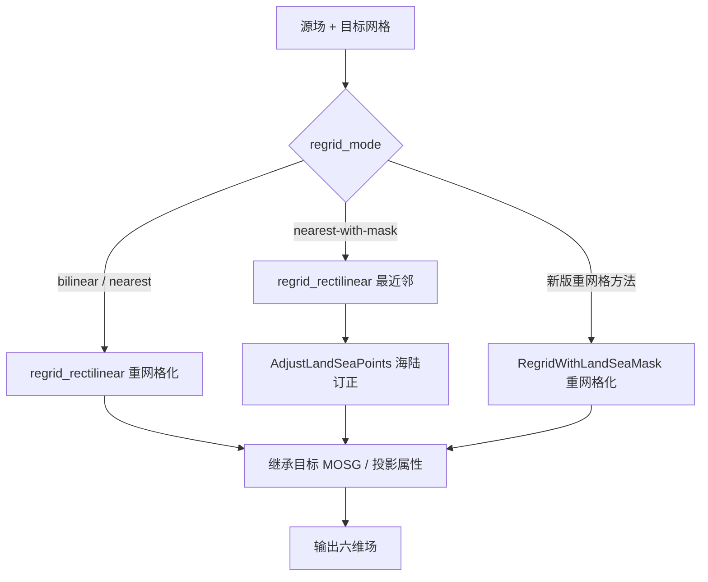
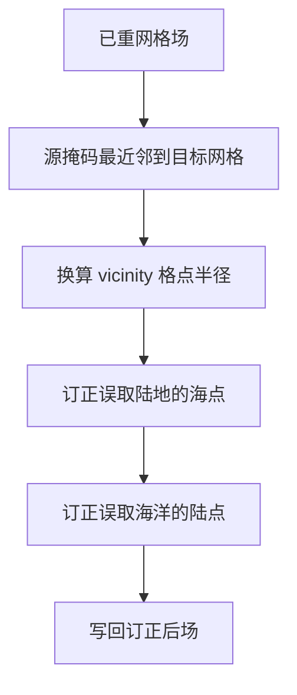
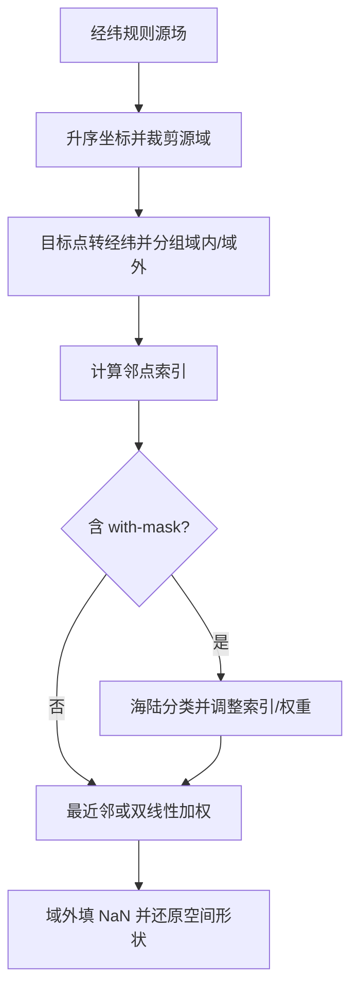

# 海陆感知重网格算法说明

## 1. 模块概览

`regrid` 模块将源场插值到目标空间网格，可选按海陆类型避免“陆点取海值 / 海点取陆值”。实现面向 `meteva_base` 六维 `xarray.DataArray`（`member, level, time, dtime, lat, lon`），对应上游 IMPROVER `improver.regrid.landsea` / `landsea2`。

当前迁移实现包含：

| 类 / 函数 | 作用 |
| --- | --- |
| `RegridLandSea` | 统一入口：按 `regrid_mode` 分派 scipy 路径或新版 `*-2` 路径 |
| `AdjustLandSeaPoints` | scipy 最近邻后的海陆不匹配订正（`nearest-with-mask`） |
| `RegridWithLandSeaMask` | 新版经纬规则源网格上的最近邻 / 双线性（含可选掩码） |
| `regrid_rectilinear` | 规则网插值（`scipy.interpolate.RegularGridInterpolator`），对应原 Iris Linear/Nearest |

---

## 2. 重网格模式

| `regrid_mode` | 路径 | 是否需要源侧 `landmask` | 说明 |
| --- | --- | --- | --- |
| `bilinear` | scipy | 否 | 双线性；对应 Iris `Linear` |
| `nearest` | scipy | 否 | 最近邻；对应 Iris `Nearest` |
| `nearest-with-mask` | scipy + `AdjustLandSeaPoints` | 是 | 先最近邻，再按海陆订正 |
| `nearest-2` | `RegridWithLandSeaMask` | 否 | 新版最近邻 |
| `bilinear-2` | `RegridWithLandSeaMask` | 否 | 新版双线性 |
| `nearest-with-mask-2` | `RegridWithLandSeaMask` | 是 | 新版最近邻 + 海陆感知 |
| `bilinear-with-mask-2` | `RegridWithLandSeaMask` | 是 | 新版双线性 + 海陆感知 |

约定：

- 海陆掩码场名为 `land_binary_mask`（或名称中含该子串）；陆点 `1`、海点 `0`。
- `extrapolation_mode` 仅作用于 **scipy 路径**（`regrid_rectilinear` / `AdjustLandSeaPoints` 内对源掩码的重网格）。`*-2` 路径对源域外目标点统一填 NaN，不使用该参数。

---

## 3. 核心计算与处理流程

本节描述插值与海陆订正的数值逻辑；六维校验、属性继承等适配步骤见第 5 节。

### 3.1 scipy 规则网插值（`regrid_rectilinear`）

在**源场自身坐标系**的规则 `(y, x)` 网上采样：

1. 读取源轴：经纬用度；投影用米（须带可解析的 `grid_mapping_attrs`）。
2. 将目标格点变换到源 CRS（同源则不做变换），得到采样点 `(y_t, x_t)`。
3. 源轴按升序重排后，对每个非空间切片调用 `RegularGridInterpolator`：
    - `method="linear"` → `bilinear`
    - `method="nearest"` → `nearest`
4. 非空间维形状继承源场；空间坐标继承目标场。

#### 域外外推（`extrapolation_mode`）

对齐 Iris `analysis._interpolation.EXTRAPOLATION_MODES` 中与 `bounds_error` / `fill_value` 相关的语义。DataArray 路径无 MaskedArray，故 `nan` / `mask` / `nanmask` 合并为填 NaN：

| 模式 | `bounds_error` | `fill_value` | 行为 |
| --- | --- | --- | --- |
| `extrapolate` | `False` | `None` | 沿边界外推 |
| `error` | `True` | `None` | 目标点越出源域时抛错 |
| `nan` / `mask` / `nanmask` | `False` | `NaN` | 域外填缺测（默认 `nanmask`） |

### 3.2 最近邻海陆订正（`AdjustLandSeaPoints`）

用于 `nearest-with-mask`：在最近邻结果上，把“目标海陆类型与所取源点不一致”的近岸点，替换为邻域内同类型最近源点的值。

设：

- $L_{\mathrm{out}}$：目标网格海陆掩码
- $L_{\mathrm{in}}^{\mathrm{nn}}$：源掩码最近邻到目标网格的结果
- $R$：邻域半径（米）换算后的格点半径

对选择器 $s \in \{0, 1\}$（先订正海点 $s=0$，再订正陆点 $s=1$）：

1. 在源掩码二维切片上，用同类型点的 KD-Tree 最近邻，把“非 $s$ 类型”位置填为最近的 $s$ 类型源值候选。
2. 在半径 $R$ 内做 vicinity 极大值，得到“邻域内存在类型 $s$ 源点”的区域。
3. 不匹配点：

   $$
   M = \bigl(L_{\mathrm{out}} = s\bigr) \land \bigl(L_{\mathrm{in}}^{\mathrm{nn}} \neq s\bigr) \land \bigl(\text{vicinity 内存在类型 } s\bigr)
   $$

4. 在 $M$ 为真处，用步骤 1 得到的同类型最近邻值替换场数据；邻域内找不到匹配点则保持原最近邻结果。

### 3.3 新版最近邻和双线性路径（`RegridWithLandSeaMask`）

前提：**源场必须是经纬度规则网格**；目标可为经纬或投影（投影须带 `grid_mapping_attrs`，目标点先转为经纬）。

主步骤：

1. 保证源（及源掩码）空间坐标升序，计算源纬向 / 经向等间距。
2. 目标点转为经纬对；按目标外包络裁剪源场（及源掩码）以减小搜索域。
3. 将目标点分为“落在源域内 / 域外”；域外点最终置 NaN。
4. 对每个域内目标点，在源规则网上找最多 4 个邻域源点索引（`basic_indexes`）。
5. **无掩码**：
    - 最近邻：按经纬平方距离取最近源点值；
    - 双线性：按双线性权重加权求和。
6. **有掩码**（`*-with-mask-2`）：
    - 分类源 / 目标海陆类型，得到“邻点与目标同类型”掩码；
    - 最近邻：优先同类型邻点，必要时在 `vicinity_radius`（米）内扩大搜索（含岛状点处理）；
    - 双线性：对海陆不匹配的邻点调整权重 / 索引（`adjust_for_surface_mismatch`），再加权。
7. 将扁平结果还原为目标网格空间形状，非空间维继承源场。

### 3.4 主流程示意

#### `RegridLandSea` 分派



#### `AdjustLandSeaPoints` 子流程



#### `RegridWithLandSeaMask` 子流程



---

## 4. 类与主函数

### 4.1 `RegridLandSea`

实现：`regrid/src/landsea.py`

```python
RegridLandSea(
    regrid_mode="bilinear",
    extrapolation_mode="nanmask",
    landmask=None,
    landmask_vicinity=25000,
).process(data, target_grid, regridded_title=None)
```

功能：

1. 校验模式与掩码是否匹配；掩码模式下检查源掩码空间范围覆盖源场（`grid_contains_cutout`）。
2. 按模式调用 `regrid_rectilinear` 或 `RegridWithLandSeaMask`（及可选 `AdjustLandSeaPoints`）。
3. 更新 `title`，并尽量继承目标网格的 MOSG 属性与 `grid_mapping_attrs`。

### 4.2 `AdjustLandSeaPoints`

实现：`regrid/src/landsea.py`

```python
AdjustLandSeaPoints(
    extrapolation_mode="nanmask",
    vicinity_radius=25000.0,
).process(data, input_land, output_land)
```

功能：见 3.2。要求 `data` 与 `output_land` 空间坐标一致。

### 4.3 `RegridWithLandSeaMask`

实现：`regrid/src/landsea2.py`

```python
RegridWithLandSeaMask(
    regrid_mode="bilinear-2",
    vicinity_radius=25000.0,
).process(data_in, data_in_mask, data_out_mask)
```

功能：见 3.3。`data_out_mask` 同时提供目标空间网格（掩码模式下亦作目标海陆类型）。

### 4.4 `regrid_rectilinear`

实现：`regrid/src/utils/grid.py`

```python
regrid_rectilinear(source, target, *, method, extrapolation_mode="nanmask")
```

`method` 为 `"linear"` 或 `"nearest"`。坐标系约定与 3.1 节一致。

---

## 5. 输入输出与参数

### 5.1 数据约定

| 项目 | 说明 |
| --- | --- |
| 输入类型 | `xr.DataArray`（经 `meb.checkout_griddata`） |
| 维度顺序 | `member, level, time, dtime, lat, lon` |
| 海陆掩码 | `land_binary_mask`，陆=1、海=0 |
| 投影网格 | 维度仍叫 `lat`/`lon`，但坐标存投影平面值（非地理经纬）；坐标 attrs 的 `units` 为可换算到米的距离单位（常见为 `m`），且 DataArray 须带可解析的 `grid_mapping_attrs` |
| 经纬网格 | 坐标为经纬度（度）：无米制坐标 `units`、且无投影 `grid_mapping_attrs` 时视为 WGS84 经纬 |
| 输出 | 六维 `DataArray`；空间坐标来自目标；非空间维来自源 |

算法默认处理**已预处理好的输入**；文件读取、`_FillValue` 解码等放在 CLI / Notebook / 测试准备阶段。

### 5.2 `RegridLandSea` 参数

| 参数 | 单位 | 必填 | 默认 | 说明 |
| --- | --- | --- | --- | --- |
| `data` | — | 是 | — | 待重网格场 |
| `target_grid` | — | 是 | — | 目标网格模板；掩码模式下应为目标海陆掩码场 |
| `regridded_title` | — | 否 | `unknown` | 写入输出 `title` |
| `regrid_mode` | — | 否 | `bilinear` | 见第 2 节 |
| `extrapolation_mode` | — | 否 | `nanmask` | 仅 scipy 路径有效 |
| `landmask` | — | 条件 | `None` | 源侧海陆掩码；`*-with-mask*` 必需 |
| `landmask_vicinity` | m | 否 | `25000` | 海岸线 / 同类型搜索半径 |

业务入口优先用本类；下列两个插件通常由其间接调用，也可单独使用。

### 5.3 `AdjustLandSeaPoints` 参数

用于 scipy 路径的 `nearest-with-mask`：在已重网格场上订正海陆不匹配点。

| 参数 | 单位 | 必填 | 默认 | 说明 |
| --- | --- | --- | --- | --- |
| `data` | — | 是 | — | 待订正场（已与目标网格对齐） |
| `input_land` | — | 是 | — | 源网格 `land_binary_mask`（陆=1，海=0） |
| `output_land` | — | 是 | — | 目标网格 `land_binary_mask`；须与 `data` 空间坐标一致 |
| `extrapolation_mode` | — | 否 | `nanmask` | 将源掩码最近邻到目标网格时的域外行为 |
| `vicinity_radius` | m | 否 | `25000` | 同类型源点搜索半径（对应入口的 `landmask_vicinity`） |

### 5.4 `RegridWithLandSeaMask` 参数

用于全部 `*-2` 模式。源场须为经纬度规则网格；目标可为经纬或投影。

| 参数 | 单位 | 必填 | 默认 | 说明 |
| --- | --- | --- | --- | --- |
| `data_in` | — | 是 | — | 待重网格源场（经纬规则网） |
| `data_in_mask` | — | 条件 | — | 源侧 `land_binary_mask`；`*-with-mask-2` 必需，无掩码模式可为 `None` |
| `data_out_mask` | — | 是 | — | 目标网格模板；掩码模式下亦提供目标海陆类型 |
| `regrid_mode` | — | 否 | `bilinear-2` | `nearest-2` / `bilinear-2` / `nearest-with-mask-2` / `bilinear-with-mask-2` |
| `vicinity_radius` | m | 否 | `25000` | 海陆感知时扩大同类型邻点搜索的半径（对应入口的 `landmask_vicinity`） |

域外目标点固定填 NaN，不接受 `extrapolation_mode`。

### 5.5 路径差异摘要

| 能力 | scipy（无 `-2`） | `*-2` |
| --- | --- | --- |
| 插值引擎 | `RegularGridInterpolator` | 规则网索引 + 距离 / 双线性权重 |
| 源网格 | 经纬或投影规则网 | **仅经纬规则网** |
| 目标网格 | 经纬或投影 | 经纬或投影 |
| 域外行为 | 由 `extrapolation_mode` 控制 | 固定填 NaN |
| 海陆订正 | 事后 `AdjustLandSeaPoints`（仅 nearest） | 插值时调整邻点 / 权重 |

---

## 6. CLI 与验证

### 6.1 示例脚本

官方 Iris 样例需先预处理为六维 meb：

```bash
python regrid/cli/preprocess_test_data.py
```

写出 `regrid/test_data/cli_input/`，供 CLI、pytest 与验证 Notebook 共用。

`regrid/cli/tran_regrid.py` 提供 `process(...)`：读取预处理后的六维 nc，调用 `RegridLandSea`，可选写出结果。

仓库根目录示例：

```bash
python regrid/cli/tran_regrid.py
```

或在代码中：

```python
from regrid.cli.tran_regrid import process

result = process(
    "regrid/test_data/cli_input/global_cutout.nc",
    "regrid/test_data/cli_input/ukvx_grid.nc",
    output_path="regrid/test_data/cli_output/cli_bilinear_result.nc",
    regrid_mode="bilinear",
    extrapolation_mode="nanmask",
)
```

掩码模式须同时提供源掩码路径，且 `regrid_mode` 为 `nearest-with-mask` / `nearest-with-mask-2` / `bilinear-with-mask-2`。

### 6.2 测试与 Notebook

| 路径 | 说明 |
| --- | --- |
| `regrid/test/test_regrid_landsea_unit.py` | 合成网格单元测试（形状、外推、掩码订正等） |
| `regrid/test/test_regrid_landsea2_unit.py` | 新版重网格路径单元测试 |
| `regrid/test/test_regrid_landsea_official.py` | 官方样例 / KGO 数值对照 |
| `regrid/test/test_cli_regrid_landsea.py` | CLI 示例对照 |
| `regrid/cli/preprocess_test_data.py` | 官方样例 → meb，写出 `cli_input/` |
| `regrid/nbs/regrid_landsea_validation.ipynb` | 读取 `cli_input/`，场景对比与 CLI 验证 |

```bash
pytest regrid/test
```

---

## 7. 已知限制与注意点

1. **输入须已规范化**：算法不做 `_FillValue` 自动解码；请先写成标准六维 meb 场。
2. **新版重网格分支源场仅支持经纬规则网**；投影源请用 scipy 路径（`bilinear` / `nearest` / `nearest-with-mask`）。
3. **`extrapolation_mode` 对新版重网格分支（`*-2`） 无效**；非法取值仅在走到 `regrid_rectilinear` 时抛错。
4. **掩码模式需要两侧掩码**：源侧 `landmask`（或 `data_in_mask`）不可省略；`target_grid` / `data_out_mask` 通常直接传入目标侧 `land_binary_mask`——同一份场既给出目标空间坐标，也给出目标海陆类型（不必再单独传“仅含坐标的目标场”）。
5. 写出 nc 时若文件被 Jupyter 或其他进程占用，可能导致写失败。
