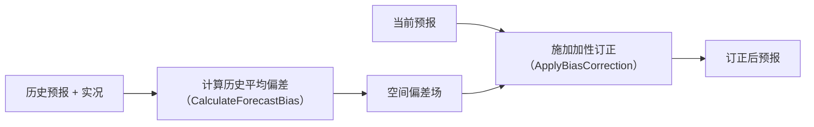
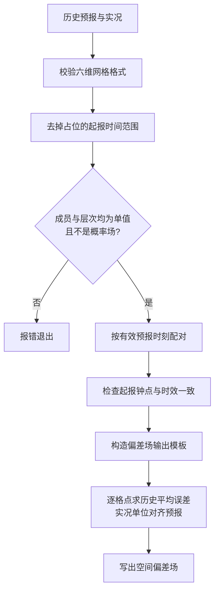
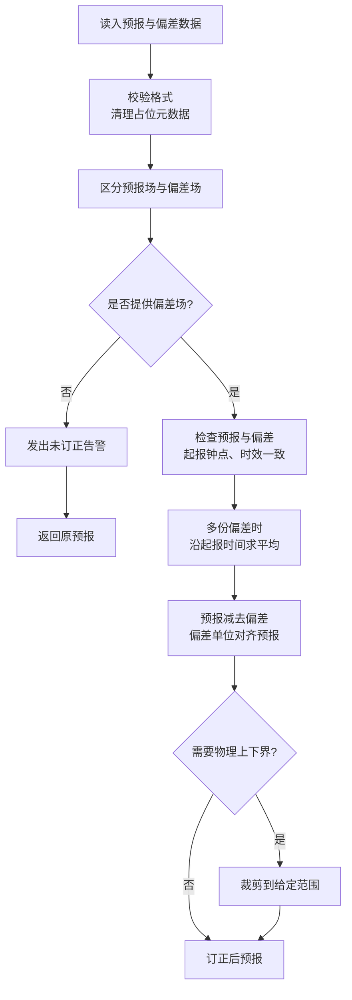

# 简单加性偏差订正（simple_bias_correction）

- 算法来源：Met Office Improver `improver/calibration/simple_bias_correction.py`
- 迁移目标：适配 `meteva_base` 六维网格（`member, level, time, dtime, lat, lon`）；主入口为 `xarray.DataArray`，底层误差/订正函数亦支持 `numpy.ndarray`
- **本模块做什么**：由历史预报与实况估计空间偏差场，再对当前预报做加性订正

## 1. 组件说明

| 组件                            | 路径                                                           | 说明                            |
|-------------------------------|--------------------------------------------------------------|-------------------------------|
| `evaluate_additive_error`     | `simple_bias_correction/src/simple_bias_correction.py`       | 计算平均加性误差 `forecast - truth`   |
| `apply_additive_correction`   | 同上                                                           | `corrected = forecast - bias` |
| `CalculateForecastBias`       | 同上                                                           | 历史样本对齐后沿 `time` 求平均，输出偏差场     |
| `ApplyBiasCorrection`         | 同上                                                           | 拆分预报/偏差、可选多偏差平均、订正与裁剪         |
| 辅助函数                          | `simple_bias_correction/src/utils/_calibration_utilities.py` | 时间配对、单位换算、`time_bounds` 处理等   |
| 测试数据预处理                       | `simple_bias_correction/cli/preprocess_test_data.py`         | 官方投影样例 → meb / 经纬对照           |
| `cal_calculate_forecast_bias` | `simple_bias_correction/cli/cal_calculate_forecast_bias.py`  | 读历史预报/实况 nc，写出偏差场             |
| `prb_bias_correction`         | `simple_bias_correction/cli/prb_bias_correction.py`          | 读预报与偏差 nc，写出订正场               |
| 验证 Notebook                   | `simple_bias_correction/nbs/simple_bias_correction.ipynb`    | 与 IMPROVER 原方法及 KGO 对照        |

## 2. 核心计算

```text
error     = forecast - truth
bias      = mean_over_time(error)     # CalculateForecastBias
corrected = forecast - bias           # ApplyBiasCorrection
```

- 缺测统一用 `NaN` 表示；两侧缺测在求平均时取掩码并集
- `ApplyBiasCorrection(fill_masked_bias_values=True)` 时，偏差中的 NaN 在相减前填 0，对应格点订正量为 0

### 2.1 单位换算（DataArray 路径）

`evaluate_additive_error` 与 `apply_additive_correction` 在双方均为 `DataArray` 时：

- 将**操作数**（实况或偏差）换算到**参考场**（预报）的单位
- 使用 `cf_units`；任一侧无单位则不做换算
- 单位不可换算时抛 `ValueError`

纯 `ndarray` 路径无单位元数据，不做换算。

### 2.2 概率场拒绝（弱规则）

meb 无 Iris 式 `threshold` 维名；单阈值概率场可能仅 `level=1`，无法仅靠维长识别。

`CalculateForecastBias._ensure_single_valued_forecast` 对**历史预报与实况**均检查：变量名以 `probability_of_` 开头（与 `threshold` 插件输出命名一致）时拒绝，错误信息与 IMPROVER 原方法 `is_probability` 一致。

多阈值概率仍由 `level > 1` 拒绝。

## 3. 总体流程



## 4. 时间语义与配对

| 坐标      | 含义                            |
|---------|-------------------------------|
| `time`  | 起报时刻（forecast reference time） |
| `dtime` | 预测周期（小时）                      |
| 有效时刻    | `time + dtime`                |

`filter_non_matching_by_valid_time`（对应原版 `filter_non_matching_cubes`）：

- 按有效时刻匹配历史预报与实况，丢弃无法配对的 `(time, dtime)` 组合
- 成功匹配后该组合截为单样本（`time`、`dtime` 长度均为 1），再沿 `time` 拼接成多日历史维
- 首次成功匹配锁定起报钟点与 `dtime`，后续只保留同一钟点、同一时效
- 全 NaN 的预报切片跳过；同一实况有效时刻只保留第一次匹配

`check_forecast_consistency`：历史预报须单一起报小时、单一 `dtime`。

## 5. `CalculateForecastBias`

### 5.1 输入要求

- `historic_forecasts`、`truths`：均为 meb 六维 `DataArray`
- 入口 `meb.checkout_griddata` 校验后，调用 `strip_placeholder_time_bounds`（见 §7）
- `member`、`level` 长度须为 1（随后 squeeze）；`time` 可为多值
- 实况同样做单值层次检查（比原版更严；分析场通常本就满足）
- 预报与实况须已在同一水平网格（本插件不做重网格）

### 5.2 处理流程



步骤说明：

1. 检查成员、层次为单值，并拒绝概率场命名
2. 按有效时刻配对历史预报与实况
3. 确认历史样本起报钟点、预测时效一致
4. 构造偏差场壳与元数据（起报时刻、可选时间范围）
5. 计算预报减实况的逐格点误差，并沿历史起报时间平均
6. 将平均误差写入偏差场

### 5.3 输出

- 名称：`forecast_error_of_<原预报名>`
- 维度：`member, level, time, dtime, lat, lon`（前四维长度均为 1）
- `time`：参与平均的历史起报中的**最新**起报点
- 多起报时 `attrs['time_bounds']` = `[最早起报, 最晚起报]`（字符串）；单起报则不写

## 6. `ApplyBiasCorrection`

### 6.1 输入

- 一个或多个 `DataArray`：恰好一个预报场，零个或多个偏差场
- 偏差场名称须含 `forecast_error`
- 当前预报可为**多 member**；同一空间偏差场广播到各 member
- 入口同样 `checkout_griddata` + `strip_placeholder_time_bounds`

### 6.2 处理流程



### 6.3 参数

| 参数                        | 默认      | 说明               |
|---------------------------|---------|------------------|
| `lower_bound`             | `None`  | 订正后下界；`None` 不裁剪 |
| `upper_bound`             | `None`  | 订正后上界            |
| `fill_masked_bias_values` | `False` | 偏差 NaN 是否填 0     |

### 6.4 多偏差文件

传入多个单起报偏差场时，沿 `time` 拼接后求平均，并写统一起报点与可选 `time_bounds`。

若某个偏差已带**有效** `time_bounds`（表示已跨多起报聚合），则不允许再与其他偏差做平均。

### 6.5 一致性检查

预报与偏差须满足：

- 起报小时（`time`）一致且各偏差间仅一种钟点
- `dtime` 一致且各偏差间仅一种时效

### 6.6 无偏差输入

未提供偏差场时：

- 发出 `UserWarning`
- 在 `attrs['comment']` 追加未订正说明
- 返回原预报

## 7. `time_bounds` 与占位清理

`meb.checkout_griddata` / `set_griddata_attrs(..., is_default=True)` 可能写入占位 `attrs['time_bounds'] = [0, 0]`，无业务含义。

- `strip_placeholder_time_bounds`：去掉此类占位，避免与真实多起报范围混淆
- `has_time_bounds`：仅当 bounds 为真实时间范围时返回 `True`（`[0, 0]` 不算）

## 8. 用法示例

```python
from simple_bias_correction.src.simple_bias_correction import (
    CalculateForecastBias,
    ApplyBiasCorrection,
)

bias = CalculateForecastBias().process(historic_forecasts, truths)

corrected = ApplyBiasCorrection(
    lower_bound=0.0,
    fill_masked_bias_values=False,
).process(forecast, bias)
```

## 9. CLI 说明与使用示例

两个示例脚本与两个插件一一对应，输入均为**预处理后的 meb 六维 `.nc`**。可从仓库根目录直接运行脚本（先修改脚本底部 `if __name__ == "__main__"` 中的路径与参数），也可在业务代码中调用其 `process()` 函数。

### 9.1 `cal_calculate_forecast_bias`（偏差计算）

| 项目   | 说明                                                          |
|------|-------------------------------------------------------------|
| 脚本   | `simple_bias_correction/cli/cal_calculate_forecast_bias.py` |
| 对应插件 | `CalculateForecastBias`                                     |
| 输入   | 历史预报文件 + 实况文件（多文件时沿 `time` 拼接）                              |
| 输出   | 偏差场 `forecast_error_of_<原预报名>`                              |

`process()` 参数：

| 参数                        | 类型                      | 说明                          |
|---------------------------|-------------------------|-----------------------------|
| `historic_forecast_paths` | `str` / `Path` / 序列     | 一个或多个历史预报 nc；多文件沿 `time` 拼接 |
| `truth_paths`             | 同上                      | 对应实况 nc；须能按有效时刻与预报配对        |
| `output_path`             | `str` / `Path` / `None` | 给出则写出偏差场；`None` 仅返回结果       |

业务代码调用示例（与脚本 `__main__` 等价）：

```python
from simple_bias_correction.cli.cal_calculate_forecast_bias import process

bias = process(
    historic_forecast_paths=[
        "cli_input/20220811T0300Z-PT0003H00M-wind_speed_at_10m.nc",
        "cli_input/20220812T0300Z-PT0003H00M-wind_speed_at_10m.nc",
        "cli_input/20220813T0300Z-PT0003H00M-wind_speed_at_10m.nc",
    ],  # PT0003H00M：含 3h 预报时效的历史预报
    truth_paths=[
        "cli_input/20220811T0300Z-PT0000H00M-wind_speed_at_10m.nc",
        "cli_input/20220812T0300Z-PT0000H00M-wind_speed_at_10m.nc",
        "cli_input/20220813T0300Z-PT0000H00M-wind_speed_at_10m.nc",
    ],  # PT0000H00M：对应分析/实况
    output_path="bias_of_wind_speed.nc",
)
```

### 9.2 `prb_bias_correction`（偏差订正）

| 项目   | 说明                                                  |
|------|-----------------------------------------------------|
| 脚本   | `simple_bias_correction/cli/prb_bias_correction.py` |
| 对应插件 | `ApplyBiasCorrection`                               |
| 输入   | 一个当前预报 + 零个或多个偏差场（变量名含 `forecast_error`）            |
| 输出   | 订正后预报                                               |

`process()` 参数：

| 参数                            | 默认      | 说明                                             |
|-------------------------------|---------|------------------------------------------------|
| `forecast_path`               | 必填      | 待订正预报 nc                                       |
| `bias_paths`                  | `None`  | 一个或多个偏差场；多份时插件内部沿 `time` 取均值；`None`/空时告警并返回原预报 |
| `lower_bound` / `upper_bound` | `None`  | 订正后物理上下界；`None` 表示该侧不裁剪                        |
| `fill_masked_bias_values`     | `False` | 偏差 NaN 是否填 0（见 §6.3）                           |
| `output_path`                 | `None`  | 给出则写出结果                                        |

业务代码调用示例：

```python
from simple_bias_correction.cli.prb_bias_correction import process

corrected = process(
    forecast_path="cli_input/20220814T0300Z-PT0003H00M-wind_speed_at_10m.nc",
    bias_paths=["bias_day1.nc", "bias_day2.nc", "bias_day3.nc"],  # 内部取均值后订正
    lower_bound=0.0,  # 风速订正，防止出现负风速
    output_path="corrected_wind_speed.nc",
)
```

### 9.3 输入输出约定

- **输入**：须经 `meb.checkout_griddata` 兼容的六维格式；脚本内部以 `valid_val=(-inf, inf, NaN)` 读入，避免 meb 默认真实值范围误置空风速等诊断量；预报与实况/偏差须已在同一水平网格。
- **写出**：使用 `xarray.DataArray.to_netcdf()` 直写，编码 `dtype="float32"`、`_FillValue=NaN`，写-读回**无精度损失**。（历史版本曾用 `meb.write_griddata_to_nc`，其 `effectiveNum` 量化机制会造成显著精度损失，已弃用。）
- **业务链路**：历史预报/实况 → `cal_calculate_forecast_bias` → 偏差场 → `prb_bias_correction`（当前预报 + 偏差场）→ 订正后预报。
- **预处理**：官方样例需先运行 `python simple_bias_correction/cli/preprocess_test_data.py` 生成 `cli_input/` 等 meb 版本输入。
- **对照验证**：见 `simple_bias_correction/nbs/simple_bias_correction.ipynb` §5 CLI 端到端验证（写回-读回结果与原 IMPROVER CLI、KGO 逐点对比）。

## 10. 测试

```powershell
pytest simple_bias_correction/test/test_calculate_forecast_bias.py
pytest simple_bias_correction/test/test_apply_bias_correction.py
```

官方样例预处理与 CLI 脚本直接运行（需先完成预处理，见 §9.3）：

```powershell
python simple_bias_correction/cli/preprocess_test_data.py
python simple_bias_correction/cli/cal_calculate_forecast_bias.py
python simple_bias_correction/cli/prb_bias_correction.py
```
