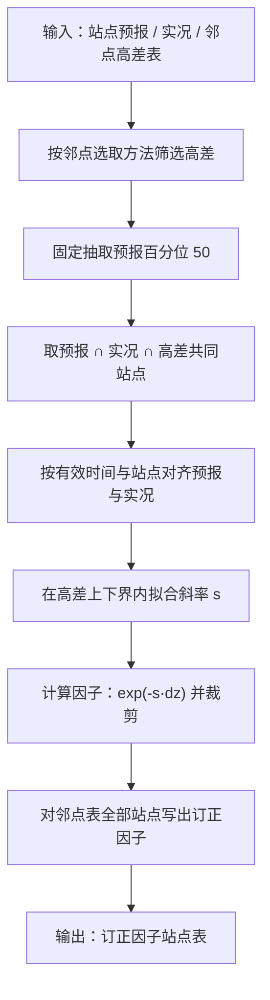
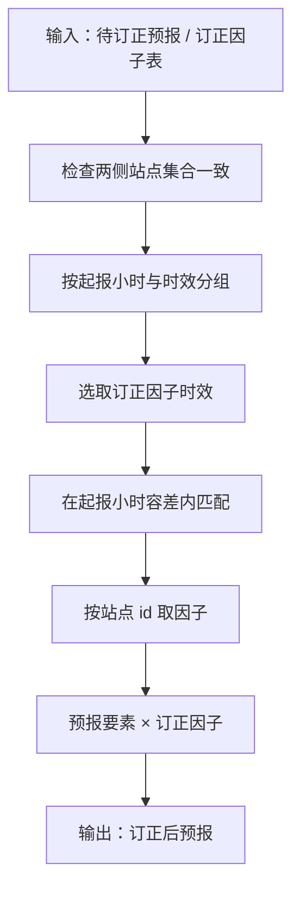

# 站点高差订正（station_height_difference_correction）

迁移自 Improver `improver.calibration.dz_rescaling`。  
**I/O 为 meteva_base 站点表**（`pandas.DataFrame`），以站点 `id` 对齐。

- `time`：起报时间  
- `dtime`：预报时效（小时）  
- 有效时间 = `time + dtime`

算法默认输入**已是规范站点表**。

核心类：

- `EstimateDzRescaling`：由历史站点预报、实况与邻点高差估计订正因子  
- `ApplyDzRescaling`：将订正因子乘到待订正预报上  

二者均继承 `PostProcessingPlugin`（与原版一致）。通过实例调用（`plugin(...)`）时，若输出站点表的 `DataFrame.attrs` 含非默认 `title`，会自动加上 `Post-Processed` 前缀；无 `title` 时不改动。

---

## 1. 核心公式

一次多项式拟合（只保留斜率 $s$）：

$$
\ln(\mathrm{forecast}/\mathrm{truth}) \approx c_0 + s \cdot \mathrm{vertical\_displacement}
$$

订正因子（并按高差上下界对应的因子值裁剪）：

$$
\mathrm{scaled\_vertical\_displacement}
= \mathrm{clip}\bigl(\exp(-s \cdot \mathrm{vertical\_displacement}),\, \text{bounds}\bigr)
$$

应用订正：

$$
\mathrm{forecast} \leftarrow \mathrm{forecast} \times \mathrm{scaled\_vertical\_displacement}
$$

---

## 2. 核心流程图

以下仅展示核心计算链路；省略列校验、类型检查等辅助步骤。流程图节点使用中文（计算公式除外）。

### 2.1 估计订正因子（EstimateDzRescaling）



拟合细节：

- 预报必须含 `percentile` 列，并固定取 50。  
- 参与拟合的样本须同时满足：预报非零且有限、高差在 `[dz_lower_bound, dz_upper_bound]` 内。  
- 实况有限且非零：用 $\ln(\mathrm{fc}/\mathrm{tr})$；实况非有限：按原版掩码路径取 $1.0$ 参与拟合。  
- 对上述样本做一次多项式拟合，只保留斜率 $s$。

裁剪细节：

- 先计算 $\mathrm{scaled\_dz}=\exp(-s\cdot\mathrm{dz})$。  
- 再分别用上下界高差得到 $\exp(-s\cdot\mathrm{dz\_lower})$、$\exp(-s\cdot\mathrm{dz\_upper})$，取其较小值与较大值作为裁剪区间（因 $s$ 符号不同，下界高差不一定对应较小因子）。  
- 最后对全部站点因子做 $\mathrm{clip}$，使结果落在该区间内。

输出细节：

- 输出站点集合与筛选后的邻点高差表对齐（可多于训练交集）。  
- 输出 `dtime` 取构造参数中的代表性时效；`forecast_reference_time_hour` 取训练预报起报小时。  

### 2.2 应用订正因子（ApplyDzRescaling）



时效与起报小时匹配规则：

- 时效：取因子表中 **≥ 预报时效** 的最近 `dtime`；若皆更小则取最大时效。  
- 起报小时：对偏移量按绝对值从小到大，在容差内尝试匹配 `forecast_reference_time_hour`。

---

## 3. 方法参数说明

### 3.1 EstimateDzRescaling 构造参数

| 参数 | 类型 | 默认 | 说明 |
| --- | --- | --- | --- |
| `forecast_period` | `float` | 必填 | 代表性预报时效（小时）。输入可含多个 `dtime`；**输出** `dtime` 取该值。 |
| `forecast_data_name` | `str` | 必填 | 预报要素列名（如 `wind_speed`）。 |
| `truth_data_name` | `str` | `None` | 实况要素列名；默认与 `forecast_data_name` 相同。 |
| `dz_lower_bound` | `float` | `None`（$-\infty$） | 训练允许的 `vertical_displacement` 下界；超出不参与拟合，输出因子亦按对应边界裁剪。 |
| `dz_upper_bound` | `float` | `None`（$+\infty$） | 训练允许的 `vertical_displacement` 上界。 |
| `land_constraint` | `bool` | `False` | 若邻点表含 `neighbour_selection_method`，按陆地约束筛选（与原版命名规则一致）。 |
| `similar_altitude` | `bool` | `False` | 若邻点表含方法列，按最小高差邻点筛选；可与 `land_constraint` 组合。 |

`process(forecast, truth, neighbour)` 主函数输入：

| 参数 | 说明 |
| --- | --- |
| `forecast` | 历史站点预报表（含六列坐标 + 要素列 + **`percentile`**） |
| `truth` | 站点实况表（含六列坐标 + 要素列） |
| `neighbour` | 邻点高差表，至少含 `id`、`vertical_displacement`；可选 `neighbour_selection_method`、`lon`/`lat` |

输出：订正因子站点表，含 `scaled_vertical_displacement`、`dtime`、`forecast_reference_time_hour` 等。

### 3.2 ApplyDzRescaling 构造参数

| 参数 | 类型 | 默认 | 说明 |
| --- | --- | --- | --- |
| `forecast_data_name` | `str` | 必填 | 待订正预报的要素列名。 |
| `frt_hour_leniency` | `int` | `1` | 起报小时匹配容差（小时）；按 \|offset\| 从小到大尝试。 |

`process(forecast, scaled_dz)` 主函数输入：

| 参数 | 说明 |
| --- | --- |
| `forecast` | 待订正站点预报表 |
| `scaled_dz` | 订正因子表，至少含 `id`、`dtime`、`scaled_vertical_displacement`；建议含 `forecast_reference_time_hour` |

输出：与输入预报同结构的订正后站点表（要素列已乘因子）。

### 3.3 输入表列与输出 dtype 约定

| 表 | 必需列 | 说明 |
| --- | --- | --- |
| forecast / truth | `level, time, dtime, id, lon, lat` + 要素列 | 要素列名由构造参数显式指定；**预报另须含 `percentile`** |
| neighbour | `id` + `vertical_displacement` | 可选 `neighbour_selection_method`、`lon`/`lat` |
| scaled_vertical_displacement | `id, dtime, scaled_vertical_displacement` | 建议含 `forecast_reference_time_hour` |

Estimate / Apply 均在返回前经 `set_stadata_coords_dtype` 规范化输出 dtype：

| 列 | dtype |
| --- | --- |
| `level` / `lon` / `lat` / 要素列 | `float32` |
| `dtime` / `id` | `int32` |
| `time` | `datetime64` |

---

## 4. 方法调用示例

### 4.1 估计订正因子

```python
from station_height_difference_correction import EstimateDzRescaling

plugin = EstimateDzRescaling(
    forecast_period=6,
    forecast_data_name="wind_speed",
    dz_lower_bound=-550,
    dz_upper_bound=550,
    land_constraint=True,
)
scaled_dz = plugin.process(forecast_sta, truth_sta, neighbour_sta)
# 或：scaled_dz = plugin(forecast_sta, truth_sta, neighbour_sta)
```

### 4.2 应用订正因子

```python
from station_height_difference_correction import ApplyDzRescaling

plugin = ApplyDzRescaling(
    forecast_data_name="wind_speed",
    frt_hour_leniency=1,
)
rescaled = plugin.process(forecast_sta, scaled_dz_sta)
# 或：rescaled = plugin(forecast_sta, scaled_dz_sta)
```

---

## 5. CLI 示例

示例脚本路径：

- `station_height_difference_correction/cli/dsc_estimate_dz_rescaling.py`
- `station_height_difference_correction/cli/dsc_apply_dz_rescaling.py`

在仓库根目录直接运行（脚本内会把仓库根加入 `sys.path`，并用 `__file__` 定位测试数据）：

```text
python station_height_difference_correction/cli/dsc_estimate_dz_rescaling.py
python station_height_difference_correction/cli/dsc_apply_dz_rescaling.py
```

### 5.1 估计：调用 `process`

```python
from pathlib import Path
from station_height_difference_correction.cli.dsc_estimate_dz_rescaling import process

data_root = Path("station_height_difference_correction/test_data/estimate-dz-rescaling")
result = process(
    data_root / "cli_input" / "T1200Z_forecast.csv",
    data_root / "cli_input" / "T1200Z_truth.csv",
    data_root / "cli_input" / "neighbour.csv",
    forecast_period=6,
    forecast_data_name="wind_speed",
    dz_lower_bound=-550,
    dz_upper_bound=550,
    land_constraint=True,
    output_path=data_root / "cli_output" / "scaled_vertical_displacement_T1200Z.csv",
)
```

### 5.2 应用：调用 `process`

```python
from pathlib import Path
from station_height_difference_correction.cli.dsc_apply_dz_rescaling import process

data_root = Path("station_height_difference_correction/test_data/apply-dz-rescaling")
result = process(
    data_root / "cli_input" / "apply_forecast.csv",
    data_root / "cli_input" / "apply_scaled_dz.csv",
    forecast_data_name="wind_speed",
    frt_hour_leniency=1,
    output_path=data_root / "cli_output" / "forecast_rescaled.csv",
)
```

---

## 6. 测试

### 6.1 单元测试

路径：`station_height_difference_correction/test/test_dz_rescaling_unit.py`。

在仓库根目录执行：

```text
pytest station_height_difference_correction/test
```

以合成小样本为主，主要覆盖：

- Estimate：拟合与裁剪公式、百分位 50 筛选、高差上下界、邻点选取方法、缺测实况拟合、输出站点集合与 dtype  
- Apply：因子相乘、时效选取、起报小时容差、站点集合一致性校验  
- 工具函数与 Estimate CLI `process` 冒烟（依赖 `test_data/.../cli_input`，缺失则 skip）

### 6.2 官方数据验证

见 `nbs/dz_rescaling_validation.ipynb`：按「预处理 → 输入图 → 方法调用 → 三图结果对比」组织 Estimate / Apply；另含 CLI 示例（本仓库 `process` 读写 meb 站点表，原版 Improver CLI 处理官方 NetCDF，结果写入对应 `cli_output/` 并与 KGO 对照）。数值对比使用 `np.allclose`（默认 `atol=1e-4`、`rtol=1e-4`），并通过 `assert` 断言。

---

## 7. 对照原版

- 参考实现：`improver-1.18.7/improver/calibration/dz_rescaling.py`
- 原 I/O 为 Iris 站点 Cube；本模块改为 meb 站点表。
- 原版 `site_id_coord`（默认 `wmo_id`）在 meb 下固定为列 `id`，不再作为构造参数。
- 预报必须含 `percentile` 列，并固定取 50（对齐原版 `iris.Constraint(percentile=50.0)`，非构造参数）。
- 预报/实况要素列名须由 `forecast_data_name` / `truth_data_name` 显式指定。
- 方法输出列 dtype 按 meb 规范规范化（`dtime`/`id` 为 `int32` 等）。
- 邻点高差列固定为 `vertical_displacement`；订正因子列固定为 `scaled_vertical_displacement`。
- 插件基类：`utils/base_plugin.py`；站点表工具：`src/utils/_sta.py`
