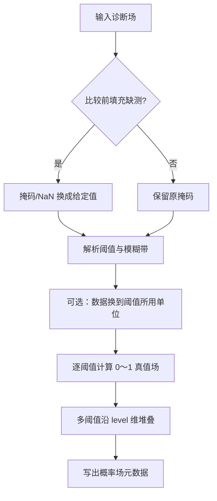

# 阈值概率转换（Threshold）算法说明

- 算法来源：Met Office Improver `improver.threshold.Threshold`
- 迁移目标：适配 `meteva_base` 六维网格（`member, level, time, dtime, lat, lon`），阈值数值写入 `level` 维；同时支持 `numpy.ndarray` 输入
- **本插件做什么**：把诊断场（如气温、降水）变成「相对某个阈值是否成立」的 0～1 场。硬阈值时每个格点为 0 或 1；fuzzy 时在阈值附近做线性过渡，给出中间值。

本仓库 **`Threshold` 主类**已覆盖上游同名插件的完整能力（硬阈值、fuzzy、多阈值、单位换算、``collapse_coord``、``vicinity``、``fill_masked`` 等）。未纳入本类的能力（如 ``LatitudeDependentThreshold``、``between_thresholds``）属于 Improver 其他插件或独立模块，不在本文档范围。

## 1. 组件说明

- **`Threshold`**：主插件类（`threshold_probability_conversion/src/threshold.py`）
- **`comparison_operator_dict`** / **`rescale`**：比较符与线性重标定（`threshold_probability_conversion/src/utils/`）
- **CLI**：`threshold_probability_conversion/cli/prb_threshold.py`（``process`` 入口）、`threshold_probability_conversion/cli/preprocess_test_data.py`（测试/meb 预处理）

## 2. 核心计算

### 2.1 硬阈值

当 fuzzy 上下界相等时，直接用比较符得到 0/1：

$$
T(x) = \mathbf{1}\{x \,\mathrm{op}\, t\}
$$

其中 $\mathrm{op} \in \{>,\ge,<,\le\}$。

### 2.2 Fuzzy

当 $lo < t < hi$ 时，在阈值处隶属度为 0.5，向两侧线性过渡到 0/1：

- $x < t$：$x$ 在 $[lo,t]$ 映射到 $[0,0.5]$
- $x \ge t$：$x$ 在 $[t,hi]$ 映射到 $[0.5,1]$

若比较符为「小于」类（`less_than` / `less_than_or_equal_to`），再取 $1 - T(x)$。

### 2.3 单位

若指定 `threshold_units`，比较前先把**数据**换到该单位，再与 `threshold_values` 比较。

| 输入类型 | 数据单位来源 | 输出侧 |
| -------- | ------------ | ------ |
| **DataArray (meb)** | `attrs["units"]`（缺省 `"1"`） | `level` 坐标写**原场单位**下的阈值数值 |
| **ndarray** | `process(..., data_units=...)`（缺省 `"1"`） | 仅 `(n_threshold, *shape)`，**无** `level` 坐标与单位元数据 |

ndarray 示例：数据为 K、阈值写摄氏度时须显式传入数据单位：

```python
Threshold(threshold_values=6.85, threshold_units="celsius").process(
    data_kelvin, data_units="K"
)
```

### 2.4 ``fill_masked``（比较前填充缺测）

``fill_masked`` 在**单位换算与阈值比较之前**生效：

- **已设置**：掩码点（``MaskedArray``）或 NaN（meb 路径常见海点）替换为该值，随后当作普通数值参与比较；输出不再保留输入掩码。
- **未设置**（默认）：保留掩码；比较后掩码位置真值场为 **0** 并继续带掩码（ndarray 返回 ``MaskedArray``）。走 ``vicinity`` 时掩码点在邻域滤波前置 ``-inf``、滤波后置 **0**，避免以 0 误参与邻域最大值。
- 未设 ``fill_masked`` 时，非掩码 **NaN** 会报错。

## 3. 处理流程



## 4. 输入输出约定

| 类型 | 输入 | 输出 |
| ------ | ------ | ------ |
| DataArray | meb 六维，`level` 长度为 1 | 六维，`level` = 阈值（原场单位），`units="1"` |
| DataArray + ``collapse_coord`` | 同上 | 六维；被压维坐标长度为 1，属性 ``collapsed_coords`` 记录压维维名 |
| DataArray + ``vicinity`` | 米制等距投影或经纬 meb | 六维；变量名含 ``_in_vicinity_``；``radius_of_vicinity`` 记为标量坐标/属性 |
| DataArray + 多半径 ``vicinity`` | 同上 | ``xr.Dataset``：每个半径一个六维变量（``..._r{半径米}``），各自 ``radius_of_vicinity`` 属性 |
| ndarray | 任意形状；``MaskedArray`` 可选 | ``(n_threshold, *shape)`` 或带掩码的 ``MaskedArray``；不支持 ``collapse_coord`` / ``vicinity`` / ``landmask``；设 ``threshold_units`` 时需 ``process(..., data_units=...)`` |

**空间坐标约定（meb）**：

- **常规经纬**：``lat`` / ``lon`` 可无 ``units``（或 ``degree_*``）→ 算法按经纬网处理。
- **Improver 投影兼容**：空间坐标须写距离 ``units``（如 ``m``），主变量 ``attrs`` 含 ``grid_mapping_attrs``（JSON 投影参数）；预处理见 ``cli/preprocess_test_data.py``。

输出属性（DataArray / Dataset）：

- `relative_to_threshold` / `spp__relative_to_threshold`：如 `greater_than`
- 变量名：`probability_of_{diag}_{above|below}_threshold`；vicinity 时为 ``..._in_vicinity_...``

### 4.1 ``Threshold.__init__`` 参数

构造插件实例；``threshold_values`` 与 ``threshold_config`` **必须二选一**。

| 参数 | 类型 | 默认值 | 说明 |
| ------ | ------ | ------ | ------ |
| ``threshold_values`` | ``float`` / ``list[float]`` | ``None`` | 一个或多个阈值；与 ``threshold_config`` **互斥** |
| ``threshold_config`` | ``dict`` | ``None`` | 阈值配置：键为阈值数值（字符串），值为 ``[下界, 上界]``（fuzzy）或 ``"None"``（硬阈值）；与 ``threshold_values`` **互斥** |
| ``fuzzy_factor`` | ``float`` | ``None`` | 乘性模糊因子，须满足 ``0 < fuzzy_factor < 1``；由阈值自动生成 fuzzy 上下界；与 config 中显式 fuzzy 界**互斥**；阈值为 **0** 时不可用 |
| ``threshold_units`` | ``str`` | ``None`` | 阈值所用单位（cf_units 字符串，如 ``celsius``、``mm hr-1``）；指定后先把**数据**换到该单位再比较 |
| ``comparison_operator`` | ``str`` | ``">"`` | 比较方向：``>`` ``>=`` ``<`` ``<=`` 或 ``gt`` ``ge`` ``lt`` ``le`` |
| ``collapse_coord`` | ``str`` / ``list[str]`` | ``None`` | 对指定维求平均并压成长度 1；仅 ``member``、``time`` 或其组合；须 meb 输入 |
| ``collapse_cell_methods`` | ``dict[str, str]`` | ``None`` | 可选，记录压维统计方法，如 ``{"member": "mean"}``；写入输出属性 ``collapse_cell_methods`` |
| ``vicinity`` | ``float`` / ``list[float]`` | ``None`` | 方形邻域半径（**米**）；在 ``collapse_coord`` **之前**对真值场做邻域最大值；多个半径时 ``process`` 返回 ``xr.Dataset`` |
| ``fill_masked`` | ``float`` | ``None`` | 比较前用该值填充掩码点 / NaN；见 §2.4 |

### 4.2 ``Threshold.process`` 参数

| 参数 | 类型 | 默认值 | 说明 |
| ------ | ------ | ------ | ------ |
| ``input_data`` | ``xr.DataArray`` / ``ndarray`` | （必填） | 诊断场。DataArray 须为 meb 六维且 ``level`` 长度为 1；ndarray 任意形状 |
| ``data_units`` | ``str`` | ``None`` | **仅 ndarray**：数据单位；设 ``threshold_units`` 时用于换算（缺省 ``"1"``）。DataArray 读 ``attrs["units"]`` |
| ``landmask`` | ``xr.DataArray`` / ``ndarray`` | ``None`` | 与空间维同形的海陆掩码（``True``=陆）；**须**与构造时的 ``vicinity`` 联用 |

**返回值**（依输入与构造参数）：

| 条件 | 返回类型 |
| ------ | ---------- |
| ndarray 输入 | ``ndarray`` 形状 ``(n_threshold, *input_shape)``；有掩码且未设 ``fill_masked`` 时为 ``MaskedArray`` |
| meb 输入，无多半径 vicinity | ``xr.DataArray`` 六维，``level``=阈值（原场单位），``units="1"`` |
| meb 输入，多半径 ``vicinity`` | ``xr.Dataset``，每个半径一个六维变量 |

**约束**：``collapse_coord``、``vicinity``、``landmask`` 仅支持 meb（``DataArray``）输入；未设 ``vicinity`` 时不可传 ``landmask``。

## 5. 使用示例

### 5.1 插件 ``Threshold``

```python
from threshold_probability_conversion.src.threshold import Threshold

# 多阈值、逐成员
result = Threshold(
    threshold_values=[270.0, 280.0, 290.0],
    comparison_operator=">",
).process(temperature_meb)

# 集合概率：对 member 求平均
ensemble_prob = Threshold(
    threshold_values=280.0,
    collapse_coord="member",
).process(temperature_meb)

# fuzzy
fuzzy = Threshold(
    threshold_values=280.0,
    fuzzy_factor=0.99,
).process(temperature_meb)

# 邻域内是否发生（50 km 方形邻域最大值）
in_vic = Threshold(
    threshold_values=5.0,
    threshold_units="mm",
    vicinity=50000.0,
).process(precip_meb)

# 多半径 vicinity：返回 Dataset
multi_vic = Threshold(
    threshold_values=5.0,
    vicinity=[10000.0, 20000.0],
).process(precip_meb)

# 阈值 JSON 配置 + 海陆分邻域
import json
with open("threshold_config.json", encoding="utf-8") as fh:
    cfg = json.load(fh)
Threshold(threshold_config=cfg, vicinity=10000.0).process(
    precip_meb, landmask=landmask_meb
)
```

### 5.2 CLI ``prb_threshold.process``

CLI 读 meb 六维 nc，内部调用 ``Threshold``；指定 ``output_path`` 时写出 NetCDF（``float32`` + zlib）。

```python
from threshold_probability_conversion.cli.prb_threshold import process

# 硬阈值（与 test_data/basic 一致）
process(
    "threshold_probability_conversion/test_data/basic/cli_inputs/input_meb.nc",
    threshold_values=280.0,
    output_path="threshold_probability_conversion/test_data/basic/cli_outputs/cli_threshold_result.nc",
)

# 阈值单位与 fuzzy
process(
    "threshold_probability_conversion/test_data/basic/cli_inputs/input_meb.nc",
    threshold_values=6.85,
    threshold_units="celsius",
    fuzzy_factor=0.99,
    output_path="out_fuzzy.nc",
)

# JSON 阈值配置
process(
    "threshold_probability_conversion/test_data/basic/cli_inputs/input_meb.nc",
    threshold_config_path="threshold_probability_conversion/test_data/json/threshold_config.json",
    output_path="out_config.nc",
)

# vicinity + 海陆掩码 + 集合压维
process(
    "threshold_probability_conversion/test_data/vicinity/cli_inputs/input_meb.nc",
    threshold_values=[0.03, 0.1, 1.0],
    threshold_units="mm hr-1",
    vicinity=[10000.0, 20000.0],
    landmask_path="threshold_probability_conversion/test_data/vicinity/cli_inputs/landmask_meb.nc",
    collapse_coord="member",
    output_path="out_vicinity.nc",
)
```

脚本直接运行（使用脚本内默认 ``test_data/basic`` 路径）：

```text
python threshold_probability_conversion/cli/preprocess_test_data.py   # 可选：生成/更新 meb 与 latlon 样例
python threshold_probability_conversion/cli/prb_threshold.py
```

### 5.3 CLI 参数说明

CLI 在 ``Threshold.__init__`` 参数基础上增加 ``input_path`` / ``output_path``；``landmask`` 改为从 ``landmask_path`` 读 nc。构造参数含义见 §4.1。

| 参数 | 类型 | 说明 |
| ------ | ------ | ------ |
| ``input_path`` | ``str`` | meb 六维诊断场 NetCDF 路径 |
| ``threshold_values`` | ``float`` / ``list[float]`` | 阈值；与 ``threshold_config_path`` **互斥** |
| ``threshold_config_path`` | ``str`` | JSON 阈值配置（键为阈值字符串，值为 fuzzy 界或 ``"None"``） |
| ``threshold_units`` | ``str`` | 阈值单位（如 ``celsius``、``mm hr-1``）；指定后先把数据换到该单位再比较 |
| ``comparison_operator`` | ``str`` | 比较符：``>`` ``>=`` ``<`` ``<=`` 或 ``gt`` ``ge`` ``lt`` ``le``；默认 ``>`` |
| ``fuzzy_factor`` | ``float`` | 模糊因子 (0, 1)；与 config 中显式 fuzzy 界**互斥** |
| ``fill_masked`` | ``float`` | 比较前用该值填充掩码点 / NaN |
| ``vicinity`` | ``float`` / ``list[float]`` | 方形邻域半径（**米**）；多个半径时返回 ``xr.Dataset`` |
| ``landmask_path`` | ``str`` | 海陆掩码 nc（``True``=陆）；**须**与 ``vicinity`` 联用 |
| ``collapse_coord`` | ``str`` / ``list[str]`` | 压维并求平均：``member``、``time`` 或其组合 |
| ``output_path`` | ``str`` | 可选；写出 NetCDF。多半径 ``Dataset`` 按 ``data_vars`` 分别编码；单 ``DataArray`` 包装为单变量 Dataset 写出 |

返回值：``xr.DataArray``（单半径或无 vicinity）或 ``xr.Dataset``（多半径 vicinity）。

## 6. 测试与官方对照

```text
pytest threshold_probability_conversion/test
```

官方场景（与 Improver acceptance 参数一致）：`basic`、`below_threshold`（`<=`）、`multiple_thresholds`、`threshold_units`、`fuzzy_factor`（0.99）、`threshold_units_fuzzy_factor`、`fuzzy_bounds` config、`json` config；`vicinity`（含 landmask、多半径、collapse）；`vicinity_masked`（掩码降水）。

Notebook（`threshold_probability_conversion/nbs/threshold.ipynb`）含投影/经纬对照；CLI 示例以投影 meb 为主。

## 7. ``collapse_coord`` 与 ``vicinity`` 用法

### 7.1 ``collapse_coord``

输入、输出均为 meb 六维。``collapse_coord`` **仅接受** ``member``、``time``（可组合）：

| 维 | 输入 | 输出 | 说明 |
| ---- | ---- | ---- | ---- |
| ``member`` | 长度可 > 1 | 压维后长度 1 | 集合概率 |
| ``time`` | 长度可 > 1 | 压维后长度 1 | 多时刻平均 |
| ``level`` | **须为 1** | 变为阈值坐标 | 不可压维 |
| ``lat`` / ``lon`` | 格点 | 不变 | 不可压维 |

对有效（非掩码）切片求算术平均；可选 ``collapse_cell_methods``，输出属性 ``collapsed_coords`` 记录压维维名。

### 7.2 ``vicinity``

在 ``collapse_coord`` **之前**对阈值真值场做方形邻域最大值（米制半径 → 格点数）。

- 单半径：六维 ``DataArray``，属性 ``radius_of_vicinity``（m）。
- 多半径：``xr.Dataset``，变量名 ``{基名}_r{半径米}``。
- ``landmask``：``process(..., landmask=...)``，陆/海分别做邻域（CLI 用 ``landmask_path``）。
- 海点等无效区：输入常用 NaN；写出 meb 时建议 ``preserve_nan_fill=True``。

## 附录：实现与迁移补充

以下内容面向对照上游或排查差异，**使用插件/CLI 时可略读**。

| 主题 | 说明 |
| ------ | ------ |
| 迁移范围 | 本模块对应 ``improver.threshold.Threshold``；``LatitudeDependentThreshold``、``between_thresholds``、``threshold_interpolation`` 等为其他类/模块 |
| ``collapse_coord`` 维名 | meb 集合统一在 ``member``；不接受上游 ``realization`` / ``percentile`` 等旧名，预处理阶段应迁入 ``member`` |
| ``dtime`` 压维 | 当前不支持对 ``dtime`` 做 ``collapse_coord`` |
| fuzzy 比较符 | fuzzy 路径下 ``<`` 与 ``<=`` 数值结果与上游一致 |
| 经纬 ``vicinity`` | 修改后方法 meb 支持经纬输入（LAEA 推断格距）；上游 Iris 米制邻域不支持经纬 Cube，对照时原方法/KGO 常用投影结果重网格 |
| CLI 写出 | 概率场统一 ``float32``，避免 meb 默认 ``scale_factor`` 打包 |
